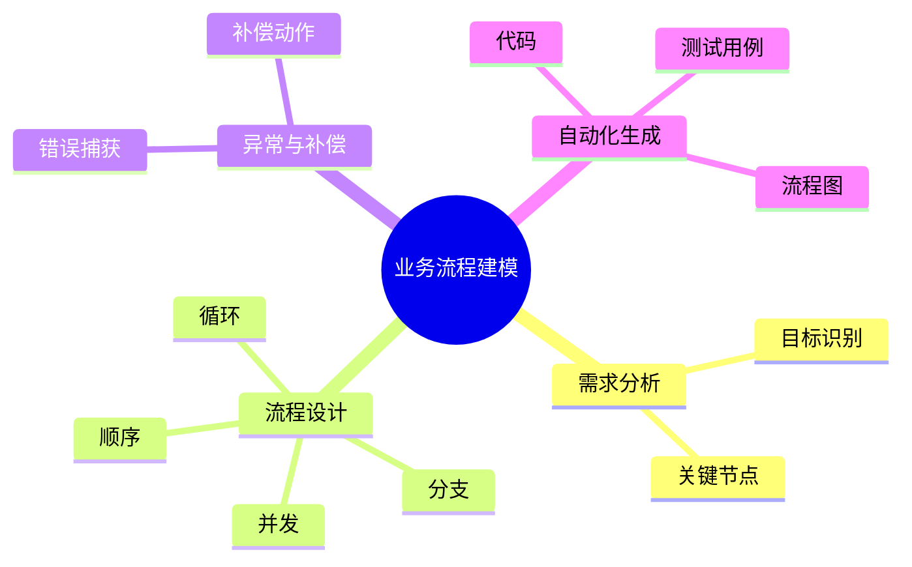

# 业务逻辑建模理论探讨

## 1. 形式化目标

- 以结构化方式描述系统的业务流程、条件、动作、分支、循环等。
- 支持多种业务逻辑模式（顺序、分支、并发、循环、补偿等）统一建模。
- 便于自动生成业务代码、流程图、测试用例等。

## 2. 核心概念

- **流程节点**：任务、决策、事件、网关等。
- **条件与分支**：if/else、switch、case等。
- **循环与并发**：for、while、并行网关等。
- **补偿与异常处理**：补偿动作、错误捕获、回滚等。

## 3. 已有标准

- BPMN（业务流程建模与标注）
- UML活动图、状态机
- Camunda、Activiti等工作流引擎

## 4. 可行性分析

- 业务逻辑建模结构化强，标准化程度高，适合DSL抽象。
- 可自动生成流程图、代码、测试用例。
- 易于与AI结合进行流程补全、异常检测、优化建议。

## 5. 自动化价值

- 降低手工编码和维护业务逻辑的成本。
- 提高业务流程的可视化和可追溯性。
- 支持自动化测试和回归验证。

## 6. 与AI结合点

- 智能补全业务流程、条件分支。
- 自动推理流程优化、异常场景。
- 智能生成测试用例和补偿策略。

---

## 7. 常见业务逻辑模式一览（表格）

| 模式         | 说明                 | 典型场景           |
|--------------|----------------------|--------------------|
| 顺序         | 任务依次执行         | 审批流、下单流程   |
| 分支         | 条件判断分流         | 审核通过/拒绝     |
| 并发         | 多任务并行           | 并行审批、批量处理 |
| 循环         | 重复执行直到满足条件 | 批量导入、轮询     |
| 补偿         | 失败时回滚或补救     | 订单取消、退款     |

---

## 8. 业务流程建模步骤思维导图

---

## 9. 形式化推理/证明片段

**定理（流程可达性）**：
若业务流程图中所有节点均存在从起点到终点的路径，则流程无死节点。

*证明思路*：
对流程图做深度优先遍历，若所有节点均被访问，则无死节点。

**推论（补偿完整性）**：
若每个可能失败的节点均有补偿路径，则流程具备异常恢复能力。

## 理论确定性与论证推理

在业务逻辑建模领域，理论确定性是实现业务流程自动化、异常处理、补偿机制的基础。以 BPMN、UML、Camunda、Activiti 等主流工作流平台为例：

1. **形式化定义**  
   业务流程、条件分支、并发控制、补偿机制等均有标准化描述和配置语言。

2. **公理化系统**  
   通过工作流引擎和规则引擎，实现业务逻辑的自动推理与异常处理。

3. **类型安全**  
   流程节点、条件表达式、动作参数等类型严格定义，防止业务流程错误。

4. **可证明性**  
   关键属性如流程可达性、补偿完整性等可通过验证和测试进行形式化证明。

这些理论基础为业务逻辑建模的自动化配置、异常处理和补偿机制提供了理论支撑。
