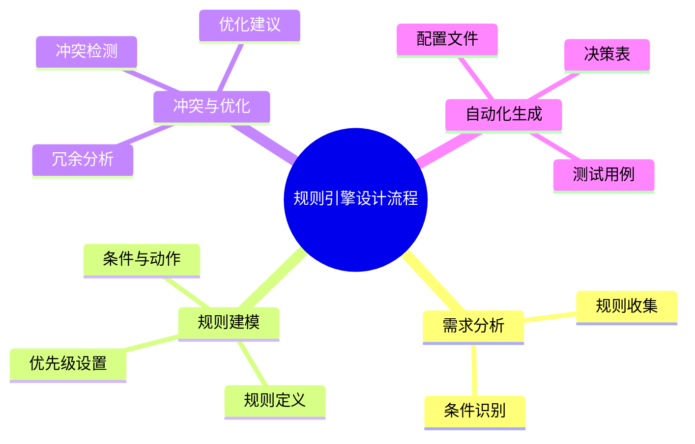

# 规则引擎建模理论探讨

## 1. 形式化目标

- 以结构化方式描述系统中的规则、条件、动作、优先级、冲突解决等。
- 支持决策表、规则集、推理链等多种规则结构统一建模。
- 便于自动生成规则引擎配置、决策表、测试用例等。

## 2. 核心概念

- **规则（Rule）**：条件+动作的组合。
- **条件（Condition）**：规则触发的前提。
- **动作（Action）**：条件满足时执行的操作。
- **优先级与冲突解决**：规则执行顺序、冲突处理。
- **规则集与推理链**：规则的组合与推理流程。

## 3. 已有标准

- Drools、Jess、CLIPS等规则引擎
- DMN（决策模型与标注）
- 业务决策表、规则DSL

## 4. 可行性分析

- 规则建模结构化强，标准化程度高，适合DSL抽象。
- 可自动生成规则配置、决策表、测试用例。
- 易于与AI结合进行规则补全、冲突检测、优化建议。

## 5. 自动化价值

- 降低手工实现和维护规则的成本。
- 提高决策的可追溯性和灵活性。
- 支持自动化测试和回归验证。

## 6. 与AI结合点

- 智能补全规则、条件、动作。
- 自动推理规则冲突、冗余。
- 智能生成测试用例和优化建议。

---

## 7. 常见规则类型与特性一览（表格）

| 类型         | 特性                   | 典型场景           |
|--------------|------------------------|--------------------|
| 决策表       | 条件-动作矩阵          | 价格计算、审批流   |
| 规则集       | 多规则组合             | 风控、推荐系统     |
| 推理链       | 规则依赖、链式推理      | 专家系统、诊断     |
| 优先级规则   | 明确优先级、冲突解决    | 促销叠加、权限控制 |

---

## 8. 规则引擎设计流程思维导图

---

## 9. 形式化推理/证明片段

**定理（规则覆盖性）**：
若规则集R能覆盖所有输入空间，则系统无遗漏决策。

*证明思路*：
对输入空间做穷举，若每种输入均有规则匹配，则覆盖性成立。

**推论（冲突检测）**：
若存在输入x，使得规则r1与r2均可触发且动作冲突，则需优化规则集。

## 理论确定性与论证推理

在规则引擎建模领域，理论确定性是实现规则自动化执行、冲突检测、决策推理的基础。以 Drools、Jess、CLIPS、DMN 等主流规则引擎平台为例：

1. **形式化定义**  
   规则定义、条件表达式、动作处理、优先级设置等均有标准化描述和配置语言。

2. **公理化系统**  
   通过规则引擎和推理机，实现规则逻辑的自动推理与冲突解决。

3. **类型安全**  
   规则条件、动作参数、优先级值等类型严格定义，防止规则执行错误。

4. **可证明性**  
   关键属性如规则覆盖性、冲突检测等可通过验证和测试进行形式化证明。

这些理论基础为规则引擎建模的自动化配置、冲突检测和决策推理提供了理论支撑。
