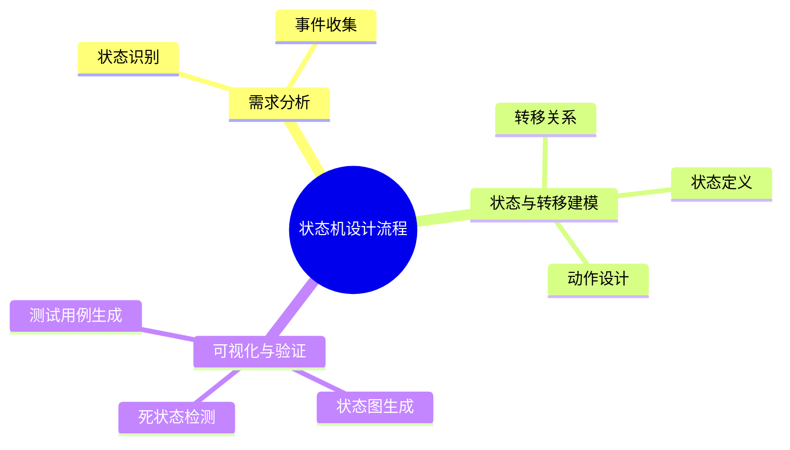

# 状态机建模理论探讨

## 1. 形式化目标

- 以结构化方式描述系统的状态、事件、转移、动作等。
- 支持有限状态机（FSM）、层次状态机（HSM）、并发状态机等统一建模。
- 便于自动生成状态机代码、可视化图、测试用例等。

## 2. 核心概念

- **状态（State）**：系统的离散状态。
- **事件（Event）**：触发状态转移的输入。
- **转移（Transition）**：状态间的迁移关系。
- **动作（Action）**：转移或状态进入/退出时执行的操作。
- **初始/终止状态**：状态机的起点和终点。

## 3. 已有标准

- UML状态图
- SCXML（W3C状态机标准）
- XState、Sismic等状态机工具

## 4. 可行性分析

- 状态机建模结构化强，标准化程度高，适合DSL抽象。
- 可自动生成状态机代码、图、测试用例。
- 易于与AI结合进行状态补全、异常检测、优化建议。

## 5. 自动化价值

- 降低手工实现和维护状态机的成本。
- 提高系统的可预测性和健壮性。
- 支持自动化测试和回归验证。

## 6. 与AI结合点

- 智能补全状态、事件、转移。
- 自动推理死状态、不可达状态。
- 智能生成测试用例和异常处理。

---

## 7. 常见状态机类型与特性一览（表格）

| 类型         | 特性                   | 典型场景           |
|--------------|------------------------|--------------------|
| FSM          | 单一状态、明确定义转移 | 订单流转、门禁系统 |
| HSM          | 状态嵌套、分层         | UI组件、协议栈     |
| 并发状态机   | 多分支并行             | 复杂业务流程       |
| Mealy/Moore  | 输出依赖于状态/转移    | 控制系统、协议机   |

---

## 8. 状态机设计流程思维导图

---

## 9. 形式化推理/证明片段

**定理（状态可达性）**：
若状态机中所有状态均存在从初始状态出发的路径，则无不可达状态。

*证明思路*：
对状态转移图做深度优先遍历，若所有状态均被访问，则无不可达状态。

**推论（死状态检测）**：
若某状态无出边且非终止状态，则为死状态，应优化设计。

## 理论确定性与论证推理

在状态机建模领域，理论确定性是实现状态自动化管理、事件处理、状态转移的基础。以 UML Statechart、SCXML、XState、Sismic 等主流状态机平台为例：

1. **形式化定义**  
   状态定义、事件类型、转移规则、动作处理等均有标准化描述和配置语言。

2. **公理化系统**  
   通过状态机引擎和事件处理器，实现状态逻辑的自动推理与状态管理。

3. **类型安全**  
   状态类型、事件参数、转移条件等类型严格定义，防止状态转移错误。

4. **可证明性**  
   关键属性如状态可达性、死状态检测等可通过验证和测试进行形式化证明。

这些理论基础为状态机建模的自动化配置、事件处理和状态管理提供了理论支撑。
