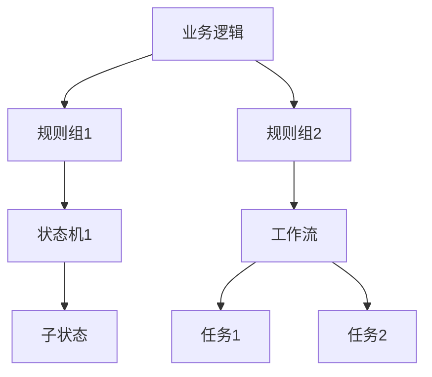

# 功能模型理论创新与递归推理

## 1. 理论创新与差异化

- **递归功能AST结构**：支持业务逻辑、规则、状态机、工作流等多层嵌套与组合，表达复杂功能流转。
- **规则引擎与推理**：引入优先级、分组、条件嵌套、冲突检测等递归规则推理机制。
- **状态机与并发**：支持多级状态嵌套、并发分支、异常处理、补偿机制。
- **AI自动化**：集成AI辅助规则生成、异常检测、流程优化、自动修复建议。
- **工程难点与创新**：解决跨模块依赖、流程一致性、异常补偿、动态扩展等工程难题。

## 2. 递归推理伪代码

```python
# 递归推理：自动推导嵌套业务规则的执行顺序与冲突

def infer_rule_order(rules):
    ordered = []
    for rule in sorted(rules, key=lambda r: r.priority):
        if rule.sub_rules:
            ordered.extend(infer_rule_order(rule.sub_rules))
        ordered.append(rule)
    return ordered
```

## 3. 典型递归流程图



## 4. 实际代码片段（AI辅助规则生成）

```python
# AI辅助生成业务规则

def ai_generate_rule(context):
    # context: 包含业务实体、历史数据、目标约束等
    return ai_model.suggest_rule(context)

# 规则冲突检测

def detect_conflicts(rules):
    conflicts = []
    for i, r1 in enumerate(rules):
        for r2 in rules[i+1:]:
            if r1.condition == r2.condition and r1.action != r2.action:
                conflicts.append((r1, r2))
    return conflicts
```

## 5. 工程难点与创新解决方案

- **跨模块依赖递归解析**：自动发现业务逻辑与规则、状态机、工作流间的依赖关系。
- **流程一致性与补偿**：支持流程异常自动补偿、回滚、幂等性校验。
- **动态扩展与自愈**：支持规则/流程的热插拔、AI辅助自愈与优化。
- **AI驱动的流程优化**：利用AI分析历史执行轨迹，自动优化流程路径与规则优先级。

## 6. 行业映射与案例

- 金融：风控规则递归建模，AI辅助检测欺诈与异常。
- 智能家居：场景联动规则递归组合，AI自动生成个性化自动化流程。
- 工业：设备状态机与告警规则递归建模，AI辅助异常检测与自愈。

---

> 本文档持续递归完善，欢迎补充更多创新理论、推理伪代码、流程图与行业案例。
