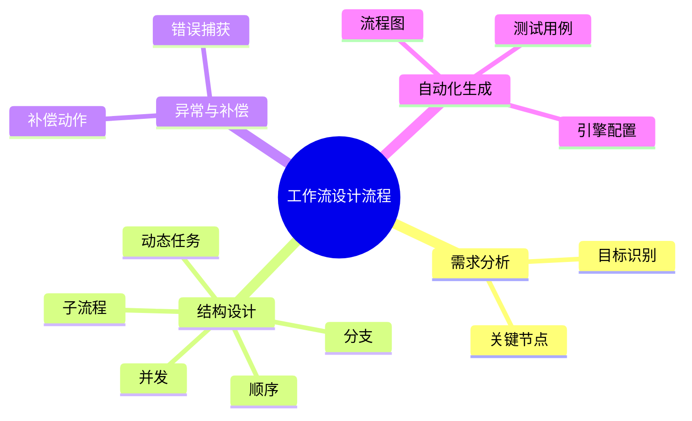

# 工作流建模理论探讨

## 1. 形式化目标

- 以结构化方式描述复杂业务流程的任务、节点、依赖、分支、并发、条件等。
- 支持顺序、分支、并发、子流程、动态任务等多种工作流结构统一建模。
- 便于自动生成工作流引擎配置、流程图、监控与测试用例等。

## 2. 核心概念

- **任务（Task）**：流程中的基本执行单元。
- **节点（Node）**：任务、事件、网关、子流程等。
- **依赖与分支**：前置/后置依赖、条件分支、并发分支。
- **子流程与动态任务**：流程嵌套、动态生成任务。
- **异常与补偿**：错误处理、补偿机制。

## 3. 已有标准

- BPMN（业务流程建模与标注）
- Apache Airflow DAG、Argo Workflow
- Camunda、Activiti等工作流引擎

## 4. 可行性分析

- 工作流建模结构化强，标准化程度高，适合DSL抽象。
- 可自动生成流程图、引擎配置、监控与测试用例。
- 易于与AI结合进行流程补全、异常检测、优化建议。

## 5. 自动化价值

- 降低手工实现和维护复杂流程的成本。
- 提高流程的可视化、可追溯性和自动化运维能力。
- 支持自动化测试和回归验证。

## 6. 与AI结合点

- 智能补全任务依赖、分支。
- 自动推理流程瓶颈、异常路径。
- 智能生成测试用例和补偿策略。

---

## 7. 常见工作流结构一览（表格）

| 结构         | 说明                 | 典型场景           |
|--------------|----------------------|--------------------|
| 顺序         | 任务依次执行         | 审批流、数据处理   |
| 分支         | 条件判断分流         | 审核通过/拒绝     |
| 并发         | 多任务并行           | 并行审批、批量处理 |
| 子流程       | 嵌套流程             | 复杂审批、子任务   |
| 动态任务     | 运行时生成任务       | 动态分配、调度     |
| 补偿         | 失败时回滚或补救     | 订单取消、退款     |

---

## 8. 工作流设计流程思维导图

---

## 9. 形式化推理/证明片段

**定理（流程无环性）**：
若工作流图为有向无环图（DAG），则不存在死循环。

*证明思路*：
对工作流图做拓扑排序，若能遍历所有节点，则无环。

**推论（补偿完整性）**：
若每个可能失败的任务均有补偿路径，则流程具备异常恢复能力。
