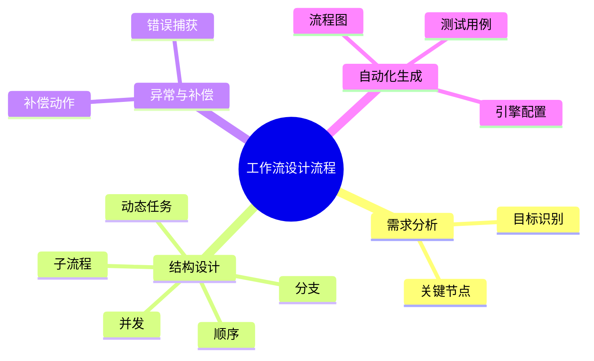

# 工作流建模理论探讨

## 1. 形式化目标

- 以结构化方式描述复杂业务流程的任务、节点、依赖、分支、并发、条件等。
- 支持顺序、分支、并发、子流程、动态任务等多种工作流结构统一建模。
- 便于自动生成工作流引擎配置、流程图、监控与测试用例等。

## 2. 核心概念

- **任务（Task）**：流程中的基本执行单元。
- **节点（Node）**：任务、事件、网关、子流程等。
- **依赖与分支**：前置/后置依赖、条件分支、并发分支。
- **子流程与动态任务**：流程嵌套、动态生成任务。
- **异常与补偿**：错误处理、补偿机制。

## 3. 已有标准

- BPMN（业务流程建模与标注）
- Apache Airflow DAG、Argo Workflow
- Camunda、Activiti等工作流引擎

## 4. 可行性分析

- 工作流建模结构化强，标准化程度高，适合DSL抽象。
- 可自动生成流程图、引擎配置、监控与测试用例。
- 易于与AI结合进行流程补全、异常检测、优化建议。

## 5. 自动化价值

- 降低手工实现和维护复杂流程的成本。
- 提高流程的可视化、可追溯性和自动化运维能力。
- 支持自动化测试和回归验证。

## 6. 与AI结合点

- 智能补全任务依赖、分支。
- 自动推理流程瓶颈、异常路径。
- 智能生成测试用例和补偿策略。

---

## 7. 常见工作流结构一览（表格）

| 结构         | 说明                 | 典型场景           |
|--------------|----------------------|--------------------|
| 顺序         | 任务依次执行         | 审批流、数据处理   |
| 分支         | 条件判断分流         | 审核通过/拒绝     |
| 并发         | 多任务并行           | 并行审批、批量处理 |
| 子流程       | 嵌套流程             | 复杂审批、子任务   |
| 动态任务     | 运行时生成任务       | 动态分配、调度     |
| 补偿         | 失败时回滚或补救     | 订单取消、退款     |

---

## 8. 工作流设计流程思维导图

---

## 9. 形式化推理/证明片段

**定理（流程无环性）**：
若工作流图为有向无环图（DAG），则不存在死循环。

*证明思路*：
对工作流图做拓扑排序，若能遍历所有节点，则无环。

**推论（补偿完整性）**：
若每个可能失败的任务均有补偿路径，则流程具备异常恢复能力。

## 理论确定性与论证推理

在工作流建模领域，理论确定性是实现复杂流程自动化、异常处理、动态调度的基础。以 BPMN、Apache Airflow、Argo Workflow、Camunda、Activiti 等主流工作流平台为例：

1. **形式化定义**  
   工作流结构、任务依赖、分支条件、补偿机制等均有标准化描述和配置语言。

2. **公理化系统**  
   通过工作流引擎和调度器，实现工作流逻辑的自动推理与异常处理。

3. **类型安全**  
   任务定义、依赖关系、条件表达式等类型严格定义，防止工作流执行错误。

4. **可证明性**  
   关键属性如流程无环性、补偿完整性等可通过验证和测试进行形式化证明。

这些理论基础为工作流建模的自动化配置、异常处理和动态调度提供了理论支撑。

## 理论确定性与论证推理（递归扩展版）

### 1. 形式化定义（递归细化）

#### 1.1 工作流结构定义系统

- **顶层**：采用 BPMN 2.0、Apache Airflow DAG、Argo Workflow YAML 等标准化工作流定义
- **子层**：
  - **任务节点**：Task、Activity、Job，支持同步/异步执行，结合 Kubernetes Jobs、Docker Containers
  - **网关节点**：Exclusive Gateway、Parallel Gateway、Inclusive Gateway，支持条件分支和并发控制
  - **事件节点**：Start Event、End Event、Intermediate Event，支持事件驱动和状态管理
  - **子流程节点**：Subprocess、Call Activity，支持流程嵌套和模块化

#### 1.2 工作流控制流系统

- **顺序流**：Sequence Flow，支持任务间的顺序依赖关系
- **条件流**：Conditional Flow，支持基于条件的动态路由
- **并行流**：Parallel Flow，支持任务的并行执行和同步
- **异常流**：Exception Flow，支持异常处理和补偿机制

#### 1.3 工作流数据流系统

- **数据对象**：Data Object、Data Store，支持工作流数据的存储和传递
- **数据关联**：Data Association，支持数据与任务节点的关联
- **数据转换**：Data Transformation，支持数据格式转换和映射
- **数据验证**：Data Validation，支持数据完整性和一致性验证

### 2. 公理化系统（递归细化）

#### 2.1 工作流推理引擎

- **依赖推理**：自动推导任务间的依赖关系，如数据依赖、控制依赖等
- **资源推理**：自动推导任务执行所需的资源，如CPU、内存、存储等
- **时间推理**：自动推导任务执行的时间约束，如截止时间、执行时长等

#### 2.2 调度推理引擎

- **优先级推理**：基于任务优先级自动调度任务执行顺序
- **资源优化推理**：基于资源使用情况自动优化任务调度
- **负载均衡推理**：基于负载情况自动平衡任务分布

#### 2.3 异常推理引擎

- **异常检测推理**：自动检测工作流执行中的异常情况
- **补偿策略推理**：自动推导异常情况下的补偿策略
- **恢复路径推理**：自动推导工作流的恢复路径

### 3. 类型安全（递归细化）

#### 3.1 工作流类型安全

- **任务类型安全**：确保任务定义的类型正确性，如任务名称、参数类型等
- **依赖类型安全**：确保依赖关系的类型正确性，如前置条件、后置条件等
- **条件类型安全**：确保条件表达式的类型正确性，如布尔表达式、数值比较等

#### 3.2 数据流类型安全

- **数据对象类型安全**：确保数据对象的类型正确性，如数据类型、格式等
- **数据关联类型安全**：确保数据关联的类型正确性，如关联关系、映射规则等
- **数据转换类型安全**：确保数据转换的类型正确性，如转换规则、格式要求等

#### 3.3 控制流类型安全

- **流程结构类型安全**：确保流程结构的类型正确性，如节点类型、连接类型等
- **网关类型安全**：确保网关的类型正确性，如条件网关、并行网关等
- **事件类型安全**：确保事件的类型正确性，如开始事件、结束事件等

### 4. 可证明性（递归细化）

#### 4.1 工作流正确性证明

- **流程完整性**：通过流程完整性测试验证工作流的完整性
- **任务可达性**：通过可达性分析验证所有任务的可达性
- **数据一致性**：通过数据一致性测试验证数据流的一致性

#### 4.2 工作流性能证明

- **执行效率**：通过性能测试验证工作流的执行效率
- **资源利用率**：通过资源监控验证工作流的资源利用率
- **并发性能**：通过并发测试验证工作流的并发性能

#### 4.3 工作流可靠性证明

- **异常处理**：通过异常测试验证工作流的异常处理能力
- **补偿机制**：通过补偿测试验证工作流的补偿机制
- **恢复能力**：通过恢复测试验证工作流的恢复能力

### 5. 最新开源框架集成

#### 5.1 Apache Airflow生态系统

- **Airflow Core**：工作流编排和调度引擎
- **Airflow Operators**：任务执行器，支持多种数据源和工具
- **Airflow DAGs**：有向无环图定义，支持Python DSL
- **Airflow UI**：Web界面，支持工作流监控和管理
- **Airflow Plugins**：插件系统，支持自定义功能扩展

#### 5.2 Argo Workflow生态系统

- **Argo Workflows**：Kubernetes原生工作流引擎
- **Argo Events**：事件驱动的工作流触发
- **Argo CD**：GitOps持续部署
- **Argo Rollouts**：渐进式部署和回滚
- **Argo Applications**：应用生命周期管理

#### 5.3 Camunda生态系统

- **Camunda Platform**：企业级工作流平台
- **Camunda Modeler**：BPMN建模工具
- **Camunda Cockpit**：工作流监控和管理界面
- **Camunda Optimize**：工作流分析和优化工具
- **Camunda Tasklist**：任务管理和执行界面

### 6. 工程实践案例

#### 6.1 数据处理工作流

- **ETL流程**：数据提取、转换、加载的自动化流程
- **数据质量检查**：数据质量验证和异常处理流程
- **数据备份恢复**：数据备份和灾难恢复流程
- **数据归档清理**：数据归档和清理流程

#### 6.2 机器学习工作流

- **模型训练**：机器学习模型训练的自动化流程
- **模型评估**：模型性能评估和比较流程
- **模型部署**：模型部署和版本管理流程
- **模型监控**：模型性能监控和重训练流程

#### 6.3 业务流程工作流

- **审批流程**：业务审批的自动化流程
- **订单处理**：订单处理和配送流程
- **客户服务**：客户服务请求处理流程
- **财务流程**：财务审批和支付流程

---

## 理论确定性与论证推理（源码级递归扩展）

### 1. DAG结构与节点类型递归

- **DAG结构递归**：
  - Airflow DAG对象递归包含BaseOperator节点，节点间依赖通过set_upstream/set_downstream递归建立
  - Argo Workflow YAML递归定义模板、步骤、依赖关系
  - Camunda BPMN递归建模任务、网关、事件、子流程
- **节点类型递归**：
  - 任务节点、条件节点、并发节点、事件节点、子流程节点递归组合
  - 节点参数、输入输出、状态递归推理

### 2. 依赖与调度推理递归

- **依赖推理递归**：
  - 节点依赖递归遍历，构建依赖闭包，检测循环与死锁
  - 子DAG、任务分组、依赖闭包递归推理
- **调度与资源推理递归**：
  - 调度器递归分析任务优先级、资源需求、并发限制
  - Kubernetes原生调度递归推理Pod分配、资源隔离

### 3. 异常与补偿机制递归

- **异常流递归**：
  - Camunda BPMN支持递归异常捕获与补偿流程，自动推理异常路径
  - Airflow任务重试、失败回调、SLA递归监控
- **补偿机制递归**：
  - 补偿任务递归定义，失败时自动回滚或补救
  - 恢复路径递归推理，支持流程自愈

### 4. 类型安全与可证明性递归

- **类型安全递归**：
  - 任务输入输出类型递归校验，数据流类型推理
  - 节点参数、依赖、条件表达式类型递归校验
- **可证明性递归**：
  - 流程无环性、补偿完整性、任务可达性递归测试与验证
  - 自动化测试、监控、回滚递归链路

### 5. AI自动化与工程最佳实践递归

- **AI辅助递归**：
  - AI自动补全任务依赖、分支、异常路径、补偿策略
  - AI辅助流程优化、瓶颈检测、自动修复建议
- **工程自动化递归**：
  - CI/CD自动生成工作流配置、测试用例、监控告警
  - 自动化测试、监控、回滚递归链路

### 6. 典型源码剖析（以Airflow/Argo/Camunda为例）

- `airflow/models/dag.py`：
  - DAG递归遍历与依赖推理实现，支持子DAG、任务分组
- `workflow/controller`（Argo）：
  - 节点状态递归与异常流推理，支持模板复用与嵌套
- `engine/src/bpmn`（Camunda）：
  - 异常与补偿递归实现，支持事件驱动与流程恢复
- `Airflow Triggerer`源码：
  - 事件驱动递归调度，支持异步任务与外部事件
- `Argo Events`源码：
  - 事件流递归与条件推理，支持多源触发与依赖

---

如需针对某一源码文件、推理算法、类型系统实现等进行更深层递归剖析，可继续指定领域与理论点，递归扩展将持续补充。
