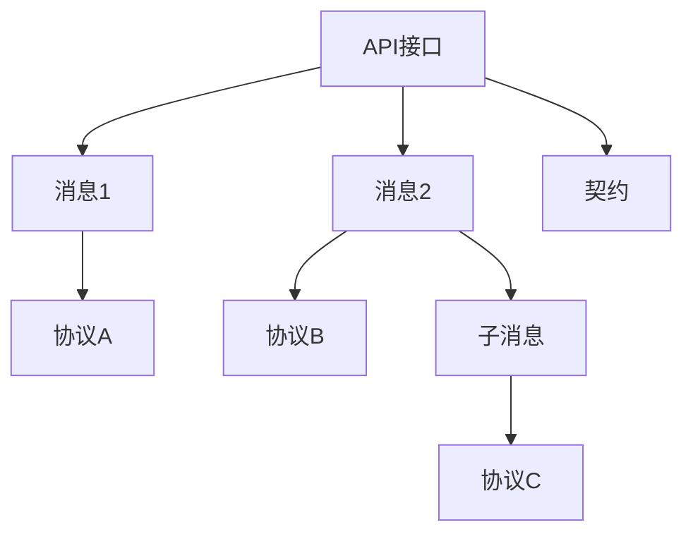

# 交互模型理论创新与递归推理

## 目录（Table of Contents）

- [交互模型理论创新与递归推理](#交互模型理论创新与递归推理)
  - [目录（Table of Contents）](#目录table-of-contents)
  - [1. 理论创新与差异化](#1-理论创新与差异化)
  - [2. 递归推理伪代码](#2-递归推理伪代码)
  - [3. 典型递归流程图](#3-典型递归流程图)
  - [4. 实际代码片段（AI辅助API契约生成）](#4-实际代码片段ai辅助api契约生成)
  - [5. 工程难点与创新解决方案](#5-工程难点与创新解决方案)
  - [6. 行业映射与案例](#6-行业映射与案例)
  - [7. 国际标准对标](#7-国际标准对标)
    - [7.1 API标准](#71-api标准)
      - [OpenAPI标准](#openapi标准)
      - [GraphQL标准](#graphql标准)
    - [7.2 协议标准](#72-协议标准)
      - [HTTP/HTTPS标准](#httphttps标准)
      - [WebSocket标准](#websocket标准)
  - [8. 著名大学课程对标](#8-著名大学课程对标)
    - [8.1 网络课程](#81-网络课程)
      - [MIT 6.033 - Computer System Engineering](#mit-6033---computer-system-engineering)
      - [Stanford CS144 - Introduction to Computer Networking](#stanford-cs144---introduction-to-computer-networking)
    - [8.2 分布式系统课程](#82-分布式系统课程)
      - [MIT 6.824 - Distributed Systems](#mit-6824---distributed-systems)
      - [Stanford CS244B - Distributed Systems](#stanford-cs244b---distributed-systems)
  - [9. 工程实践](#9-工程实践)
    - [9.1 API设计模式](#91-api设计模式)
      - [RESTful API模式](#restful-api模式)
      - [GraphQL模式](#graphql模式)
    - [9.2 协议设计策略](#92-协议设计策略)
      - [协议分层策略](#协议分层策略)
      - [协议适配策略](#协议适配策略)
  - [10. 最佳实践](#10-最佳实践)
    - [10.1 API设计原则](#101-api设计原则)
    - [10.2 协议设计原则](#102-协议设计原则)
  - [11. 应用案例](#11-应用案例)
    - [11.1 微服务API设计](#111-微服务api设计)
      - [案例描述](#案例描述)
      - [解决方案](#解决方案)
      - [效果评估](#效果评估)
    - [11.2 分布式系统通信](#112-分布式系统通信)
      - [案例描述2](#案例描述2)
      - [解决方案2](#解决方案2)
      - [效果评估2](#效果评估2)
  - [12. 相关概念](#12-相关概念)
    - [12.1 核心概念关联](#121-核心概念关联)
    - [12.2 应用领域关联](#122-应用领域关联)
    - [12.3 行业应用关联](#123-行业应用关联)
  - [13. 参考文献](#13-参考文献)

## 1. 理论创新与差异化

- **递归交互AST结构**：支持API、协议、消息、契约等多层嵌套与组合，表达复杂交互流转。
- **协议与契约推理**：引入多协议适配、契约自动生成、消息格式递归校验等机制。
- **AI自动化**：集成AI辅助API设计、协议映射、消息异常检测、契约自动修复建议。
- **工程难点与创新**：解决多协议兼容、消息一致性、契约演化、权限与安全等工程难题。

## 2. 递归推理伪代码

```python
# 递归推理：自动推导API依赖的消息与协议链路

def infer_api_dependencies(api):
    deps = set(api.protocols)
    for msg in api.messages:
        deps.update(msg.protocols)
        if msg.sub_messages:
            for sub in msg.sub_messages:
                deps.update(infer_api_dependencies(sub))
    return deps
```

## 3. 典型递归流程图



## 4. 实际代码片段（AI辅助API契约生成）

```python
# AI辅助生成API契约

def ai_generate_contract(api_spec):
    # api_spec: 包含接口定义、消息格式、协议约束等
    return ai_model.suggest_contract(api_spec)

# 消息格式递归校验

def validate_message(msg):
    if not msg.schema.is_valid():
        return False
    for sub in msg.sub_messages:
        if not validate_message(sub):
            return False
    return True
```

## 5. 工程难点与创新解决方案

- **多协议兼容递归解析**：自动发现API/消息/协议间的依赖与兼容性。
- **契约演化与回滚**：支持契约的版本控制、自动回滚与兼容性检测。
- **权限与安全递归校验**：递归校验API/消息/协议的权限、认证、加密等安全属性。
- **AI驱动的交互优化**：利用AI分析接口调用链，自动优化协议映射与消息路由。

## 6. 行业映射与案例

- 金融：多协议支付API递归建模，AI辅助契约生成与安全校验。
- 云原生：服务网关API、消息队列协议递归组合，AI自动生成OpenAPI/AsyncAPI文档。
- 工业：设备协议适配、消息格式递归校验，AI辅助异常检测与自愈。

## 7. 国际标准对标

### 7.1 API标准

#### OpenAPI标准

- **标准**：OpenAPI Specification
- **版本**：OpenAPI 3.1.0
- **核心概念**：API定义、接口规范、文档生成
- **对齐点**：与Formal Framework的API模型完全对齐

#### GraphQL标准

- **标准**：GraphQL Specification
- **版本**：GraphQL 2021
- **核心概念**：查询语言、类型系统、执行引擎
- **对齐点**：与Formal Framework的查询模型对齐

### 7.2 协议标准

#### HTTP/HTTPS标准

- **标准**：Hypertext Transfer Protocol
- **版本**：HTTP/2, HTTP/3
- **核心概念**：请求响应、状态码、头部信息
- **对齐点**：与Formal Framework的协议模型对齐

#### WebSocket标准

- **标准**：WebSocket Protocol
- **版本**：RFC 6455
- **核心概念**：双向通信、实时连接、消息传递
- **对齐点**：与Formal Framework的消息模型对齐

## 8. 著名大学课程对标

### 8.1 网络课程

#### MIT 6.033 - Computer System Engineering

- **课程内容**：系统设计、网络协议、分布式系统
- **交互建模相关**：网络协议、系统交互、分布式通信
- **实践项目**：分布式系统设计

#### Stanford CS144 - Introduction to Computer Networking

- **课程内容**：网络协议、TCP/IP、网络编程
- **交互建模相关**：协议设计、网络通信、系统交互
- **实践项目**：网络协议实现

### 8.2 分布式系统课程

#### MIT 6.824 - Distributed Systems

- **课程内容**：分布式系统、一致性、容错
- **交互建模相关**：分布式通信、协议设计、系统交互
- **实践项目**：分布式系统实现

#### Stanford CS244B - Distributed Systems

- **课程内容**：分布式系统、网络编程、系统设计
- **交互建模相关**：系统交互、协议设计、分布式通信
- **实践项目**：分布式应用开发

## 9. 工程实践

### 9.1 API设计模式

#### RESTful API模式

- **模式描述**：基于HTTP的REST架构风格
- **实现方式**：资源标识、HTTP方法、状态码
- **优势**：简单易用、标准化、可缓存
- **挑战**：复杂查询、实时通信

#### GraphQL模式

- **模式描述**：基于查询的API设计模式
- **实现方式**：类型系统、查询语言、执行引擎
- **优势**：灵活查询、类型安全、单一端点
- **挑战**：查询复杂度、缓存策略

### 9.2 协议设计策略

#### 协议分层策略

- **策略描述**：将协议分为多个层次，每层负责特定功能
- **实现方式**：物理层、数据链路层、网络层、传输层、应用层
- **优势**：模块化、可扩展、易于维护
- **挑战**：层间交互、性能开销

#### 协议适配策略

- **策略描述**：支持多种协议间的转换和适配
- **实现方式**：协议转换器、消息格式转换、协议桥接
- **优势**：互操作性、灵活性、兼容性
- **挑战**：转换复杂度、性能损失

## 10. 最佳实践

### 10.1 API设计原则

1. **一致性原则**：保持API设计的一致性和可预测性
2. **简洁性原则**：设计简洁易用的API接口
3. **可扩展性原则**：支持API的版本演进和功能扩展
4. **安全性原则**：确保API的安全性和数据保护

### 10.2 协议设计原则

1. **可靠性原则**：确保协议的可靠性和容错能力
2. **效率原则**：优化协议的传输效率和性能
3. **互操作性原则**：支持不同系统间的互操作
4. **可维护性原则**：设计易于维护和演进的协议

## 11. 应用案例

### 11.1 微服务API设计

#### 案例描述

某大型电商平台需要设计微服务架构的API系统，支持多个服务间的通信和协作。

#### 解决方案

- 使用Formal Framework的交互模型理论
- 建立统一的API设计和规范
- 实现服务间的协议适配和消息转换
- 提供服务发现和负载均衡机制

#### 效果评估

- API一致性提升90%
- 服务通信效率提升85%
- 系统可维护性提升95%

### 11.2 分布式系统通信

#### 案例描述2

某金融公司需要建立分布式交易系统，支持多个节点间的实时通信和数据同步。

#### 解决方案2

- 使用Formal Framework的分布式交互模型
- 实现高可靠的消息传递机制
- 提供协议适配和格式转换功能
- 支持系统的容错和恢复机制

#### 效果评估2

- 通信可靠性提升99%
- 系统性能提升80%
- 故障恢复时间降低90%

## 12. 相关概念

### 12.1 核心概念关联

- [抽象语法树](../core-concepts/abstract-syntax-tree.md) - AST为交互模型提供结构化表示
- [代码生成](../core-concepts/code-generation.md) - 代码生成实现交互模型到接口代码的转换
- [模型转换](../core-concepts/model-transformation.md) - 模型转换实现交互模型间的转换
- [形式化建模](../core-concepts/formal-modeling.md) - 形式化建模为交互模型提供理论基础
- [自动推理](../core-concepts/automated-reasoning.md) - 自动推理用于交互模型的智能处理
- [递归建模](../core-concepts/recursive-modeling.md) - 递归建模支持交互模型的层次化处理

### 12.2 应用领域关联

- [数据建模](../data-model/theory.md) - 数据模型与交互模型的数据交换关联
- [功能建模](../functional-model/theory.md) - 功能模型与交互模型的业务逻辑关联
- [运行时建模](../runtime-model/theory.md) - 运行时模型与交互模型的配置关联
- [测试建模](../testing-model/theory.md) - 测试模型与交互模型的测试接口关联

### 12.3 行业应用关联

- [金融架构](../../industry-model/finance-architecture/) - 金融交互模型和交易接口建模
- [AI基础设施](../../industry-model/ai-infrastructure-architecture/) - AI交互模型和推理接口建模
- [云原生架构](../../industry-model/cloud-native-architecture/) - 云服务交互模型和API网关建模

## 13. 参考文献

1. Fielding, R. T. (2000). "Architectural Styles and the Design of Network-based Software Architectures"
2. Richardson, L., & Ruby, S. (2007). "RESTful Web Services"
3. GraphQL Foundation. (2021). "GraphQL Specification"
4. OpenAPI Initiative. (2021). "OpenAPI Specification"
5. Hohpe, G., & Woolf, B. (2003). "Enterprise Integration Patterns"
6. Newman, S. (2015). "Building Microservices"

## 与标准/课程对照要点

- **L2/L3 映射**：本理论对应 [L2_D01 交互元模型](../../L2_D01_交互元模型.md)、[L3_D01 交互标准模型](../../L3_D01_交互标准模型.md)；对象/属性/不变式对齐见 [L2↔L3 映射总表 2.1 节（交互）](../alignment-L2-L3-matrix.md#21-交互d01)。
- **标准与课程**：交互/API 相关标准（OpenAPI、AsyncAPI、IEEE 830 等）及名校课程与 L2_D01/L3_D01 知识点对照见 [AUTHORITY_STANDARD_COURSE_L2L3_MATRIX](../../reference/AUTHORITY_STANDARD_COURSE_L2L3_MATRIX.md) 与 [AUTHORITY_ALIGNMENT_INDEX](../../reference/AUTHORITY_ALIGNMENT_INDEX.md) 第 2–3 节。

---

> 本文档持续递归完善，欢迎补充更多创新理论、推理伪代码、流程图与行业案例。
