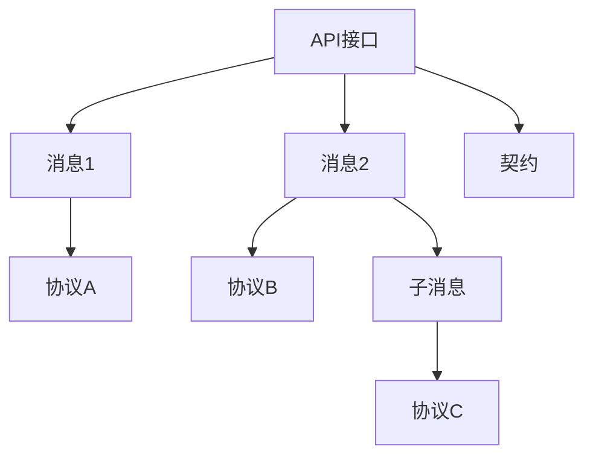

# 交互模型理论创新与递归推理

## 1. 理论创新与差异化

- **递归交互AST结构**：支持API、协议、消息、契约等多层嵌套与组合，表达复杂交互流转。
- **协议与契约推理**：引入多协议适配、契约自动生成、消息格式递归校验等机制。
- **AI自动化**：集成AI辅助API设计、协议映射、消息异常检测、契约自动修复建议。
- **工程难点与创新**：解决多协议兼容、消息一致性、契约演化、权限与安全等工程难题。

## 2. 递归推理伪代码

```python
# 递归推理：自动推导API依赖的消息与协议链路

def infer_api_dependencies(api):
    deps = set(api.protocols)
    for msg in api.messages:
        deps.update(msg.protocols)
        if msg.sub_messages:
            for sub in msg.sub_messages:
                deps.update(infer_api_dependencies(sub))
    return deps
```

## 3. 典型递归流程图



## 4. 实际代码片段（AI辅助API契约生成）

```python
# AI辅助生成API契约

def ai_generate_contract(api_spec):
    # api_spec: 包含接口定义、消息格式、协议约束等
    return ai_model.suggest_contract(api_spec)

# 消息格式递归校验

def validate_message(msg):
    if not msg.schema.is_valid():
        return False
    for sub in msg.sub_messages:
        if not validate_message(sub):
            return False
    return True
```

## 5. 工程难点与创新解决方案

- **多协议兼容递归解析**：自动发现API/消息/协议间的依赖与兼容性。
- **契约演化与回滚**：支持契约的版本控制、自动回滚与兼容性检测。
- **权限与安全递归校验**：递归校验API/消息/协议的权限、认证、加密等安全属性。
- **AI驱动的交互优化**：利用AI分析接口调用链，自动优化协议映射与消息路由。

## 6. 行业映射与案例

- 金融：多协议支付API递归建模，AI辅助契约生成与安全校验。
- 云原生：服务网关API、消息队列协议递归组合，AI自动生成OpenAPI/AsyncAPI文档。
- 工业：设备协议适配、消息格式递归校验，AI辅助异常检测与自愈。

---

> 本文档持续递归完善，欢迎补充更多创新理论、推理伪代码、流程图与行业案例。
