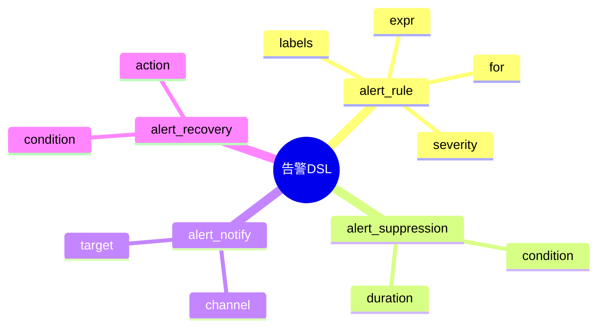

# 告警模型DSL草案

## 1. 设计目标
- 用声明式语法描述告警规则、分级、抑制、通知、闭环等流程
- 支持多源多级告警统一建模
- 便于自动生成告警与通知配置

## 2. 基本语法结构

```dsl
alert_rule "HighCPU" {
  expr = "cpu_usage > 0.9"
  for = "5m"
  severity = "critical"
  labels = { service = "web" }
}

alert_suppression "NightTime" {
  condition = "hour >= 0 && hour < 6"
  duration = "6h"
}

alert_notify "OpsTeam" {
  channel = "email"
  target = "ops@example.com"
}
```

## 3. 关键元素
- alert_rule：告警规则定义
- alert_suppression：告警抑制规则
- alert_notify：告警通知配置
- alert_recovery：告警恢复与自愈

---

## 4. 示例

```dsl
alert_rule "DiskFull" {
  expr = "disk_free < 1024"
  for = "10m"
  severity = "warning"
  labels = { host = "db" }
}

alert_notify "DBA" {
  channel = "sms"
  target = "+8613800000000"
}

alert_recovery "AutoClean" {
  condition = "disk_free > 2048"
  action = "run_cleanup_script"
}
```

---

## 5. 与主流标准的映射

| DSL元素         | Prometheus Alertmanager | PagerDuty | Zabbix Trigger |
|-----------------|------------------------|-----------|----------------|
| alert_rule      | group/rule             | service   | trigger        |
| alert_suppression| inhibit/silence       | schedule  | maintenance    |
| alert_notify    | receiver               | escalation| action         |
| alert_recovery  | n/a                    | auto-resolve| recovery      |

---

## 6. 递归扩展建议
- 支持多级告警聚合与降噪
- 告警与日志、指标、追踪的统一DSL
- 告警闭环与AI自愈的集成

---

## 7. 告警DSL关键元素表格

| 元素             | 说明           | 典型属性           |
|------------------|----------------|--------------------|
| alert_rule       | 告警规则定义   | expr, for, severity|
| alert_suppression| 抑制规则       | condition, duration|
| alert_notify     | 通知配置       | channel, target    |
| alert_recovery   | 恢复与自愈     | condition, action  |

---

## 8. 告警DSL语法思维导图（Mermaid）



---

## 9. 形式化DSL推理片段

**推论：**  
若 alert_rule、alert_suppression、alert_notify、alert_recovery 语法均具备完备性，则任意告警检测与响应流程均可通过DSL自动生成配置与推理链路。

**证明思路：**  
- 每个环节均可形式化为DSL声明；
- DSL可自动转化为告警/通知/自愈配置；
- 组合DSL可推导出完整的告警处理链路。 