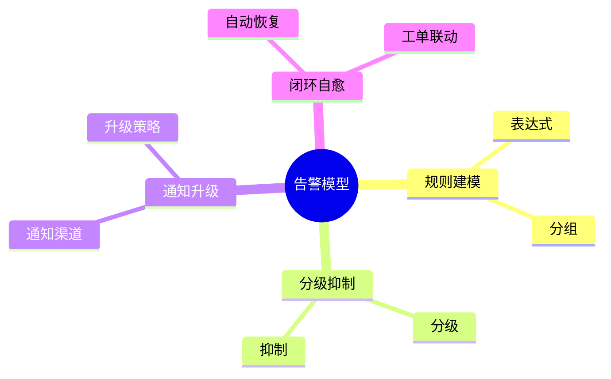

# 告警模型理论探讨

## 1. 形式化目标
- 明确告警规则、触发机制、通知流程的结构与语义
- 支持告警配置、分级、抑制、恢复等流程的自动化与标准化
- 为监控系统的异常检测、事件响应、根因定位等提供形式化基础

## 2. 核心概念
- 告警规则（Alert Rule）
- 告警级别（Severity）
- 告警抑制（Suppression）
- 告警恢复（Recovery）
- 通知渠道（Notification Channel）

## 3. 已有标准
- Prometheus Alertmanager
- PagerDuty
- OpsGenie
- Zabbix Trigger

## 4. 可行性分析
- 告警规则、分级、抑制、恢复等流程可DSL化
- 通知、升级、闭环等可形式化建模
- 与日志、指标、追踪等可统一为可观测性模型

## 5. 自动化价值
- 自动生成告警规则与通知配置
- 自动化异常检测与事件闭环
- 告警与AI结合实现智能降噪、根因定位

## 6. 与AI结合点
- 智能告警聚合与降噪
- 告警驱动的根因分析与预测
- 告警优先级自动调整

## 7. 递归细分方向
- 告警规则建模（Rule Modeling）
- 告警分级与抑制（Severity & Suppression）
- 告警通知与升级（Notification & Escalation）
- 告警闭环与自愈（Auto-remediation）

---

## 8. 常见告警元素表格

| 元素         | 说明           | 典型字段                |
|--------------|----------------|-------------------------|
| Rule         | 告警规则       | expr, for, labels       |
| Severity     | 告警级别       | level, threshold        |
| Suppression  | 告警抑制       | condition, duration     |
| Recovery     | 告警恢复       | condition, action       |
| Channel      | 通知渠道       | type, target            |

---

## 9. 告警建模与处理思维导图（Mermaid）

---

## 10. 形式化推理/论证片段

**定理：**  
若告警规则、分级、抑制、通知、闭环等环节均可形式化建模，则监控告警系统具备可验证性与可自动化推理能力。

**证明思路：**  
1. 规则建模可用DSL描述表达式与分组；
2. 分级抑制可形式化为状态机与条件触发；
3. 通知升级可归约为事件流与策略映射；
4. 闭环自愈可组合为自动化响应链路。 