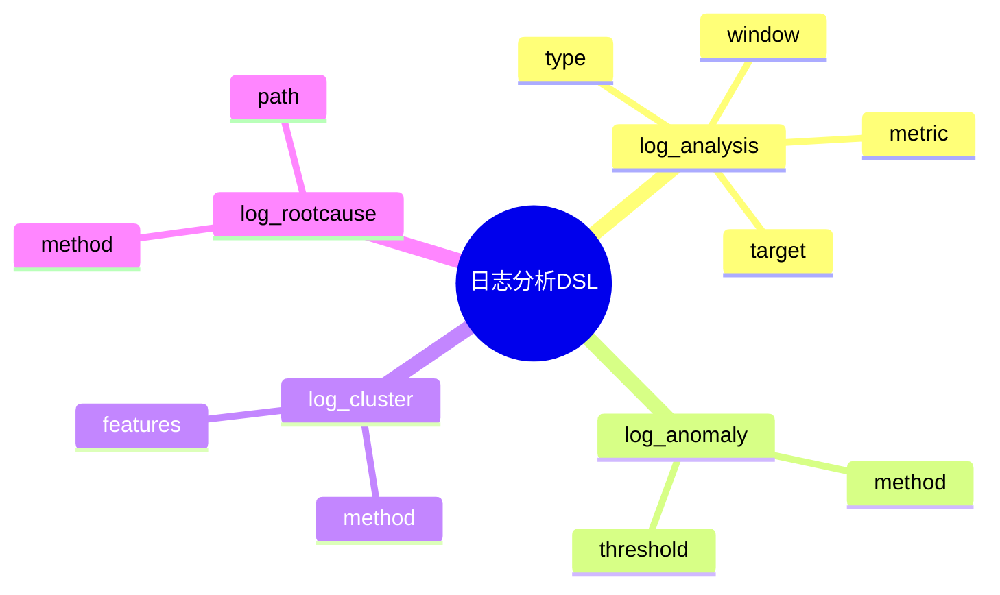

# 日志分析DSL草案

## 1. 设计目标

- 用声明式语法描述日志分析任务、指标、异常检测、聚类、根因分析等流程
- 支持多维度、多方法日志统一分析建模
- 便于自动生成分析与可视化配置

## 2. 基本语法结构

```dsl
log_analysis "error_rate" {
  type = "stat"
  target = "level == 'ERROR'"
  metric = "count / total"
  window = "1h"
}

log_anomaly "spike" {
  method = "zscore"
  threshold = 3
}

log_cluster "pattern" {
  method = "kmeans"
  features = ["msg", "service"]
}

log_rootcause "trace" {
  method = "dependency"
  path = "trace_id"
}
```

## 3. 关键元素

- log_analysis：分析任务定义
- log_anomaly：异常检测配置
- log_cluster：聚类分析配置
- log_rootcause：根因分析配置

---

## 4. 示例

```dsl
log_analysis "top_ips" {
  type = "stat"
  target = "ip"
  metric = "count"
  window = "24h"
}

log_anomaly "outlier" {
  method = "iqr"
  threshold = 1.5
}

log_cluster "access_pattern" {
  method = "dbscan"
  features = ["url", "status"]
}

log_rootcause "error_chain" {
  method = "event_correlation"
  path = "event_id"
}
```

---

## 5. 与主流标准的映射

| DSL元素      | ELK/Kibana | Grafana/Loki | Splunk |
|--------------|------------|--------------|--------|
| log_analysis | metric     | query        | search |
| log_anomaly  | watcher    | alert        | anomaly|
| log_cluster  | ML plugin  | n/a          | cluster|
| log_rootcause| n/a        | n/a          | rootcause|

---

## 6. 递归扩展建议

- 支持多级分析与自动化响应
- 分析与采集、存储、查询的统一DSL
- 分析与AI智能洞察的集成

---

## 7. 日志分析DSL关键元素表格

| 元素          | 说明           | 典型属性           |
|---------------|----------------|--------------------|
| log_analysis  | 分析任务定义   | type, target, metric, window |
| log_anomaly   | 异常检测配置   | method, threshold  |
| log_cluster   | 聚类分析配置   | method, features   |
| log_rootcause | 根因分析配置   | method, path       |

---

## 8. 日志分析DSL语法思维导图（Mermaid）



---

## 9. 形式化DSL推理片段

**推论：**  
若 log_analysis、log_anomaly、log_cluster、log_rootcause 语法均具备完备性，则任意日志分析流程均可通过DSL自动生成配置与推理链路。

**证明思路：**  

- 每个环节均可形式化为DSL声明；
- DSL可自动转化为分析/异常/聚类/根因配置；
- 组合DSL可推导出完整的日志分析链路。
