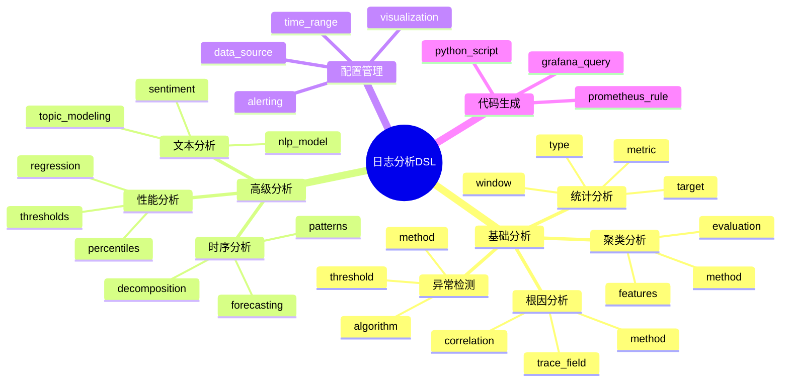

# 日志分析DSL草案

## 1. 设计目标

- 用声明式语法描述日志分析任务、指标、异常检测、聚类、根因分析等流程
- 支持多维度、多方法日志统一分析建模
- 便于自动生成分析与可视化配置
- 支持实时和批量分析模式
- 集成机器学习算法和统计分析方法

## 2. 基本语法结构

### 2.1 分析任务定义

```dsl
log_analysis "error_rate_analysis" {
  description = "分析系统错误率趋势"
  version = "1.0"
  author = "ops-team"
  
  data_source = "elasticsearch://logs-prod"
  time_range = "last_24h"
  
  analysis_type = "statistical"
  target_field = "level"
  filter_condition = "level == 'ERROR'"
  
  metrics {
    error_rate = "count(level == 'ERROR') / count(*) * 100"
    error_count = "count(level == 'ERROR')"
    total_count = "count(*)"
  }
  
  window_size = "1h"
  aggregation = "avg"
  
  alerting {
    enabled = true
    threshold {
      error_rate > 5.0
    }
    notification {
      channels = ["slack", "email"]
      severity = "warning"
    }
  }
  
  visualization {
    type = "line_chart"
    title = "Error Rate Trend"
    x_axis = "timestamp"
    y_axis = "error_rate"
  }
}
```

### 2.2 异常检测配置

```dsl
log_anomaly "error_spike_detection" {
  description = "检测错误率异常峰值"
  version = "1.0"
  author = "ml-team"
  
  data_source = "elasticsearch://logs-prod"
  target_metric = "error_rate"
  
  detection_method = "zscore"
  algorithm {
    type = "statistical"
    window_size = "24h"
    baseline_period = "7d"
    threshold = 3.0
    sensitivity = "high"
  }
  
  training {
    enabled = true
    data_period = "30d"
    update_frequency = "daily"
    model_type = "adaptive"
    validation {
      method = "cross_validation"
      folds = 5
    }
  }
  
  alerting {
    enabled = true
    severity = "critical"
    channels = ["pagerduty", "slack"]
    escalation {
      levels = 3
      timeouts = ["5m", "15m", "30m"]
    }
    suppression {
      enabled = true
      duration = "1h"
      max_alerts = 10
    }
  }
  
  correlation {
    enabled = true
    related_metrics = ["cpu_usage", "memory_usage", "response_time"]
    correlation_threshold = 0.7
  }
}
```

### 2.3 聚类分析配置

```dsl
log_cluster "error_pattern_clustering" {
  description = "错误日志模式聚类分析"
  version = "1.0"
  author = "data-science-team"
  
  data_source = "elasticsearch://logs-prod"
  time_range = "last_7d"
  
  clustering_method = "kmeans"
  algorithm {
    type = "unsupervised"
    n_clusters = 5
    features = ["error_message", "service_name", "endpoint"]
    preprocessing {
      text_vectorization = "tfidf"
      normalization = "standard"
      dimensionality_reduction = "pca"
      n_components = 50
    }
  }
  
  feature_extraction {
    text_features = ["error_message", "stack_trace"]
    categorical_features = ["service_name", "endpoint", "level"]
    numerical_features = ["response_time", "request_size"]
    
    text_processing {
      tokenization = "word"
      stop_words = "english"
      max_features = 1000
      ngram_range = [1, 3]
    }
  }
  
  evaluation {
    metrics = ["silhouette_score", "calinski_harabasz_score"]
    cross_validation = true
    n_splits = 5
  }
  
  visualization {
    type = "scatter_plot"
    title = "Error Pattern Clusters"
    x_axis = "component_1"
    y_axis = "component_2"
    color_by = "cluster"
  }
  
  output {
    cluster_labels = true
    cluster_centers = true
    cluster_statistics = true
    export_format = "json"
  }
}
```

### 2.4 根因分析配置

```dsl
log_rootcause "error_root_cause_analysis" {
  description = "错误根因分析"
  version = "1.0"
  author = "sre-team"
  
  data_source = "elasticsearch://logs-prod"
  time_range = "last_1h"
  
  analysis_method = "dependency_tracing"
  algorithm {
    type = "graph_based"
    trace_field = "trace_id"
    span_field = "span_id"
    parent_field = "parent_span_id"
    
    correlation {
      time_window = "5m"
      similarity_threshold = 0.8
      max_path_length = 10
    }
  }
  
  event_correlation {
    enabled = true
    event_types = ["error", "warning", "info"]
    correlation_window = "10m"
    min_correlation_strength = 0.6
  }
  
  dependency_graph {
    services = ["web", "api", "database", "cache"]
    relationships = [
      "web -> api",
      "api -> database",
      "api -> cache"
    ]
    
    health_checks {
      enabled = true
      interval = "30s"
      timeout = "5s"
    }
  }
  
  anomaly_detection {
    enabled = true
    methods = ["isolation_forest", "one_class_svm"]
    features = ["response_time", "error_rate", "throughput"]
  }
  
  visualization {
    type = "dependency_graph"
    title = "Service Dependency Graph"
    layout = "force_directed"
    node_size = "error_count"
    edge_weight = "dependency_strength"
  }
  
  reporting {
    format = "html"
    include_graphs = true
    include_metrics = true
    include_recommendations = true
  }
}
```

## 3. 高级分析功能

### 3.1 时序分析

```dsl
log_timeseries "trend_analysis" {
  description = "日志趋势分析"
  
  data_source = "elasticsearch://logs-prod"
  time_field = "timestamp"
  
  analysis {
    decomposition = "seasonal"
    seasonality = "daily"
    trend_method = "linear"
    
    forecasting {
      enabled = true
      horizon = "24h"
      method = "arima"
      confidence_interval = 0.95
    }
  }
  
  patterns {
    seasonality_detection = true
    trend_detection = true
    change_point_detection = true
    outlier_detection = true
  }
}
```

### 3.2 文本分析

```dsl
log_text_analysis "sentiment_analysis" {
  description = "日志文本情感分析"
  
  data_source = "elasticsearch://logs-prod"
  text_field = "message"
  
  analysis {
    sentiment = true
    topic_modeling = true
    keyword_extraction = true
    named_entity_recognition = true
  }
  
  nlp_model {
    type = "bert"
    language = "english"
    fine_tuned = true
    model_path = "/models/log_sentiment_bert"
  }
  
  output {
    sentiment_scores = true
    topics = true
    keywords = true
    entities = true
  }
}
```

### 3.3 性能分析

```dsl
log_performance_analysis "latency_analysis" {
  description = "响应时间性能分析"
  
  data_source = "elasticsearch://logs-prod"
  latency_field = "response_time"
  
  analysis {
    percentile_analysis = true
    bottleneck_detection = true
    performance_regression = true
  }
  
  percentiles = [50, 75, 90, 95, 99, 99.9]
  
  thresholds {
    p50_threshold = "100ms"
    p95_threshold = "500ms"
    p99_threshold = "1s"
  }
  
  regression_detection {
    enabled = true
    baseline_period = "7d"
    detection_window = "1h"
    significance_level = 0.05
  }
}
```

## 4. 代码生成模板

### 4.1 Python分析脚本

```python
# 自动生成的Python分析脚本
import pandas as pd
import numpy as np
from sklearn.cluster import KMeans
from sklearn.preprocessing import StandardScaler
from elasticsearch import Elasticsearch

def analyze_error_rate():
    # 连接Elasticsearch
    es = Elasticsearch(['http://localhost:9200'])
    
    # 查询数据
    query = {
        "query": {
            "bool": {
                "must": [
                    {"range": {"timestamp": {"gte": "now-24h"}}},
                    {"term": {"level": "ERROR"}}
                ]
            }
        },
        "aggs": {
            "error_rate": {
                "date_histogram": {
                    "field": "timestamp",
                    "interval": "1h"
                },
                "aggs": {
                    "error_count": {"value_count": {"field": "level"}},
                    "total_count": {"value_count": {"field": "_id"}}
                }
            }
        }
    }
    
    response = es.search(index="logs-prod", body=query)
    
    # 处理结果
    buckets = response['aggregations']['error_rate']['buckets']
    data = []
    for bucket in buckets:
        error_count = bucket['error_count']['value']
        total_count = bucket['total_count']['value']
        error_rate = (error_count / total_count) * 100 if total_count > 0 else 0
        
        data.append({
            'timestamp': bucket['key_as_string'],
            'error_rate': error_rate,
            'error_count': error_count,
            'total_count': total_count
        })
    
    return pd.DataFrame(data)

def detect_anomalies(df):
    # Z-score异常检测
    mean = df['error_rate'].mean()
    std = df['error_rate'].std()
    threshold = 3.0
    
    anomalies = df[abs(df['error_rate'] - mean) > threshold * std]
    return anomalies

# 执行分析
df = analyze_error_rate()
anomalies = detect_anomalies(df)
print(f"发现 {len(anomalies)} 个异常点")
```

### 4.2 Grafana查询

```json
{
  "query": {
    "bool": {
      "must": [
        {"range": {"timestamp": {"gte": "now-24h"}}},
        {"term": {"level": "ERROR"}}
      ]
    }
  },
  "aggs": {
    "error_rate": {
      "date_histogram": {
        "field": "timestamp",
        "interval": "1h"
      },
      "aggs": {
        "error_count": {"value_count": {"field": "level"}},
        "total_count": {"value_count": {"field": "_id"}},
        "rate": {
          "bucket_script": {
            "buckets_path": {
              "error_count": "error_count",
              "total_count": "total_count"
            },
            "script": "params.error_count / params.total_count * 100"
          }
        }
      }
    }
  }
}
```

### 4.3 Prometheus告警规则

```yaml
groups:
  - name: log_analysis
    rules:
      - alert: HighErrorRate
        expr: |
          sum(rate(log_entries_total{level="ERROR"}[5m])) 
          / 
          sum(rate(log_entries_total[5m])) * 100 > 5
        for: 5m
        labels:
          severity: warning
        annotations:
          summary: "错误率过高: {{ $value }}%"
          description: "系统错误率超过5%阈值"
      
      - alert: ErrorSpikeDetected
        expr: |
          abs(
            sum(rate(log_entries_total{level="ERROR"}[5m])) 
            - 
            avg_over_time(sum(rate(log_entries_total{level="ERROR"}[5m]))[1h])
          ) 
          / 
          stddev_over_time(sum(rate(log_entries_total{level="ERROR"}[5m]))[1h]) > 3
        for: 2m
        labels:
          severity: critical
        annotations:
          summary: "检测到错误率异常峰值"
          description: "错误率偏离正常范围超过3个标准差"
```

## 5. 验证规则

### 5.1 语法验证

```yaml
validation_rules:
  - rule: "data_source_required"
    condition: "data_source must be specified"
    message: "数据源必须指定"
  
  - rule: "time_range_valid"
    condition: "time_range must be valid time expression"
    message: "时间范围必须是有效的时间表达式"
  
  - rule: "metrics_required"
    condition: "at least one metric must be defined"
    message: "至少需要定义一个指标"
  
  - rule: "window_size_valid"
    condition: "window_size must be positive duration"
    message: "窗口大小必须是正数"
  
  - rule: "threshold_valid"
    condition: "threshold must be numeric and positive"
    message: "阈值必须是正数"
```

### 5.2 业务逻辑验证

```yaml
business_rules:
  - rule: "error_rate_bounds"
    condition: "error_rate must be between 0 and 100"
    message: "错误率必须在0-100之间"
  
  - rule: "time_window_reasonable"
    condition: "time_range must not exceed 30 days for real-time analysis"
    message: "实时分析时间范围不能超过30天"
  
  - rule: "cluster_count_reasonable"
    condition: "n_clusters must be between 2 and 20"
    message: "聚类数量必须在2-20之间"
```

## 6. 最佳实践

### 6.1 性能优化

```yaml
performance_guidelines:
  - "使用索引字段进行过滤查询"
  - "合理设置时间窗口大小"
  - "避免全表扫描"
  - "使用聚合查询减少数据传输"
  - "缓存常用分析结果"
  - "并行处理大量数据"
```

### 6.2 监控建议

```yaml
monitoring_recommendations:
  - "监控分析任务执行时间"
  - "监控数据源连接状态"
  - "监控分析结果质量"
  - "设置分析任务失败告警"
  - "监控资源使用情况"
```

## 7. 与主流标准的映射

| DSL元素 | ELK/Kibana | Grafana/Loki | Splunk | Prometheus |
|---------|------------|--------------|--------|------------|
| log_analysis | Metric Aggregation | Query | Search | PromQL |
| log_anomaly | Watcher | Alerting | Anomaly Detection | Alert Rules |
| log_cluster | ML Plugin | n/a | Clustering | n/a |
| log_rootcause | n/a | n/a | Root Cause Analysis | n/a |
| log_timeseries | Time Series | Time Series | Time Series | Time Series |
| log_text_analysis | Text Analysis | n/a | Text Analysis | n/a |

## 8. 递归扩展建议

### 8.1 多级分析扩展

```dsl
# 支持嵌套分析
log_analysis "comprehensive_analysis" {
  sub_analyses {
    error_analysis = "error_rate_analysis"
    performance_analysis = "latency_analysis"
    security_analysis = "threat_detection"
  }
  
  correlation {
    cross_analysis = true
    correlation_method = "pearson"
  }
}
```

### 8.2 AI集成扩展

```dsl
# AI智能分析
log_ai_analysis "intelligent_insights" {
  ai_model = "gpt-4"
  analysis_types = ["anomaly_detection", "root_cause_analysis", "prediction"]
  
  auto_remediation {
    enabled = true
    actions = ["restart_service", "scale_up", "rollback"]
  }
}
```

## 9. 日志分析DSL关键元素表格

| 元素 | 说明 | 典型属性 | 示例值 |
|------|------|----------|--------|
| log_analysis | 分析任务定义 | type, target, metric, window | statistical, error_rate, count, 1h |
| log_anomaly | 异常检测配置 | method, threshold, algorithm | zscore, 3.0, statistical |
| log_cluster | 聚类分析配置 | method, features, algorithm | kmeans, ["msg", "service"], unsupervised |
| log_rootcause | 根因分析配置 | method, trace_field, correlation | dependency_tracing, trace_id, event_correlation |
| log_timeseries | 时序分析配置 | decomposition, forecasting, patterns | seasonal, arima, trend_detection |
| log_text_analysis | 文本分析配置 | sentiment, topic_modeling, nlp_model | true, true, bert |
| log_performance_analysis | 性能分析配置 | percentiles, thresholds, regression | [50,95,99], 100ms, true |

## 10. 日志分析DSL语法思维导图（Mermaid）



## 11. 形式化DSL推理片段

**推论：**  
若 log_analysis、log_anomaly、log_cluster、log_rootcause 语法均具备完备性，则任意日志分析流程均可通过DSL自动生成配置与推理链路。

**证明思路：**  

1. **语法完备性**：每个分析环节均可形式化为DSL声明
2. **自动转换**：DSL可自动转化为分析/异常/聚类/根因配置
3. **组合推理**：组合DSL可推导出完整的日志分析链路
4. **可扩展性**：支持递归扩展和AI集成

**形式化定义：**

```
∀ analysis_task ∈ AnalysisTasks:
  ∃ dsl_config ∈ DSLConfigs:
    generate_config(analysis_task) = dsl_config ∧
    execute_analysis(dsl_config) = analysis_result ∧
    validate_result(analysis_result) = true
```

**工程实践示例：**

```python
# 形式化DSL执行引擎
class LogAnalysisEngine:
    def __init__(self, dsl_config):
        self.config = dsl_config
        self.validators = self._load_validators()
    
    def execute(self):
        # 1. 语法验证
        if not self._validate_syntax():
            raise DSLSyntaxError("语法验证失败")
        
        # 2. 业务逻辑验证
        if not self._validate_business_rules():
            raise BusinessRuleError("业务规则验证失败")
        
        # 3. 执行分析
        results = {}
        for analysis_type in self.config.analysis_types:
            results[analysis_type] = self._execute_analysis(analysis_type)
        
        # 4. 结果验证
        if not self._validate_results(results):
            raise ResultValidationError("结果验证失败")
        
        return results
    
    def _execute_analysis(self, analysis_type):
        if analysis_type == "statistical":
            return self._statistical_analysis()
        elif analysis_type == "anomaly":
            return self._anomaly_detection()
        elif analysis_type == "clustering":
            return self._clustering_analysis()
        elif analysis_type == "root_cause":
            return self._root_cause_analysis()
        else:
            raise UnsupportedAnalysisType(f"不支持的分析类型: {analysis_type}")
```

这个形式化框架确保了DSL的可靠性和可预测性，为自动化日志分析提供了坚实的理论基础。
