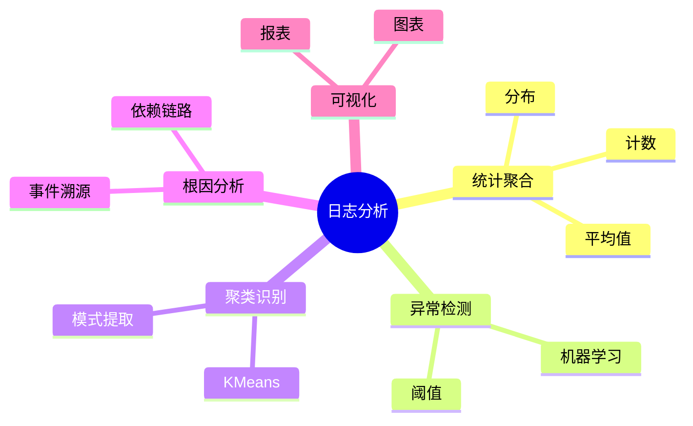

# 日志分析理论探讨

## 1. 形式化目标

- 明确日志分析的流程、方法、指标与自动化能力
- 支持多维度、多粒度的日志统计、聚类、异常检测与根因分析
- 为日志驱动的监控、运维、业务洞察等场景提供可验证的分析基础

## 2. 核心概念

- 统计分析（Statistical Analysis）
- 异常检测（Anomaly Detection）
- 聚类与模式识别（Clustering & Pattern Recognition）
- 根因分析（Root Cause Analysis）
- 可视化（Visualization）

## 3. 已有标准

- ELK Stack（Kibana）
- Grafana Loki
- OpenTelemetry Analysis
- Splunk

## 4. 可行性分析

- 日志分析流程、方法、指标等可DSL化
- 统计、聚类、异常检测、根因分析等可形式化建模
- 与采集、解析、存储、查询等可统一为日志处理链路

## 5. 自动化价值

- 自动生成分析与可视化配置
- 自动化异常检测与根因定位
- 分析与AI结合实现智能聚类、预测与洞察

## 6. 与AI结合点

- 智能日志聚类与模式识别
- 异常检测与根因分析
- 日志驱动的预测与业务洞察

## 7. 递归细分方向

- 统计与聚合分析（Statistics & Aggregation）
- 异常检测与聚类（Anomaly & Clustering）
- 根因分析与可视化（Root Cause & Visualization）
- 分析自动化与自愈（Automation & Remediation）

---

## 8. 常见分析元素表格

| 元素         | 说明           | 典型字段                |
|--------------|----------------|-------------------------|
| Analysis     | 分析任务       | type, target, config    |
| Metric       | 指标           | name, value, window     |
| Anomaly      | 异常检测       | method, threshold       |
| Cluster      | 聚类           | method, features        |
| RootCause    | 根因分析       | method, path            |

---

## 9. 日志分析流程思维导图（Mermaid）

---

## 10. 形式化推理/论证片段

**定理：**  
若日志分析的统计、聚类、异常检测、根因分析等环节均可形式化建模，则日志分析系统具备可验证性与可自动化推理能力。

**证明思路：**  

1. 统计与聚类可用DSL描述分析方法与目标；
2. 异常检测与根因分析可形式化为规则与推理链；
3. 整体流程可组合为可验证的分析链路。
