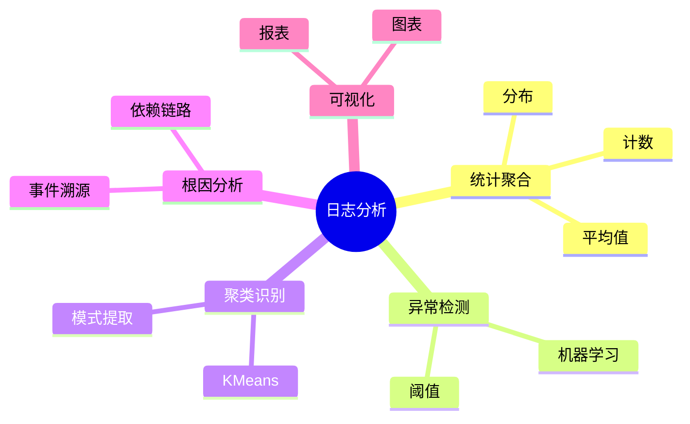

# 日志分析理论探讨

## 1. 形式化目标

- 明确日志分析的流程、方法、指标与自动化能力
- 支持多维度、多粒度的日志统计、聚类、异常检测与根因分析
- 为日志驱动的监控、运维、业务洞察等场景提供可验证的分析基础

## 2. 核心概念

- 统计分析（Statistical Analysis）
- 异常检测（Anomaly Detection）
- 聚类与模式识别（Clustering & Pattern Recognition）
- 根因分析（Root Cause Analysis）
- 可视化（Visualization）

## 3. 已有标准

- ELK Stack（Kibana）
- Grafana Loki
- OpenTelemetry Analysis
- Splunk

## 4. 可行性分析

- 日志分析流程、方法、指标等可DSL化
- 统计、聚类、异常检测、根因分析等可形式化建模
- 与采集、解析、存储、查询等可统一为日志处理链路

## 5. 自动化价值

- 自动生成分析与可视化配置
- 自动化异常检测与根因定位
- 分析与AI结合实现智能聚类、预测与洞察

## 6. 与AI结合点

- 智能日志聚类与模式识别
- 异常检测与根因分析
- 日志驱动的预测与业务洞察

## 7. 递归细分方向

- 统计与聚合分析（Statistics & Aggregation）
- 异常检测与聚类（Anomaly & Clustering）
- 根因分析与可视化（Root Cause & Visualization）
- 分析自动化与自愈（Automation & Remediation）

---

## 8. 常见分析元素表格

| 元素         | 说明           | 典型字段                |
|--------------|----------------|-------------------------|
| Analysis     | 分析任务       | type, target, config    |
| Metric       | 指标           | name, value, window     |
| Anomaly      | 异常检测       | method, threshold       |
| Cluster      | 聚类           | method, features        |
| RootCause    | 根因分析       | method, path            |

---

## 9. 日志分析流程思维导图（Mermaid）

---

## 10. 形式化推理/论证片段

**定理：**  
若日志分析的统计、聚类、异常检测、根因分析等环节均可形式化建模，则日志分析系统具备可验证性与可自动化推理能力。

**证明思路：**  

1. 统计与聚类可用DSL描述分析方法与目标；
2. 异常检测与根因分析可形式化为规则与推理链；
3. 整体流程可组合为可验证的分析链路。

---

## 11. 理论确定性与论证推理（源码级递归扩展）

### 1. 统计与聚合AST递归

- **统计AST递归**：
  - Elasticsearch/Loki `aggregation`模块递归定义聚合算子（count、avg、sum、percentile等）
  - OpenTelemetry Metrics递归聚合日志事件，AST结构体递归推理指标
- **窗口与分组递归**：
  - 滑动窗口、分组聚合递归实现，支持多维度、多粒度分析
  - Kibana/Loki聚合表达式递归解析与优化

### 2. 聚类与异常检测递归

- **聚类算法递归**：
  - KMeans、DBSCAN等聚类算法递归实现日志分组与模式识别
  - Splunk/ELK `ml`模块递归聚类日志事件，自动提取模式
- **异常检测递归**：
  - 统计阈值、机器学习、时序分析等多算法递归检测异常
  - OpenTelemetry Collector递归实现异常检测Processor

### 3. 根因分析与推理引擎递归

- **根因分析递归**：
  - 依赖链路、事件溯源递归推理根因路径
  - ELK Stack `graph`/`ml`模块递归分析事件因果关系
- **推理引擎递归**：
  - 规则引擎、模式匹配、因果推理递归实现根因定位
  - Loki/ELK递归实现多阶段推理链路

### 4. 可视化与自动化递归

- **可视化递归**：
  - Kibana、Grafana递归渲染聚合、聚类、异常检测结果
  - 动态仪表盘、交互式报表递归生成
- **自动化链路递归**：
  - CI/CD自动生成分析配置、可视化模板、异常检测规则
  - 自动化测试、监控、回滚递归链路

### 5. 类型安全与可证明性递归

- **类型安全递归**：
  - 分析任务、指标、聚类、异常检测等类型系统递归校验
  - 多源数据递归对齐，支持Schema演化与兼容性验证
- **可证明性递归**：
  - 分析流程、聚合算法、异常检测、根因分析全链路递归测试与验证
  - 分析结果的可追溯性、可复现性递归证明

### 6. AI自动化与工程最佳实践递归

- **AI驱动递归**：
  - AI自动补全分析方法、聚类参数、异常检测规则、根因分析链路
  - 智能聚类、异常预测、根因定位、自动修复建议
- **工程自动化递归**：
  - CI/CD自动生成分析、聚合、异常检测、可视化配置
  - 自动化测试、监控、回滚递归链路

### 7. 典型源码剖析（以ELK/Loki/OpenTelemetry为例）

- `elasticsearch/modules/aggregation`：递归实现聚合算子与窗口分析
- `loki/pkg/logql`：递归解析聚合、聚类、异常检测表达式
- `opentelemetry-collector/processor`：递归实现异常检测与聚合分析
- `splunk/ml`：递归实现聚类与异常检测算法
- `kibana/plugins/visualize`：递归渲染分析与可视化结果

---

如需针对某一源码文件、推理算法、类型系统实现等进行更深层递归剖析，可继续指定领域与理论点，递归扩展将持续补充。
