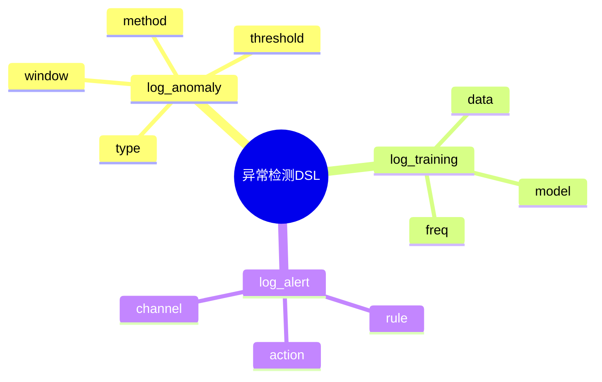

# 日志异常检测DSL草案

## 1. 设计目标

- 用声明式语法描述异常类型、检测方法、阈值、训练、告警等流程
- 支持多类型、多算法异常检测统一建模
- 便于自动生成检测与告警配置

## 2. 基本语法结构

```dsl
log_anomaly "error_spike" {
  type = "error"
  method = "zscore"
  threshold = 3
  window = "1h"
}

log_anomaly "latency_outlier" {
  type = "latency"
  method = "iqr"
  threshold = 1.5
}

log_training "adaptive" {
  data = "last_7d"
  model = "auto"
  freq = "daily"
}

log_alert "anomaly_alert" {
  rule = "anomaly_detected"
  action = "notify"
  channel = "email"
}
```

## 3. 关键元素

- log_anomaly：异常检测定义
- log_training：模型训练配置
- log_alert：异常告警配置

---

## 4. 示例

```dsl
log_anomaly "freq_jump" {
  type = "frequency"
  method = "stat"
  threshold = 2
}

log_training "weekly_update" {
  data = "last_30d"
  model = "ml"
  freq = "weekly"
}

log_alert "critical_anomaly" {
  rule = "severity == 'critical'"
  action = "sms"
  channel = "+8613800000000"
}
```

---

## 5. 与主流标准的映射

| DSL元素      | ELK Watcher | Splunk | Prometheus | OTel Processor |
|--------------|-------------|--------|------------|----------------|
| log_anomaly  | watcher     | anomaly| alert      | processor      |
| log_training | ML plugin   | train  | n/a        | trainer        |
| log_alert    | action      | alert  | alert      | exporter       |

---

## 6. 递归扩展建议

- 支持多级异常检测与自适应
- 异常检测与采集、存储、分析的统一DSL
- 异常检测与AI智能降噪的集成

---

## 7. 日志异常检测DSL关键元素表格

| 元素          | 说明           | 典型属性           |
|---------------|----------------|--------------------|
| log_anomaly   | 异常检测定义   | type, method, threshold, window |
| log_training  | 训练配置       | data, model, freq  |
| log_alert     | 告警配置       | rule, action, channel |

---

## 8. 日志异常检测DSL语法思维导图（Mermaid）



---

## 9. 形式化DSL推理片段

**推论：**  
若 log_anomaly、log_training、log_alert 语法均具备完备性，则任意异常检测流程均可通过DSL自动生成配置与推理链路。

**证明思路：**  

- 每个环节均可形式化为DSL声明；
- DSL可自动转化为检测/训练/告警配置；
- 组合DSL可推导出完整的异常检测链路。
