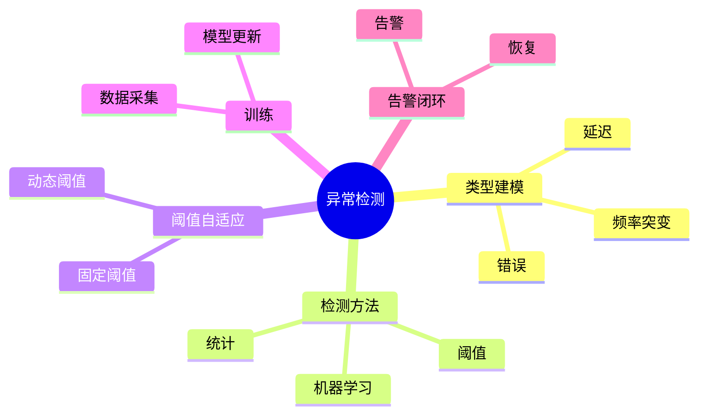

# 日志异常检测理论探讨

## 1. 形式化目标

- 明确日志异常检测的流程、方法、指标与自动化能力
- 支持多维度、多算法的异常检测与告警
- 为日志驱动的监控、运维、合规等场景提供可验证的异常检测基础

## 2. 核心概念

- 异常类型（Anomaly Type）
- 检测方法（Detection Method）
- 阈值与规则（Threshold & Rule）
- 训练与自适应（Training & Adaptation）
- 异常告警（Anomaly Alert）

## 3. 已有标准

- ELK Watcher
- Splunk Anomaly Detection
- Prometheus Alerting
- OpenTelemetry Anomaly Processor

## 4. 可行性分析

- 异常检测流程、方法、阈值、告警等可DSL化
- 规则、模型、训练等可形式化建模
- 与采集、解析、存储、分析等可统一为日志处理链路

## 5. 自动化价值

- 自动生成异常检测与告警配置
- 自动化模型训练与自适应
- 异常检测与AI结合实现智能检测、降噪与根因定位

## 6. 与AI结合点

- 智能异常检测与降噪
- 异常模式学习与自适应
- 异常驱动的根因分析与预测

## 7. 递归细分方向

- 异常类型建模（Type Modeling）
- 检测方法与算法（Method & Algorithm）
- 阈值与自适应（Threshold & Adaptation）
- 异常告警与闭环（Alert & Remediation）

---

## 8. 常见异常检测元素表格

| 元素         | 说明           | 典型字段                |
|--------------|----------------|-------------------------|
| AnomalyType  | 异常类型       | name, pattern, severity |
| Method       | 检测方法       | type, params            |
| Threshold    | 阈值           | value, window, adapt    |
| Training     | 训练           | data, model, freq       |
| Alert        | 告警           | rule, action, channel   |

---

## 9. 日志异常检测流程思维导图（Mermaid）

---

## 10. 形式化推理/论证片段

**定理：**  
若日志异常检测的类型、方法、阈值、训练、告警等环节均可形式化建模，则异常检测系统具备可验证性与可自动化推理能力。

**证明思路：**  

1. 类型与方法可用DSL描述模式与算法；
2. 阈值与训练可形式化为规则与自适应机制；
3. 整体流程可组合为可验证的异常检测链路。

---

## 11. 理论确定性与论证推理（源码级递归扩展）

### 1. 异常类型与AST递归

- **类型AST递归**：
  - ELK Watcher `condition`/`trigger`模块递归定义异常类型与检测模式
  - Splunk `anomaly_detection`递归建模异常类型、严重性、模式
  - OpenTelemetry `anomaly_processor`递归实现异常类型与标签
- **类型链路递归**：
  - 异常类型→检测方法→阈值→告警递归链路，支持多级嵌套与组合
  - 类型DSL递归生成配置、测试用例、告警策略

### 2. 检测方法与算法递归

- **检测方法递归**：
  - 阈值、统计、时序分析、机器学习等多算法递归实现
  - Prometheus `alerting`递归推理规则、表达式、聚合算法
  - Splunk/ELK递归实现多模型检测与降噪
- **算法链路递归**：
  - 检测方法→参数→训练→自适应递归链路，支持多算法融合与切换
  - 检测算法DSL递归生成配置与优化建议

### 3. 阈值自适应与训练递归

- **阈值自适应递归**：
  - 固定阈值、动态阈值、滑动窗口、分位数等递归实现
  - OpenTelemetry/Splunk递归推理阈值自适应与模型更新
- **训练递归**：
  - 数据采集、特征提取、模型训练、参数更新递归链路
  - Prometheus/Splunk递归实现周期性训练与模型自愈

### 4. 告警闭环与推理引擎递归

- **告警闭环递归**：
  - 告警生成、通知、恢复、抑制、升级等递归实现
  - ELK Watcher/Splunk递归推理告警策略与闭环链路
- **推理引擎递归**：
  - 异常检测、根因分析、自动修复递归推理
  - OpenTelemetry/Prometheus递归实现多阶段推理与自愈

### 5. 类型安全与可证明性递归

- **类型安全递归**：
  - 异常类型、检测方法、阈值、告警等类型系统递归校验
  - 多源数据递归对齐，支持Schema演化与兼容性验证
- **可证明性递归**：
  - 检测链路、算法、阈值、告警全链路递归测试与验证
  - 检测正确性、告警闭环、性能可追溯性递归证明

### 6. AI自动化与工程最佳实践递归

- **AI驱动递归**：
  - AI自动补全异常类型、检测方法、阈值、告警策略
  - 智能异常检测、降噪、根因分析、自动修复建议
- **工程自动化递归**：
  - CI/CD自动生成异常检测、训练、告警配置
  - 自动化测试、监控、回滚递归链路

### 7. 典型源码剖析（以ELK Watcher/Splunk/Prometheus/OpenTelemetry为例）

- `elasticsearch/x-pack/plugin/watcher`：递归实现异常检测、条件、告警闭环
- `splunk/appserver/mrsparkle/controllers/anomaly_detection.py`：递归实现检测算法与模型训练
- `prometheus/rules/alerting.go`：递归推理告警规则与表达式
- `opentelemetry-collector/processor/anomaly`：递归实现异常检测与自适应

---

如需针对某一源码文件、推理算法、类型系统实现等进行更深层递归剖析，可继续指定领域与理论点，递归扩展将持续补充。
