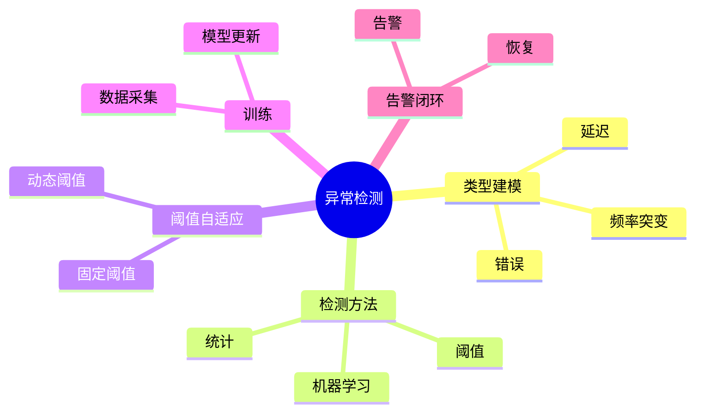

# 日志异常检测理论探讨

## 1. 形式化目标

- 明确日志异常检测的流程、方法、指标与自动化能力
- 支持多维度、多算法的异常检测与告警
- 为日志驱动的监控、运维、合规等场景提供可验证的异常检测基础

## 2. 核心概念

- 异常类型（Anomaly Type）
- 检测方法（Detection Method）
- 阈值与规则（Threshold & Rule）
- 训练与自适应（Training & Adaptation）
- 异常告警（Anomaly Alert）

## 3. 已有标准

- ELK Watcher
- Splunk Anomaly Detection
- Prometheus Alerting
- OpenTelemetry Anomaly Processor

## 4. 可行性分析

- 异常检测流程、方法、阈值、告警等可DSL化
- 规则、模型、训练等可形式化建模
- 与采集、解析、存储、分析等可统一为日志处理链路

## 5. 自动化价值

- 自动生成异常检测与告警配置
- 自动化模型训练与自适应
- 异常检测与AI结合实现智能检测、降噪与根因定位

## 6. 与AI结合点

- 智能异常检测与降噪
- 异常模式学习与自适应
- 异常驱动的根因分析与预测

## 7. 递归细分方向

- 异常类型建模（Type Modeling）
- 检测方法与算法（Method & Algorithm）
- 阈值与自适应（Threshold & Adaptation）
- 异常告警与闭环（Alert & Remediation）

---

## 8. 常见异常检测元素表格

| 元素         | 说明           | 典型字段                |
|--------------|----------------|-------------------------|
| AnomalyType  | 异常类型       | name, pattern, severity |
| Method       | 检测方法       | type, params            |
| Threshold    | 阈值           | value, window, adapt    |
| Training     | 训练           | data, model, freq       |
| Alert        | 告警           | rule, action, channel   |

---

## 9. 日志异常检测流程思维导图（Mermaid）

---

## 10. 形式化推理/论证片段

**定理：**  
若日志异常检测的类型、方法、阈值、训练、告警等环节均可形式化建模，则异常检测系统具备可验证性与可自动化推理能力。

**证明思路：**  

1. 类型与方法可用DSL描述模式与算法；
2. 阈值与训练可形式化为规则与自适应机制；
3. 整体流程可组合为可验证的异常检测链路。
