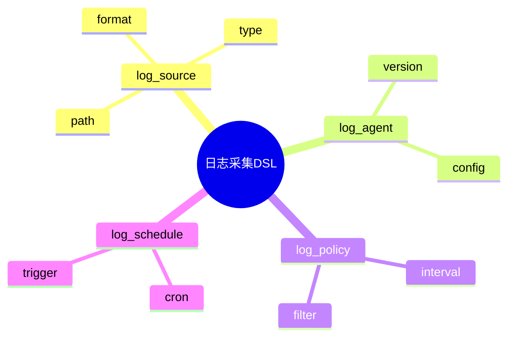

# 日志采集DSL草案

## 1. 设计目标

- 用声明式语法描述日志采集源、协议、策略、调度等流程
- 支持多源异构日志统一采集建模
- 便于自动生成采集与调度配置

## 2. 基本语法结构

```dsl
log_source "app" {
  path = "/var/log/app.log"
  type = "file"
  format = "json"
}

log_agent "fluentd" {
  version = "1.14"
  config = "fluent.conf"
}

log_policy "default" {
  interval = "1m"
  filter = "level != 'DEBUG'"
}

log_schedule "nightly" {
  cron = "0 0 * * *"
}
```

## 3. 关键元素

- log_source：日志采集源定义
- log_agent：采集代理配置
- log_policy：采集策略
- log_schedule：采集调度

---

## 4. 示例

```dsl
log_source "syslog" {
  path = "/var/log/syslog"
  type = "file"
  format = "rfc5424"
}

log_agent "otel_collector" {
  version = "0.80"
  config = "otel.yaml"
}

log_policy "error_only" {
  filter = "level == 'ERROR'"
}

log_schedule "on_event" {
  trigger = "file_change"
}
```

---

## 5. 与主流标准的映射

| DSL元素    | Fluentd/Bit | Logstash | OTel Collector |
|------------|-------------|----------|----------------|
| log_source | source      | input    | receiver       |
| log_agent  | agent       | agent    | service        |
| log_policy | filter      | filter   | processor      |
| log_schedule| schedule   | schedule | trigger        |

---

## 6. 递归扩展建议

- 支持多级采集与转发
- 采集与解析、存储的统一DSL
- 采集与AI优化的集成

---

## 7. 日志采集DSL关键元素表格

| 元素        | 说明           | 典型属性           |
|-------------|----------------|--------------------|
| log_source  | 采集源定义     | path, type, format |
| log_agent   | 采集代理配置   | version, config    |
| log_policy  | 采集策略       | interval, filter   |
| log_schedule| 采集调度       | cron, trigger      |

---

## 8. 日志采集DSL语法思维导图（Mermaid）



---

## 9. 形式化DSL推理片段

**推论：**  
若 log_source、log_agent、log_policy、log_schedule 语法均具备完备性，则任意日志采集流程均可通过DSL自动生成配置与推理链路。

**证明思路：**  

- 每个环节均可形式化为DSL声明；
- DSL可自动转化为采集/调度配置；
- 组合DSL可推导出完整的日志采集链路。
