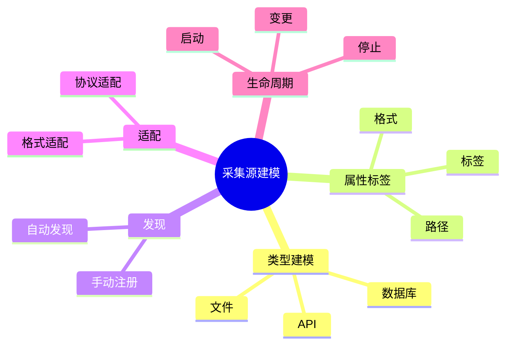

# 日志采集-源建模理论探讨

## 1. 形式化目标

- 明确日志采集源的类型、结构、属性与生命周期
- 支持多源异构日志的自动化发现、建模与管理
- 为日志采集、归一化、动态适配等场景提供可验证的源建模基础

## 2. 核心概念

- 源类型（Source Type）
- 源属性（Source Attribute）
- 源发现（Source Discovery）
- 源适配（Source Adaptation）
- 源生命周期（Source Lifecycle）

## 3. 已有标准

- Fluentd Source
- Filebeat Input
- OpenTelemetry Receiver
- Logstash Input

## 4. 可行性分析

- 源类型、属性、发现、适配等流程可DSL化
- 源生命周期、动态变更等可形式化建模
- 与采集、解析、存储等可统一为日志处理链路

## 5. 自动化价值

- 自动生成采集源配置与适配策略
- 自动化多源日志归一化与动态发现
- 源建模与AI结合实现智能源识别与自适应

## 6. 与AI结合点

- 智能源类型识别与归类
- 源属性自动补全与异常检测
- 源动态适配与优化

## 7. 递归细分方向

- 源类型建模（Type Modeling）
- 源属性与标签（Attribute & Label）
- 源发现与适配（Discovery & Adaptation）
- 源生命周期管理（Lifecycle Management）

---

## 8. 常见采集源元素表格

| 元素         | 说明           | 典型字段                |
|--------------|----------------|-------------------------|
| SourceType   | 源类型         | name, category, format  |
| Attribute    | 源属性         | key, value, type        |
| Discovery    | 源发现         | method, interval        |
| Adaptation   | 源适配         | strategy, rule          |
| Lifecycle    | 生命周期       | state, event, action    |

---

## 9. 日志采集源建模流程思维导图（Mermaid）

---

## 10. 形式化推理/论证片段

**定理：**  
若日志采集源的类型、属性、发现、适配、生命周期等环节均可形式化建模，则采集源管理系统具备可验证性与可自动化推理能力。

**证明思路：**  

1. 类型与属性可用DSL描述结构与标签；
2. 发现与适配可形式化为规则与策略；
3. 生命周期可归约为状态机与事件流；
4. 整体流程可组合为可验证的采集源链路。
