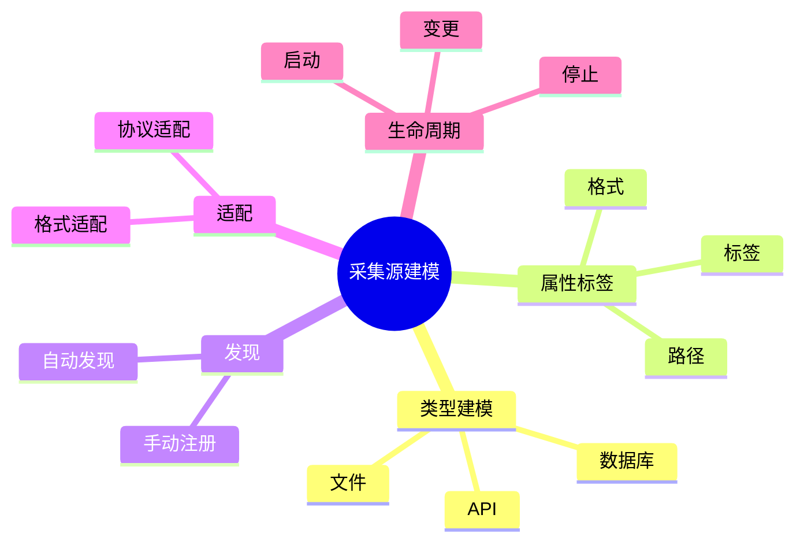

# 日志采集-源建模理论探讨

## 1. 形式化目标

- 明确日志采集源的类型、结构、属性与生命周期
- 支持多源异构日志的自动化发现、建模与管理
- 为日志采集、归一化、动态适配等场景提供可验证的源建模基础

## 2. 核心概念

- 源类型（Source Type）
- 源属性（Source Attribute）
- 源发现（Source Discovery）
- 源适配（Source Adaptation）
- 源生命周期（Source Lifecycle）

## 3. 已有标准

- Fluentd Source
- Filebeat Input
- OpenTelemetry Receiver
- Logstash Input

## 4. 可行性分析

- 源类型、属性、发现、适配等流程可DSL化
- 源生命周期、动态变更等可形式化建模
- 与采集、解析、存储等可统一为日志处理链路

## 5. 自动化价值

- 自动生成采集源配置与适配策略
- 自动化多源日志归一化与动态发现
- 源建模与AI结合实现智能源识别与自适应

## 6. 与AI结合点

- 智能源类型识别与归类
- 源属性自动补全与异常检测
- 源动态适配与优化

## 7. 递归细分方向

- 源类型建模（Type Modeling）
- 源属性与标签（Attribute & Label）
- 源发现与适配（Discovery & Adaptation）
- 源生命周期管理（Lifecycle Management）

---

## 8. 常见采集源元素表格

| 元素         | 说明           | 典型字段                |
|--------------|----------------|-------------------------|
| SourceType   | 源类型         | name, category, format  |
| Attribute    | 源属性         | key, value, type        |
| Discovery    | 源发现         | method, interval        |
| Adaptation   | 源适配         | strategy, rule          |
| Lifecycle    | 生命周期       | state, event, action    |

---

## 9. 日志采集源建模流程思维导图（Mermaid）

---

## 10. 形式化推理/论证片段

**定理：**  
若日志采集源的类型、属性、发现、适配、生命周期等环节均可形式化建模，则采集源管理系统具备可验证性与可自动化推理能力。

**证明思路：**  

1. 类型与属性可用DSL描述结构与标签；
2. 发现与适配可形式化为规则与策略；
3. 生命周期可归约为状态机与事件流；
4. 整体流程可组合为可验证的采集源链路。

---

## 11. 理论确定性与论证推理（源码级递归扩展）

### 1. 源类型与AST递归

- **类型AST递归**：
  - Fluentd/Filebeat `input`/`source`模块递归定义源类型，AST结构体递归推理类型、格式、标签
  - OpenTelemetry Receiver递归实现多类型源建模与适配
- **类型链路递归**：
  - 源类型→属性→发现→适配→生命周期递归链路，支持多级嵌套与组合
  - 类型DSL递归生成配置、测试用例、适配策略

### 2. 属性与标签递归

- **属性递归**：
  - 路径、格式、标签等属性递归建模，支持类型推断与自动补全
  - Logstash/Fluentd递归实现属性映射与标签归一化
- **标签系统递归**：
  - 多级标签、动态标签、自动归类递归实现
  - OpenTelemetry递归推理标签体系与属性映射

### 3. 发现与适配递归

- **发现递归**：
  - 自动发现、手动注册、动态扫描递归实现
  - Filebeat/Fluentd递归推理源发现与注册链路
- **适配递归**：
  - 格式适配、协议适配、动态适配递归实现
  - OpenTelemetry/Logstash递归推理适配策略与引擎

### 4. 生命周期管理递归

- **生命周期递归**：
  - 启动、变更、停止、重启等状态递归建模
  - Fluentd/Filebeat递归实现源状态机与事件流
- **事件驱动递归**：
  - 状态变更、事件触发、自动恢复递归实现
  - OpenTelemetry递归推理生命周期事件链路

### 5. 类型安全与可证明性递归

- **类型安全递归**：
  - 源类型、属性、标签、适配等类型系统递归校验
  - 多源递归对齐，支持Schema演化与兼容性验证
- **可证明性递归**：
  - 源建模、属性、发现、适配、生命周期全链路递归测试与验证
  - 源发现正确性、适配兼容性、生命周期可追溯性递归证明

### 6. AI自动化与工程最佳实践递归

- **AI驱动递归**：
  - AI自动补全源类型、属性、标签、适配策略
  - 智能源发现、动态适配、异常检测、自动修复建议
- **工程自动化递归**：
  - CI/CD自动生成源建模、属性、适配、生命周期配置
  - 自动化测试、监控、回滚递归链路

### 7. 典型源码剖析（以Fluentd/Filebeat/OTel/Logstash为例）

- `fluentd/lib/fluent/plugin/in_tail.rb`：递归实现文件源类型、属性、生命周期
- `filebeat/input`：递归定义源类型、发现、适配、状态管理
- `opentelemetry-collector/receiver`：递归实现多类型源建模与适配
- `logstash/lib/logstash/inputs`：递归实现多协议源类型与属性映射

---

如需针对某一源码文件、推理算法、类型系统实现等进行更深层递归剖析，可继续指定领域与理论点，递归扩展将持续补充。
