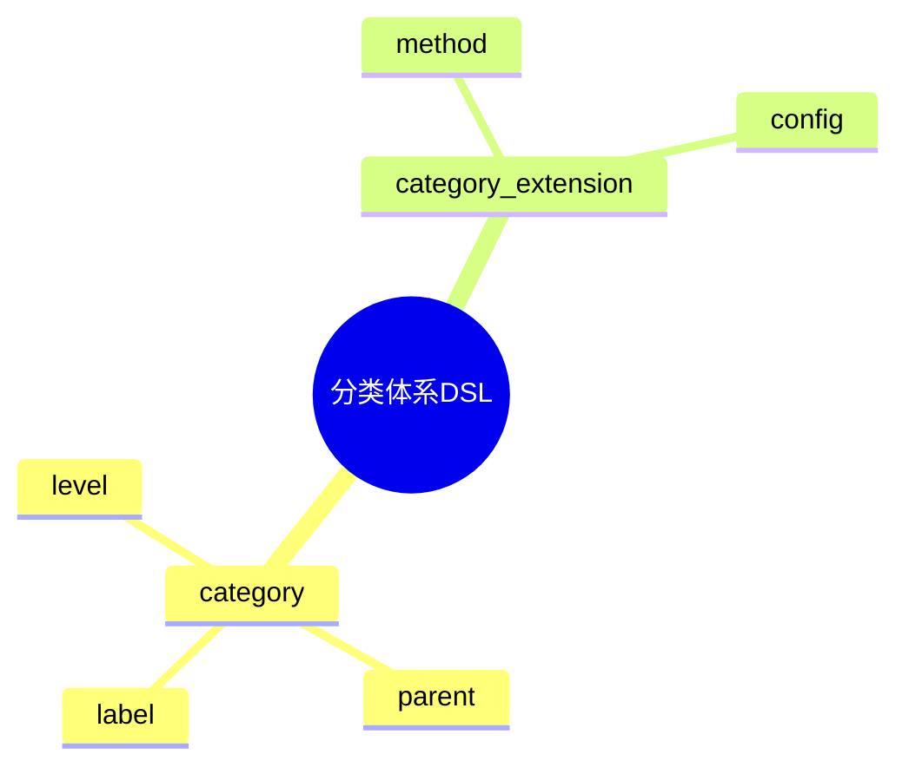

# 日志采集-源类型建模-分类体系DSL草案

## 1. 设计目标

- 用声明式语法描述类型分类标准、层级、标签、扩展等流程
- 支持多层级、多标签类型分类统一建模
- 便于自动生成分类与标签配置

## 2. 基本语法结构

```dsl
category "file" {
  level = 1
  label = ["local", "unstructured"]
}

category "syslog" {
  level = 2
  parent = "file"
  label = ["system"]
}

category "auth" {
  level = 3
  parent = "syslog"
  label = ["facility"]
}

category_extension "custom" {
  method = "plugin"
  config = "custom_plugin.yaml"
}
```

## 3. 关键元素

- category：类型分类定义
- category_extension：分类扩展配置

---

## 4. 示例

```dsl
category "database" {
  level = 1
  label = ["structured"]
}

category "mysql" {
  level = 2
  parent = "database"
  label = ["db"]
}

category_extension "dynamic" {
  method = "dynamic"
  config = "auto_discover"
}
```

---

## 5. 与主流标准的映射

| DSL元素        | Fluentd | Filebeat | OTel Receiver | Logstash |
|----------------|---------|----------|---------------|----------|
| category       | source  | input    | receiver      | input    |
| category_extension | plugin | module   | extension     | plugin   |

---

## 6. 递归扩展建议

- 支持多级分类与多标签体系
- 分类体系与类型建模、采集的统一DSL
- 分类体系与AI智能识别的集成

---

## 7. 分类体系DSL关键元素表格

| 元素            | 说明           | 典型属性           |
|-----------------|----------------|--------------------|
| category        | 分类定义       | level, parent, label |
| category_extension | 分类扩展配置 | method, config     |

---

## 8. 分类体系DSL语法思维导图（Mermaid）



---

## 9. 形式化DSL推理片段

**推论：**  
若 category、category_extension 语法均具备完备性，则任意类型分类体系均可通过DSL自动生成配置与推理链路。

**证明思路：**  

- 每个环节均可形式化为DSL声明；
- DSL可自动转化为分类/扩展配置；
- 组合DSL可推导出完整的分类体系链路。
