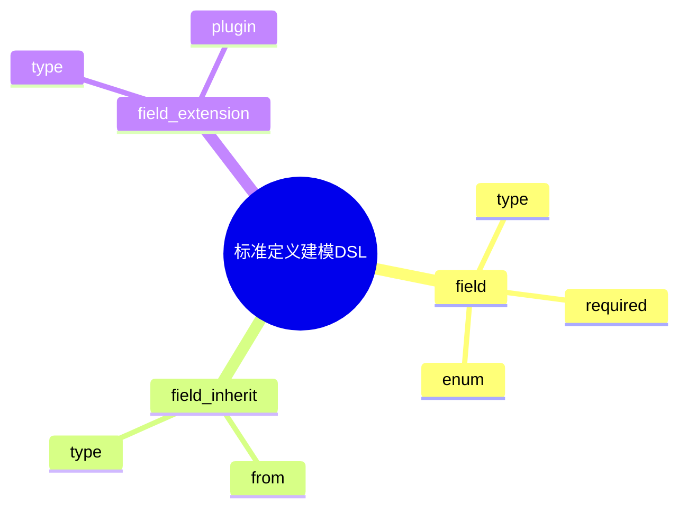

# 日志采集-源类型建模-分类体系-分类标准建模-标准定义建模DSL草案

## 1. 设计目标

- 用声明式语法描述标准字段定义、结构约束、继承、扩展等流程
- 支持多标准字段、动态扩展与继承的统一建模
- 便于自动生成标准字段与结构配置

## 2. 基本语法结构

```dsl
field "facility" {
  type = "string"
  required = true
  enum = ["auth", "cron", "daemon"]
}

field "severity" {
  type = "string"
  required = true
  enum = ["emerg", "alert", "crit", "err", "warning", "notice", "info", "debug"]
}

field "label" {
  type = "string[]"
  required = false
}

field_inherit "otel_receiver" {
  from = "receiver"
  type = "string"
}

field_extension "custom_field" {
  type = "string"
  plugin = "custom_plugin"
}
```

## 3. 关键元素

- field：标准字段定义
- field_inherit：字段继承配置
- field_extension：字段扩展配置

---

## 4. 示例

```dsl
field "input" {
  type = "string"
  required = true
}

field_inherit "module" {
  from = "input"
  type = "string"
}

field_extension "dynamic_field" {
  type = "int"
  plugin = "dynamic_plugin"
}
```

---

## 5. 与主流标准的映射

| DSL元素        | Syslog | Fluentd | OTel | Filebeat |
|----------------|--------|---------|------|----------|
| field          | field  | field   | field| field    |
| field_inherit  | n/a    | n/a     | n/a  | n/a      |
| field_extension| plugin | plugin  | extension| module |

---

## 6. 递归扩展建议

- 支持多级字段继承与动态扩展
- 字段建模与标准建模、分类体系的统一DSL
- 字段建模与AI智能识别的集成

---

## 7. 标准定义建模DSL关键元素表格

| 元素            | 说明           | 典型属性           |
|-----------------|----------------|--------------------|
| field           | 字段定义       | type, required, enum |
| field_inherit   | 字段继承配置   | from, type         |
| field_extension | 字段扩展配置   | type, plugin       |

---

## 8. 标准定义建模DSL语法思维导图（Mermaid）



---

## 9. 形式化DSL推理片段

**推论：**  
若 field、field_inherit、field_extension 语法均具备完备性，则任意标准定义建模流程均可通过DSL自动生成配置与推理链路。

**证明思路：**  

- 每个环节均可形式化为DSL声明；
- DSL可自动转化为字段/继承/扩展配置；
- 组合DSL可推导出完整的标准定义建模链路。
