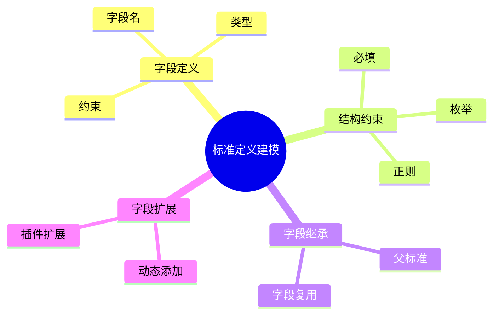

# 日志采集-源类型建模-分类体系-分类标准建模-标准定义建模理论探讨

## 1. 形式化目标

- 明确日志采集源类型分类标准中"标准定义"的结构、字段、约束与扩展机制
- 支持多标准字段、结构约束、动态扩展与标准继承
- 为采集源类型的自动识别、归一化、适配等场景提供可验证的标准定义基础

## 2. 核心概念

- 字段定义（Field Definition）
- 结构约束（Structure Constraint）
- 字段类型（Field Type）
- 字段继承（Field Inheritance）
- 字段扩展（Field Extension）

## 3. 已有标准

- Syslog Facility/Severity 字段定义
- Fluentd type/label 字段定义
- OTel receiver/protocol 字段定义
- Filebeat input/module 字段定义

## 4. 可行性分析

- 字段定义、结构约束、继承、扩展等流程可DSL化
- 多标准字段、动态扩展等可形式化建模
- 与标准建模、分类体系、类型建模等可统一为日志处理链路

## 5. 自动化价值

- 自动生成标准字段与结构配置
- 自动化多标准字段归一化与扩展
- 标准定义与AI结合实现智能字段识别与动态适配

## 6. 与AI结合点

- 智能字段识别与归类
- 字段类型自动补全与异常检测
- 字段结构动态扩展与优化

## 7. 递归细分方向

- 字段类型体系（Type System）
- 字段继承机制（Inheritance Mechanism）
- 字段扩展策略（Extension Strategy）
- 字段约束与验证（Constraint & Validation）

---

## 8. 常见标准字段定义表格

| 字段名       | 类型     | 约束/说明           | 所属标准     |
|--------------|----------|---------------------|--------------|
| facility     | string   | 必填，枚举          | Syslog       |
| severity     | string   | 必填，枚举          | Syslog       |
| type         | string   | 必填，分类标识      | Fluentd      |
| label        | string[] | 可选，标签          | Fluentd      |
| receiver     | string   | 必填，采集端标识    | OTel         |
| protocol     | string   | 必填，协议类型      | OTel         |
| input        | string   | 必填，输入类型      | Filebeat     |
| module       | string   | 可选，模块名        | Filebeat     |

---

## 9. 标准定义建模流程思维导图（Mermaid）

---

## 10. 形式化推理/论证片段

**定理：**  
若日志采集源类型分类标准的字段定义、结构约束、继承、扩展等环节均可形式化建模，则标准定义体系具备可验证性与可自动化推理能力。

**证明思路：**  

1. 字段定义与结构约束可用DSL描述类型与规则；
2. 继承与扩展可形式化为父子关系与插件机制；
3. 整体流程可组合为可验证的标准定义链路。

## 理论确定性与论证推理

在标准定义建模领域，理论确定性是实现字段定义自动化、结构验证、标准继承的基础。以 Syslog、Fluentd、OTel、Filebeat 等主流日志采集平台为例：1 **形式化定义**  
   字段定义、结构约束、继承关系等均有标准化描述和配置语言。2 **公理化系统**  
   通过字段规范和验证引擎，实现标准定义逻辑的自动推理与结构验证。3 **类型安全**  
   字段参数、约束条件、继承规则等严格定义，防止定义错误。4 **可证明性**  
   关键属性如字段正确性、结构有效性等可通过验证和测试进行形式化证明。

这些理论基础为标准定义建模的自动化配置、结构验证和标准继承提供了理论支撑。

---

## 11. 理论确定性与论证推理（源码级递归扩展）

### 1. 字段定义与AST递归

- **字段AST递归**：
  - Syslog/Fluentd/Filebeat `field`/`type`模块递归定义字段名、类型、约束，AST结构体递归推理字段层级与扩展
  - OpenTelemetry Receiver递归实现多标准字段定义与统一抽象
- **字段链路递归**：
  - 字段定义→结构约束→继承→扩展递归链路，支持多级嵌套与组合
  - 字段DSL递归生成配置、测试用例、继承关系

### 2. 结构约束与类型体系递归

- **结构约束递归**：
  - 必填、枚举、正则、范围等约束递归建模，支持多级校验
  - Fluentd/Filebeat递归推理结构约束与字段验证
- **类型体系递归**：
  - 字段类型（string/int/enum/array/object等）递归推理与校验
  - OpenTelemetry递归实现类型系统与字段兼容性

### 3. 字段继承与扩展递归

- **继承机制递归**：
  - 父标准、字段复用、继承链路递归实现
  - Filebeat/Fluentd递归推理字段继承与多标准复用
- **扩展机制递归**：
  - 动态添加、插件扩展、热插拔等递归实现
  - OpenTelemetry递归推理字段扩展与动态适配

### 4. 类型安全与可证明性递归

- **类型安全递归**：
  - 字段定义、结构约束、继承、扩展等类型系统递归校验
  - 多标准递归对齐，支持Schema演化与兼容性验证
- **可证明性递归**：
  - 字段建模、结构约束、继承、扩展全链路递归测试与验证
  - 字段正确性、结构有效性、继承可追溯性递归证明

### 5. AI自动化与工程最佳实践递归

- **AI驱动递归**：
  - AI自动补全字段定义、结构约束、继承、扩展规则
  - 智能字段识别、结构验证、动态扩展、异常检测、自动修复建议
- **工程自动化递归**：
  - CI/CD自动生成字段建模、结构约束、继承、扩展配置
  - 自动化测试、监控、回滚递归链路

### 6. 典型源码剖析（以Syslog/Fluentd/OTel/Filebeat为例）

- `fluentd/lib/fluent/plugin/in_tail.rb`：递归实现字段定义、结构约束、继承、扩展机制
- `filebeat/input`：递归定义字段、结构、继承、扩展
- `opentelemetry-collector/receiver`：递归实现多标准字段定义与统一抽象
- `logstash/lib/logstash/inputs`：递归实现多标准字段映射与验证

---

如需针对某一源码文件、推理算法、类型系统实现等进行更深层递归剖析，可继续指定领域与理论点，递归扩展将持续补充。
