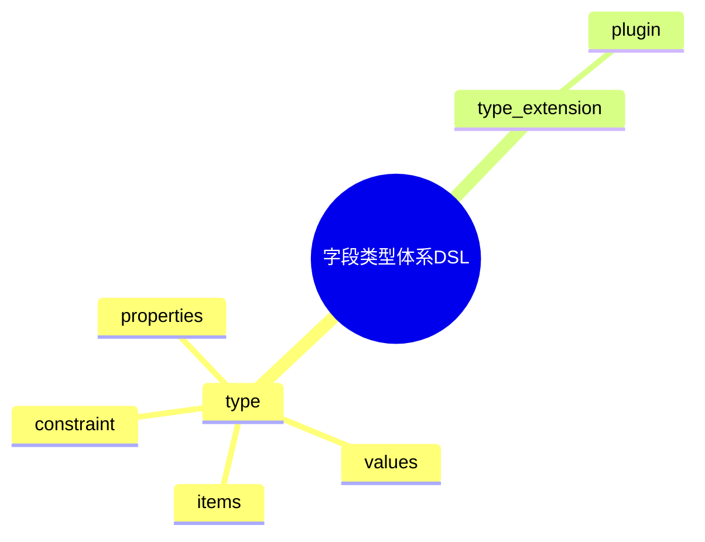

# 日志采集-源类型建模-分类体系-分类标准建模-标准定义建模-字段类型体系DSL草案

## 1. 设计目标

- 用声明式语法描述字段基本类型、复合类型、枚举类型、约束、扩展等流程
- 支持多类型、多层级字段类型统一建模
- 便于自动生成类型与约束配置

## 2. 基本语法结构

```dsl
type "string" {
  constraint = "pattern:.*"
}

type "int" {
  constraint = "range:0-100"
}

type "enum_severity" {
  values = ["emerg", "alert", "crit", "err", "warning", "notice", "info", "debug"]
}

type "array_string" {
  items = "string"
}

type_extension "custom_type" {
  plugin = "custom_plugin"
}
```

## 3. 关键元素

- type：字段类型定义
- type_extension：类型扩展配置

---

## 4. 示例

```dsl
type "object_log" {
  properties = { "msg": "string", "level": "enum_severity" }
}

type_extension "dynamic_type" {
  plugin = "dynamic_plugin"
}
```

---

## 5. 与主流标准的映射

| DSL元素        | JSON Schema | Protobuf | OpenAPI | Fluentd/OTel |
|----------------|-------------|----------|---------|--------------|
| type           | type        | type     | type    | type         |
| type_extension | extension   | custom   | extension| plugin       |

---

## 6. 递归扩展建议

- 支持多级类型定义与动态扩展
- 类型体系与标准建模、分类体系的统一DSL
- 类型体系与AI智能识别的集成

---

## 7. 字段类型体系DSL关键元素表格

| 元素            | 说明           | 典型属性           |
|-----------------|----------------|--------------------|
| type            | 类型定义       | constraint, values, items, properties |
| type_extension  | 类型扩展配置   | plugin             |

---

## 8. 字段类型体系DSL语法思维导图（Mermaid）



---

## 9. 形式化DSL推理片段

**推论：**  
若 type、type_extension 语法均具备完备性，则任意字段类型体系均可通过DSL自动生成配置与推理链路。

**证明思路：**  

- 每个环节均可形式化为DSL声明；
- DSL可自动转化为类型/扩展配置；
- 组合DSL可推导出完整的类型体系链路。
