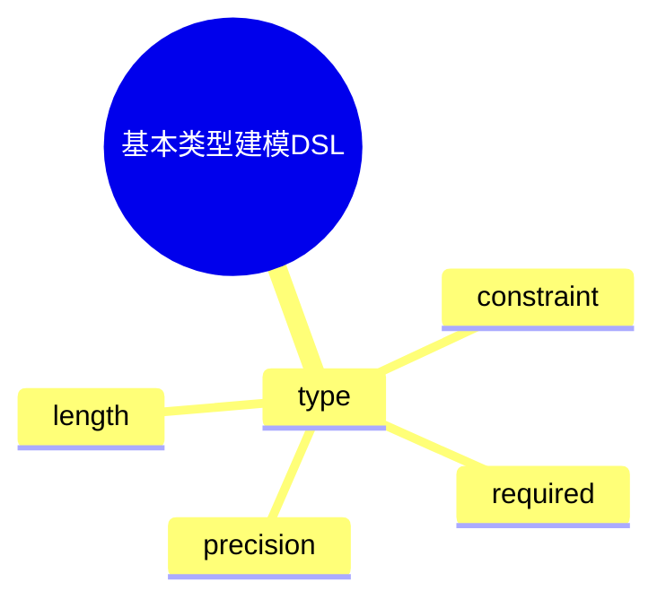

# 日志采集-源类型建模-分类体系-分类标准建模-标准定义建模-字段类型体系-基本类型建模DSL草案

## 1. 设计目标

- 用声明式语法描述基本类型定义、约束、映射、扩展等流程
- 支持多种原子类型统一建模
- 便于自动生成类型与约束配置

## 2. 基本语法结构

```dsl
type "string" {
  constraint = "pattern:^[a-zA-Z0-9_]+$"
  length = 255
}

type "int" {
  constraint = "range:0-1000"
  required = true
}

type "float" {
  constraint = "range:0.0-100.0"
  precision = 2
}

type "bool" {
  required = true
}
```

## 3. 关键元素

- type：基本类型定义

---

## 4. 示例

```dsl
type "string_short" {
  constraint = "pattern:^[a-z]+$"
  length = 32
}

type "int_positive" {
  constraint = "range:1-"
  required = true
}
```

---

## 5. 与主流标准的映射

| DSL元素        | JSON Schema | Protobuf | OpenAPI | Fluentd/OTel |
|----------------|-------------|----------|---------|--------------|
| type           | type        | type     | type    | type         |

---

## 6. 递归扩展建议

- 支持多级类型定义与动态扩展
- 基本类型建模与类型体系、标准建模的统一DSL
- 基本类型建模与AI智能识别的集成

---

## 7. 基本类型建模DSL关键元素表格

| 元素            | 说明           | 典型属性           |
|-----------------|----------------|--------------------|
| type            | 类型定义       | constraint, length, required, precision |

---

## 8. 基本类型建模DSL语法思维导图（Mermaid）



---

## 9. 形式化DSL推理片段

**推论：**  
若 type 语法具备完备性，则任意基本类型建模流程均可通过DSL自动生成配置与推理链路。

**证明思路：**  

- 每个类型均可形式化为DSL声明；
- DSL可自动转化为类型/约束配置；
- 组合DSL可推导出完整的基本类型建模链路。
