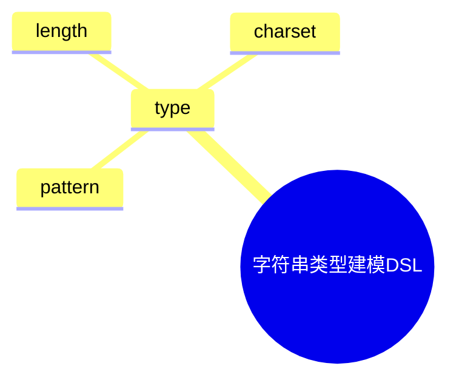

# 日志采集-源类型建模-分类体系-分类标准建模-标准定义建模-字段类型体系-基本类型建模-字符串类型建模DSL草案

## 1. 设计目标

- 用声明式语法描述字符串类型定义、约束、编码、扩展等流程
- 支持多种字符串类型统一建模
- 便于自动生成类型与约束配置

## 2. 基本语法结构

```dsl
type "string" {
  pattern = "^[a-zA-Z0-9_]+$"
  length = 255
  charset = "UTF-8"
}

type "id" {
  pattern = "^[A-Z0-9]{8,16}$"
  length = 16
  charset = "ASCII"
}

type "i18n_str" {
  length = 512
  charset = "multi-lang"
}
```

## 3. 关键元素

- type：字符串类型定义

---

## 4. 示例

```dsl
type "label" {
  pattern = "^[a-z_]+$"
  length = 32
  charset = "UTF-8"
}

type "message" {
  length = 1024
  charset = "UTF-8"
}
```

---

## 5. 与主流标准的映射

| DSL元素        | JSON Schema | Protobuf | OpenAPI | Fluentd/OTel |
|----------------|-------------|----------|---------|--------------|
| type           | string      | string   | string  | string       |

---

## 6. 递归扩展建议

- 支持多级字符串类型定义与动态扩展
- 字符串类型建模与类型体系、标准建模的统一DSL
- 字符串类型建模与AI智能识别的集成

---

## 7. 字符串类型建模DSL关键元素表格

| 元素            | 说明           | 典型属性           |
|-----------------|----------------|--------------------|
| type            | 类型定义       | pattern, length, charset |

---

## 8. 字符串类型建模DSL语法思维导图（Mermaid）



---

## 9. 形式化DSL推理片段

**推论：**  
若 type 语法具备完备性，则任意字符串类型建模流程均可通过DSL自动生成配置与推理链路。

**证明思路：**  

- 每个类型均可形式化为DSL声明；
- DSL可自动转化为类型/约束/编码配置；
- 组合DSL可推导出完整的字符串类型建模链路。
