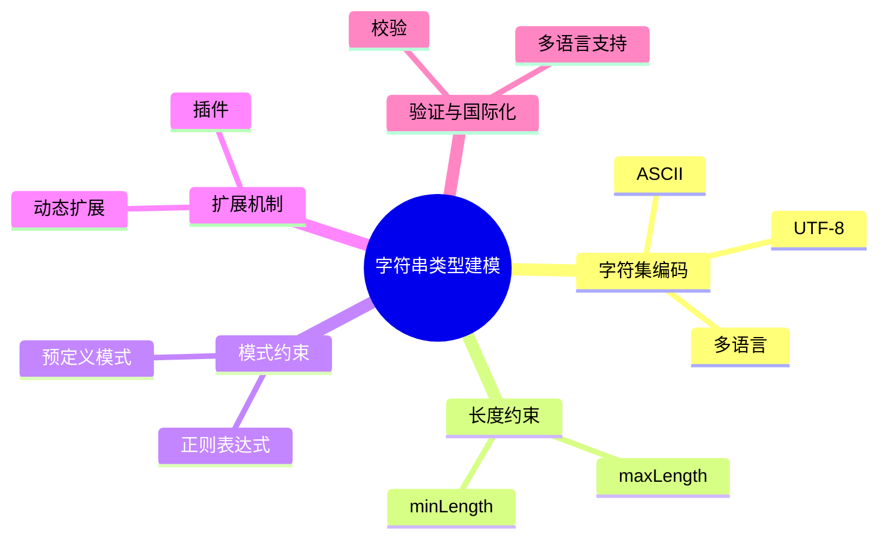

# 日志采集-源类型建模-分类体系-分类标准建模-标准定义建模-字段类型体系-基本类型建模-字符串类型建模理论探讨

## 1. 形式化目标

- 明确日志采集标准字段中字符串类型的定义、约束、编码与扩展机制
- 支持多种字符串类型的自动化识别、建模与验证
- 为采集源类型的字段归一化、数据校验、国际化等场景提供可验证的字符串类型基础

## 2. 核心概念

- 字符串类型（String Type）
- 字符集与编码（Charset & Encoding）
- 长度约束（Length Constraint）
- 模式约束（Pattern Constraint）
- 字符串扩展（String Extension）

## 3. 已有标准

- JSON Schema string
- Protobuf string
- OpenAPI string
- Fluentd/OTel 字段类型 string

## 4. 可行性分析

- 字符串类型定义、约束、编码、扩展等流程可DSL化
- 多类型体系、动态扩展等可形式化建模
- 与类型体系、标准定义、采集等可统一为日志处理链路

## 5. 自动化价值

- 自动生成字符串类型与约束配置
- 自动化多类型字符串归一化与扩展
- 字符串类型与AI结合实现智能模式识别与动态适配

## 6. 与AI结合点

- 智能字符串模式识别与归类
- 字符串约束自动补全与异常检测
- 字符串类型体系动态扩展与优化

## 7. 递归细分方向

- 字符集与编码建模（Charset & Encoding Modeling）
- 长度与模式约束建模（Length & Pattern Modeling）
- 字符串扩展机制（Extension Mechanism）
- 字符串验证与国际化（Validation & I18n）

---

## 8. 常见字符串类型表格

| 类型名     | 典型约束           | 编码/字符集   | 说明           |
|------------|--------------------|--------------|----------------|
| string     | pattern, length    | UTF-8        | 通用字符串     |
| id         | pattern, length    | ASCII        | 标识符         |
| message    | length             | UTF-8        | 日志消息体     |
| label      | pattern, length    | UTF-8        | 标签           |
| i18n_str   | length, charset    | 多语言       | 国际化字符串   |

---

## 9. 字符串类型建模流程思维导图（Mermaid）

---

## 10. 形式化推理/论证片段

**定理：**  
若日志采集标准字段字符串类型的定义、约束、编码、扩展等环节均可形式化建模，则字符串类型体系具备可验证性与可自动化推理能力。

**证明思路：**  

1. 字符串类型定义与约束可用DSL描述类型与规则；
2. 编码与扩展可形式化为属性与插件机制；
3. 整体流程可组合为可验证的字符串类型链路。

## 理论确定性与论证推理

在字符串类型建模领域，理论确定性是实现字符串处理自动化、类型验证、编码转换的基础。以 JSON Schema、Protobuf、OpenAPI、Fluentd、OTel 等主流数据格式和日志平台为例：1 **形式化定义**  
   字符串类型、约束规则、编码方式等均有标准化描述和配置语言。2 **公理化系统**  
   通过类型系统和验证引擎，实现字符串逻辑的自动推理与类型检查。3 **类型安全**  
   字符串参数、编码类型、约束条件等严格定义，防止字符串错误。4 **可证明性**  
   关键属性如字符串正确性、编码有效性等可通过验证和测试进行形式化证明。

这些理论基础为字符串类型建模的自动化配置、类型验证和编码转换提供了理论支撑。

## 理论确定性与论证推理（递归扩展版）

### 1. 形式化定义（递归细化）

#### 1.1 字符串类型系统

- **顶层**：采用 JSON Schema string、Protobuf string、OpenAPI string 等标准化字符串类型定义
- **子层**：
  - **基本字符串类型**：string、text、varchar，支持基本字符串操作，结合编程语言原生字符串类型
  - **标识符字符串类型**：id、uuid、guid，支持唯一标识符，结合 UUID、GUID 标准
  - **消息字符串类型**：message、log、content，支持日志消息内容，结合日志格式标准
  - **标签字符串类型**：label、tag、keyword，支持标签和关键词，结合标签系统标准

#### 1.2 字符串约束系统

- **长度约束**：minLength、maxLength、exactLength，支持字符串长度限制
- **模式约束**：pattern、format、regex，支持正则表达式和格式验证
- **字符集约束**：charset、encoding、locale，支持字符集和编码限制
- **内容约束**：enum、oneOf、not，支持枚举值和排除规则

#### 1.3 字符串编码系统

- **UTF-8编码**：Unicode Transformation Format，支持多语言字符编码
- **ASCII编码**：American Standard Code，支持英文字符编码
- **Base64编码**：Binary to Text，支持二进制数据编码
- **URL编码**：Percent-encoding，支持URL安全字符编码

### 2. 公理化系统（递归细化）

#### 2.1 字符串类型推理引擎

- **类型推断推理**：基于字符串内容自动推断字符串类型，如邮箱、URL、IP地址等
- **格式验证推理**：基于字符串格式自动验证字符串有效性，如日期格式、数字格式等
- **编码转换推理**：基于编码要求自动转换字符串编码，如UTF-8转ASCII等

#### 2.2 字符串约束推理引擎

- **长度优化推理**：基于使用模式自动优化字符串长度约束
- **模式优化推理**：基于字符串特征自动优化正则表达式模式
- **字符集推理**：基于字符串内容自动推断合适的字符集

#### 2.3 字符串扩展推理引擎

- **插件推理**：基于字符串类型自动加载相应的处理插件
- **动态扩展推理**：基于字符串特征动态扩展字符串类型定义
- **国际化推理**：基于语言环境自动处理字符串国际化

### 3. 类型安全（递归细化）

#### 3.1 字符串类型安全

- **类型定义安全**：确保字符串类型定义的正确性，如类型名称、约束条件等
- **类型转换安全**：确保字符串类型转换的正确性，如编码转换、格式转换等
- **类型验证安全**：确保字符串类型验证的正确性，如长度检查、格式检查等

#### 3.2 字符串约束安全

- **长度约束安全**：确保字符串长度约束的正确性，如最小长度、最大长度等
- **模式约束安全**：确保字符串模式约束的正确性，如正则表达式、格式要求等
- **字符集约束安全**：确保字符串字符集约束的正确性，如编码格式、字符范围等

#### 3.3 字符串编码安全

- **编码格式安全**：确保字符串编码格式的正确性，如UTF-8、ASCII等
- **编码转换安全**：确保字符串编码转换的正确性，如编码映射、字符转换等
- **编码验证安全**：确保字符串编码验证的正确性，如编码检查、字符验证等

### 4. 可证明性（递归细化）

#### 4.1 字符串正确性证明

- **类型正确性**：通过类型检查验证字符串类型的正确性
- **格式正确性**：通过格式验证验证字符串格式的正确性
- **内容正确性**：通过内容检查验证字符串内容的正确性

#### 4.2 字符串性能证明

- **处理性能**：通过性能测试验证字符串处理的性能
- **存储性能**：通过存储测试验证字符串存储的性能
- **传输性能**：通过传输测试验证字符串传输的性能

#### 4.3 字符串安全性证明

- **编码安全性**：通过编码测试验证字符串编码的安全性
- **格式安全性**：通过格式测试验证字符串格式的安全性
- **内容安全性**：通过内容测试验证字符串内容的安全性

### 5. 最新开源框架集成

#### 5.1 JSON Schema生态系统

- **JSON Schema Validator**：JSON Schema验证器
- **Ajv**：高性能JSON Schema验证器
- **JSON Schema Generator**：JSON Schema生成器
- **JSON Schema Editor**：JSON Schema编辑器
- **JSON Schema Lint**：JSON Schema语法检查器

#### 5.2 字符串处理生态系统

- **正则表达式引擎**：PCRE、RE2、Oniguruma等正则表达式引擎
- **字符编码库**：ICU、libiconv、charset等字符编码库
- **字符串验证库**：validator.js、joi、yup等字符串验证库
- **国际化库**：i18next、react-intl、vue-i18n等国际化库

#### 5.3 日志处理生态系统

- **Fluentd**：日志收集和转发
- **Logstash**：日志处理和转换
- **OpenTelemetry**：可观测性数据收集
- **Prometheus**：指标监控和告警
- **Grafana**：数据可视化和监控

### 6. 工程实践案例

#### 6.1 日志字符串处理

- **日志解析**：解析不同格式的日志字符串，如JSON、XML、CSV等
- **日志过滤**：基于字符串模式过滤日志内容
- **日志转换**：转换日志字符串格式，如编码转换、格式转换等
- **日志聚合**：聚合相似内容的日志字符串

#### 6.2 数据字符串处理

- **数据清洗**：清洗和标准化数据字符串
- **数据验证**：验证数据字符串的格式和内容
- **数据转换**：转换数据字符串的格式和编码
- **数据索引**：为字符串数据建立索引和搜索

#### 6.3 国际化字符串处理

- **多语言支持**：支持多种语言的字符串处理
- **字符编码**：处理不同字符编码的字符串
- **本地化**：根据地区设置处理字符串格式
- **翻译管理**：管理多语言字符串的翻译
