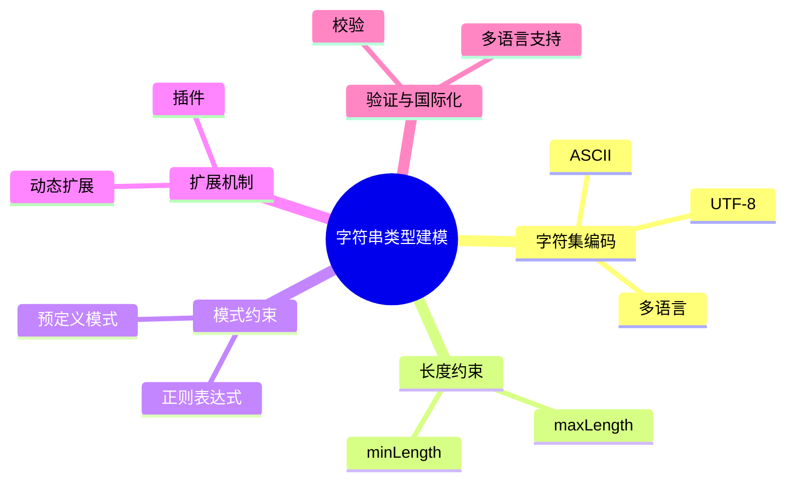

# 日志采集-源类型建模-分类体系-分类标准建模-标准定义建模-字段类型体系-基本类型建模-字符串类型建模理论探讨

## 1. 形式化目标

- 明确日志采集标准字段中字符串类型的定义、约束、编码与扩展机制
- 支持多种字符串类型的自动化识别、建模与验证
- 为采集源类型的字段归一化、数据校验、国际化等场景提供可验证的字符串类型基础

## 2. 核心概念

- 字符串类型（String Type）
- 字符集与编码（Charset & Encoding）
- 长度约束（Length Constraint）
- 模式约束（Pattern Constraint）
- 字符串扩展（String Extension）

## 3. 已有标准

- JSON Schema string
- Protobuf string
- OpenAPI string
- Fluentd/OTel 字段类型 string

## 4. 可行性分析

- 字符串类型定义、约束、编码、扩展等流程可DSL化
- 多类型体系、动态扩展等可形式化建模
- 与类型体系、标准定义、采集等可统一为日志处理链路

## 5. 自动化价值

- 自动生成字符串类型与约束配置
- 自动化多类型字符串归一化与扩展
- 字符串类型与AI结合实现智能模式识别与动态适配

## 6. 与AI结合点

- 智能字符串模式识别与归类
- 字符串约束自动补全与异常检测
- 字符串类型体系动态扩展与优化

## 7. 递归细分方向

- 字符集与编码建模（Charset & Encoding Modeling）
- 长度与模式约束建模（Length & Pattern Modeling）
- 字符串扩展机制（Extension Mechanism）
- 字符串验证与国际化（Validation & I18n）

---

## 8. 常见字符串类型表格

| 类型名     | 典型约束           | 编码/字符集   | 说明           |
|------------|--------------------|--------------|----------------|
| string     | pattern, length    | UTF-8        | 通用字符串     |
| id         | pattern, length    | ASCII        | 标识符         |
| message    | length             | UTF-8        | 日志消息体     |
| label      | pattern, length    | UTF-8        | 标签           |
| i18n_str   | length, charset    | 多语言       | 国际化字符串   |

---

## 9. 字符串类型建模流程思维导图（Mermaid）

---

## 10. 形式化推理/论证片段

**定理：**  
若日志采集标准字段字符串类型的定义、约束、编码、扩展等环节均可形式化建模，则字符串类型体系具备可验证性与可自动化推理能力。

**证明思路：**  

1. 字符串类型定义与约束可用DSL描述类型与规则；
2. 编码与扩展可形式化为属性与插件机制；
3. 整体流程可组合为可验证的字符串类型链路。
