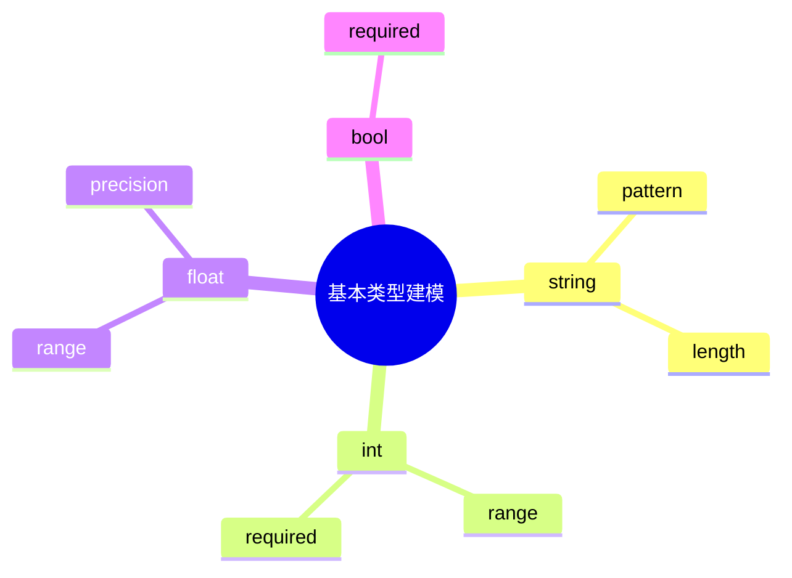

# 日志采集-源类型建模-分类体系-分类标准建模-标准定义建模-字段类型体系-基本类型建模理论探讨

## 1. 形式化目标

- 明确日志采集标准字段基本类型的定义、约束、适用范围与扩展机制
- 支持多种原子类型的自动化识别、建模与验证
- 为采集源类型的字段归一化、类型安全、数据校验等场景提供可验证的基本类型基础

## 2. 核心概念

- 原子类型（Primitive Type）
- 类型约束（Type Constraint）
- 类型映射（Type Mapping）
- 类型验证（Type Validation）
- 类型扩展（Type Extension）

## 3. 已有标准

- JSON Schema 基本类型
- Protobuf 基本类型
- OpenAPI 基本类型
- Fluentd/OTel 字段类型

## 4. 可行性分析

- 基本类型定义、约束、映射、扩展等流程可DSL化
- 多类型体系、动态扩展等可形式化建模
- 与类型体系、标准定义、采集等可统一为日志处理链路

## 5. 自动化价值

- 自动生成基本类型与约束配置
- 自动化多类型字段归一化与扩展
- 基本类型与AI结合实现智能类型识别与动态适配

## 6. 与AI结合点

- 智能类型识别与归类
- 类型约束自动补全与异常检测
- 基本类型体系动态扩展与优化

## 7. 递归细分方向

- 字符串类型建模（String Modeling）
- 数值类型建模（Number Modeling）
- 布尔类型建模（Boolean Modeling）
- 基本类型约束与验证（Constraint & Validation）

---

## 8. 常见基本类型表格

| 类型名   | 典型约束           | 说明           |
|----------|--------------------|----------------|
| string   | pattern, length    | 字符串类型     |
| int      | range, required    | 整数类型       |
| float    | range, precision   | 浮点类型       |
| bool     | required           | 布尔类型       |

---

## 9. 基本类型建模流程思维导图（Mermaid）

---

## 10. 形式化推理/论证片段

**定理：**  
若日志采集标准字段基本类型的定义、约束、映射、扩展等环节均可形式化建模，则基本类型体系具备可验证性与可自动化推理能力。

**证明思路：**  

1. 基本类型定义与约束可用DSL描述类型与规则；
2. 类型映射与扩展可形式化为规则与插件机制；
3. 整体流程可组合为可验证的基本类型链路。
