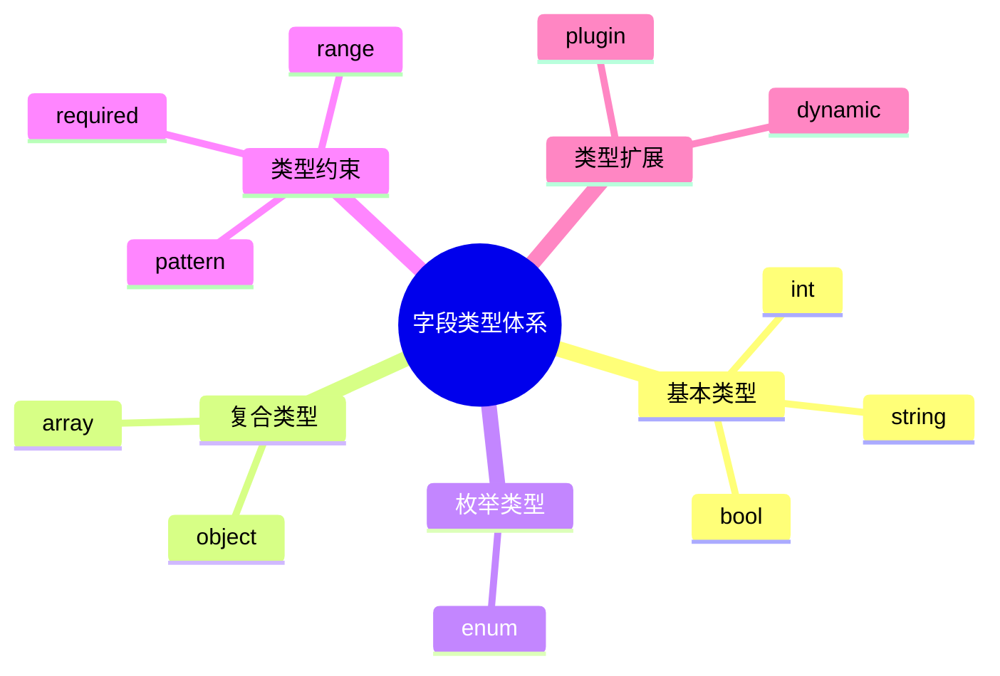

# 日志采集-源类型建模-分类体系-分类标准建模-标准定义建模-字段类型体系理论探讨

## 1. 形式化目标

- 明确日志采集标准字段类型体系的分类、结构、约束与扩展机制
- 支持多类型、多层级字段类型的自动化识别、建模与验证
- 为采集源类型的字段归一化、类型安全、动态扩展等场景提供可验证的类型体系基础

## 2. 核心概念

- 字段基本类型（Primitive Type）
- 复合类型（Composite Type）
- 枚举类型（Enum Type）
- 类型约束（Type Constraint）
- 类型扩展（Type Extension）

## 3. 已有标准

- JSON Schema Type
- Protobuf Type
- OpenAPI Type
- Fluentd/OTel 字段类型

## 4. 可行性分析

- 字段类型定义、约束、扩展等流程可DSL化
- 多类型体系、动态扩展等可形式化建模
- 与标准定义、分类体系、采集等可统一为日志处理链路

## 5. 自动化价值

- 自动生成字段类型与约束配置
- 自动化多类型字段归一化与扩展
- 类型体系与AI结合实现智能类型识别与动态适配

## 6. 与AI结合点

- 智能类型识别与归类
- 类型约束自动补全与异常检测
- 类型体系动态扩展与优化

## 7. 递归细分方向

- 基本类型建模（Primitive Modeling）
- 复合类型建模（Composite Modeling）
- 枚举类型建模（Enum Modeling）
- 类型约束与验证（Constraint & Validation）

---

## 8. 常见字段类型体系表格

| 类型类别   | 示例类型         | 典型约束           | 说明           |
|------------|------------------|--------------------|----------------|
| 基本类型   | string, int      | required, pattern  | 原子类型       |
| 复合类型   | array, object    | items, properties  | 嵌套结构       |
| 枚举类型   | enum             | values             | 有限集合       |
| 扩展类型   | custom, plugin   | extension, plugin  | 动态扩展       |

---

## 9. 字段类型体系建模流程思维导图（Mermaid）

---

## 10. 形式化推理/论证片段

**定理：**  
若日志采集标准字段类型体系的基本类型、复合类型、枚举类型、约束、扩展等环节均可形式化建模，则类型体系具备可验证性与可自动化推理能力。

**证明思路：**  

1. 基本类型、复合类型、枚举类型可用DSL描述结构与约束；
2. 类型约束与扩展可形式化为规则与插件机制；
3. 整体流程可组合为可验证的类型体系链路。
