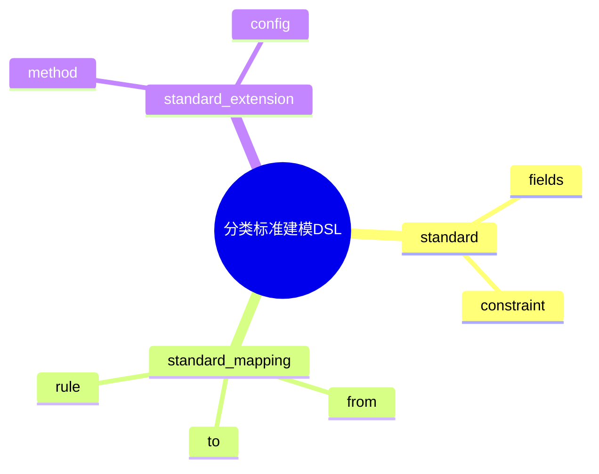

# 日志采集-源类型建模-分类体系-分类标准建模DSL草案

## 1. 设计目标

- 用声明式语法描述分类标准定义、映射、扩展、适用性等流程
- 支持多标准并存与动态扩展的统一建模
- 便于自动生成标准与映射配置

## 2. 基本语法结构

```dsl
standard "syslog" {
  fields = ["facility", "severity"]
  constraint = "RFC5424"
}

standard "fluentd" {
  fields = ["type", "label"]
}

standard_mapping "syslog_to_fluentd" {
  from = "syslog"
  to = "fluentd"
  rule = "facility->type"
}

standard_extension "custom" {
  method = "plugin"
  config = "custom_standard.yaml"
}
```

## 3. 关键元素

- standard：分类标准定义
- standard_mapping：标准映射配置
- standard_extension：标准扩展配置

---

## 4. 示例

```dsl
standard "otel" {
  fields = ["receiver", "protocol"]
}

standard_mapping "fluentd_to_otel" {
  from = "fluentd"
  to = "otel"
  rule = "type->receiver"
}

standard_extension "dynamic" {
  method = "dynamic"
  config = "auto_discover"
}
```

---

## 5. 与主流标准的映射

| DSL元素        | Syslog | Fluentd | OTel | Filebeat |
|----------------|--------|---------|------|----------|
| standard       | RFC5424| type    | receiver | input |
| standard_mapping| mapping| mapping | mapping| mapping |
| standard_extension| plugin| plugin | extension| module |

---

## 6. 递归扩展建议

- 支持多级标准定义与动态扩展
- 标准建模与分类体系、类型建模的统一DSL
- 标准建模与AI智能识别的集成

---

## 7. 分类标准建模DSL关键元素表格

| 元素            | 说明           | 典型属性           |
|-----------------|----------------|--------------------|
| standard        | 标准定义       | fields, constraint |
| standard_mapping| 标准映射配置   | from, to, rule     |
| standard_extension| 标准扩展配置 | method, config     |

---

## 8. 分类标准建模DSL语法思维导图（Mermaid）



---

## 9. 形式化DSL推理片段

**推论：**  
若 standard、standard_mapping、standard_extension 语法均具备完备性，则任意分类标准建模流程均可通过DSL自动生成配置与推理链路。

**证明思路：**  

- 每个环节均可形式化为DSL声明；
- DSL可自动转化为标准/映射/扩展配置；
- 组合DSL可推导出完整的分类标准建模链路。
