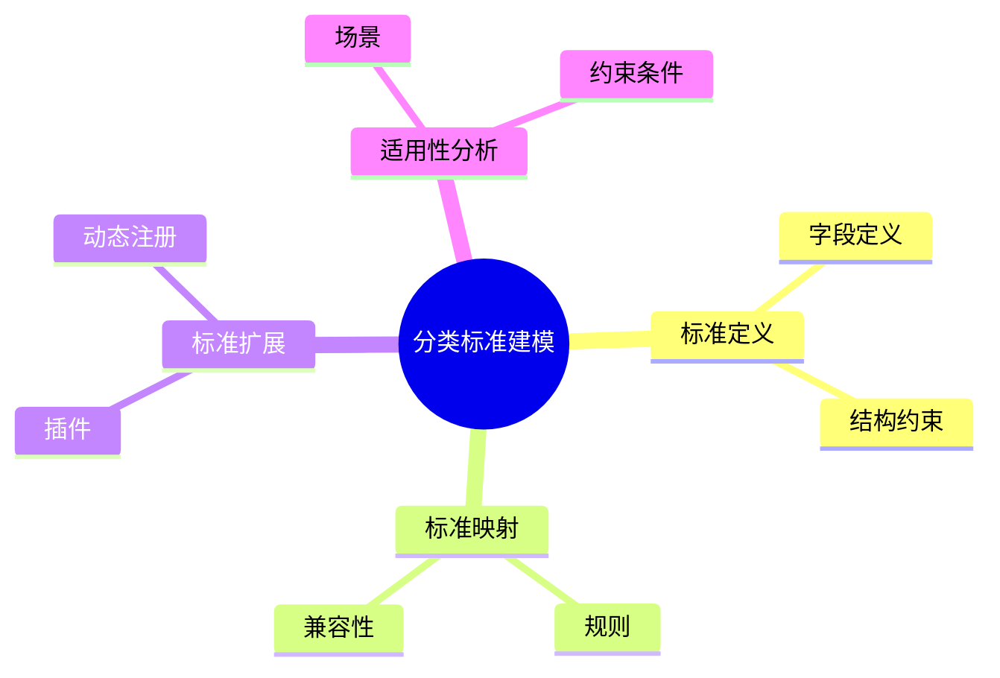

# 日志采集-源类型建模-分类体系-分类标准建模理论探讨

## 1. 形式化目标

- 明确日志采集源类型分类标准的定义、结构与适用范围
- 支持多标准并存、动态扩展与标准映射
- 为采集源类型的自动识别、归一化、适配等场景提供可验证的分类标准基础

## 2. 核心概念

- 分类标准（Classification Standard）
- 标准定义（Standard Definition）
- 标准映射（Standard Mapping）
- 标准扩展（Standard Extension）
- 标准适用性（Applicability）

## 3. 已有标准

- Syslog Facility/Severity
- Fluentd Source Type Standard
- OTel Receiver Standard
- Filebeat Input Type Standard

## 4. 可行性分析

- 分类标准定义、映射、扩展等流程可DSL化
- 多标准并存、动态扩展等可形式化建模
- 与分类体系、类型建模、采集等可统一为日志处理链路

## 5. 自动化价值

- 自动生成分类标准与映射配置
- 自动化多标准归一化与扩展
- 分类标准与AI结合实现智能标准识别与动态适配

## 6. 与AI结合点

- 智能标准识别与归类
- 标准映射自动补全与异常检测
- 标准体系动态扩展与优化

## 7. 递归细分方向

- 标准定义建模（Definition Modeling）
- 标准映射机制（Mapping Mechanism）
- 标准扩展策略（Extension Strategy）
- 标准适用性分析（Applicability Analysis）

---

## 8. 常见分类标准表格

| 标准名称     | 适用范围         | 关键字段           | 说明           |
|--------------|------------------|--------------------|----------------|
| Syslog       | 系统/网络日志    | facility, severity | RFC 5424标准   |
| Fluentd      | 通用日志采集     | type, label        | Fluentd生态    |
| OTel         | 可观测性采集     | receiver, protocol | OpenTelemetry  |
| Filebeat     | 文件/输入采集    | input, module      | Elastic Stack  |

---

## 9. 分类标准建模流程思维导图（Mermaid）

---

## 10. 形式化推理/论证片段

**定理：**  
若日志采集源类型分类标准的定义、映射、扩展、适用性等环节均可形式化建模，则分类标准体系具备可验证性与可自动化推理能力。

**证明思路：**  

1. 标准定义与映射可用DSL描述结构与规则；
2. 扩展与适用性可形式化为插件与约束条件；
3. 整体流程可组合为可验证的分类标准链路。
