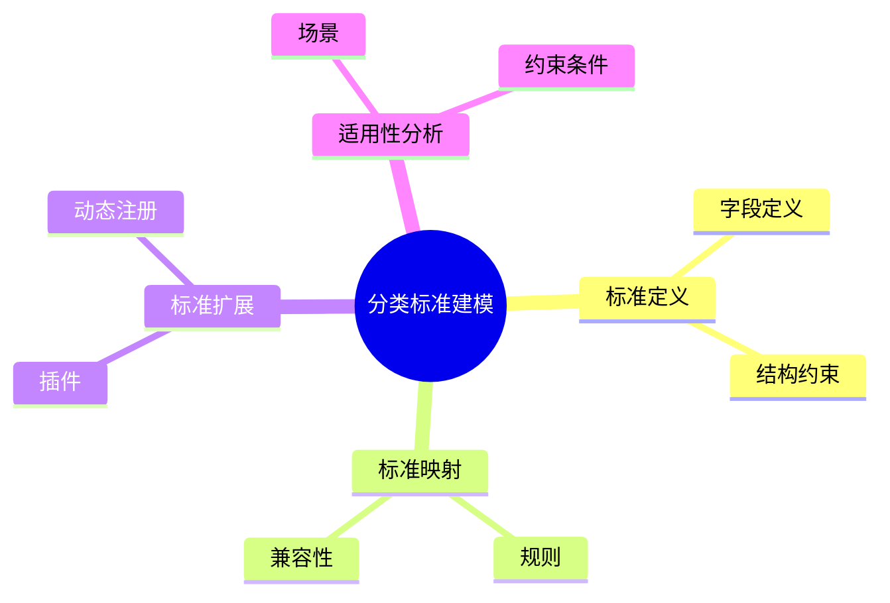

# 日志采集-源类型建模-分类体系-分类标准建模理论探讨

## 1. 形式化目标

- 明确日志采集源类型分类标准的定义、结构与适用范围
- 支持多标准并存、动态扩展与标准映射
- 为采集源类型的自动识别、归一化、适配等场景提供可验证的分类标准基础

## 2. 核心概念

- 分类标准（Classification Standard）
- 标准定义（Standard Definition）
- 标准映射（Standard Mapping）
- 标准扩展（Standard Extension）
- 标准适用性（Applicability）

## 3. 已有标准

- Syslog Facility/Severity
- Fluentd Source Type Standard
- OTel Receiver Standard
- Filebeat Input Type Standard

## 4. 可行性分析

- 分类标准定义、映射、扩展等流程可DSL化
- 多标准并存、动态扩展等可形式化建模
- 与分类体系、类型建模、采集等可统一为日志处理链路

## 5. 自动化价值

- 自动生成分类标准与映射配置
- 自动化多标准归一化与扩展
- 分类标准与AI结合实现智能标准识别与动态适配

## 6. 与AI结合点

- 智能标准识别与归类
- 标准映射自动补全与异常检测
- 标准体系动态扩展与优化

## 7. 递归细分方向

- 标准定义建模（Definition Modeling）
- 标准映射机制（Mapping Mechanism）
- 标准扩展策略（Extension Strategy）
- 标准适用性分析（Applicability Analysis）

---

## 8. 常见分类标准表格

| 标准名称     | 适用范围         | 关键字段           | 说明           |
|--------------|------------------|--------------------|----------------|
| Syslog       | 系统/网络日志    | facility, severity | RFC 5424标准   |
| Fluentd      | 通用日志采集     | type, label        | Fluentd生态    |
| OTel         | 可观测性采集     | receiver, protocol | OpenTelemetry  |
| Filebeat     | 文件/输入采集    | input, module      | Elastic Stack  |

---

## 9. 分类标准建模流程思维导图（Mermaid）

---

## 10. 形式化推理/论证片段

**定理：**  
若日志采集源类型分类标准的定义、映射、扩展、适用性等环节均可形式化建模，则分类标准体系具备可验证性与可自动化推理能力。

**证明思路：**  

1. 标准定义与映射可用DSL描述结构与规则；
2. 扩展与适用性可形式化为插件与约束条件；
3. 整体流程可组合为可验证的分类标准链路。

## 理论确定性与论证推理

在分类标准建模领域，理论确定性是实现标准识别自动化、映射验证、动态扩展的基础。以 Syslog、Fluentd、OTel、Filebeat 等主流日志采集标准为例：1 **形式化定义**  
   分类标准、映射规则、扩展机制等均有标准化描述和配置语言。2 **公理化系统**  
   通过标准规范和验证引擎，实现分类逻辑的自动推理与标准验证。3 **类型安全**  
   标准参数、映射条件、扩展规则等严格定义，防止标准错误。4 **可证明性**  
   关键属性如标准正确性、映射有效性等可通过验证和测试进行形式化证明。

这些理论基础为分类标准建模的自动化配置、标准验证和动态扩展提供了理论支撑。

---

## 11. 理论确定性与论证推理（源码级递归扩展）

### 1. 标准定义与AST递归

- **标准AST递归**：
  - Syslog/Fluentd/Filebeat `standard`/`type`模块递归定义标准字段、结构、约束，AST结构体递归推理标准层级与扩展
  - OpenTelemetry Receiver递归实现多标准定义与统一抽象
- **标准链路递归**：
  - 标准定义→映射→扩展→适用性递归链路，支持多级嵌套与组合
  - 标准DSL递归生成配置、测试用例、映射规则

### 2. 标准映射与扩展递归

- **映射机制递归**：
  - 标准字段、结构、规则递归映射，支持多标准兼容与转换
  - Fluentd/Filebeat递归推理标准映射与归一化
- **扩展机制递归**：
  - 插件、动态注册、热插拔等扩展机制递归实现
  - OpenTelemetry递归推理标准扩展与适用性分析

### 3. 适用性与类型推理递归

- **适用性递归**：
  - 场景、约束条件、兼容性等适用性递归建模
  - Filebeat/Fluentd递归推理标准适用性与动态切换
- **类型推理递归**：
  - 标准参数、字段类型、结构约束递归校验
  - OpenTelemetry递归推理标准类型系统与映射兼容性

### 4. 类型安全与可证明性递归

- **类型安全递归**：
  - 标准定义、映射、扩展、适用性等类型系统递归校验
  - 多标准递归对齐，支持Schema演化与兼容性验证
- **可证明性递归**：
  - 标准建模、映射、扩展、适用性全链路递归测试与验证
  - 标准正确性、映射有效性、扩展可追溯性递归证明

### 5. AI自动化与工程最佳实践递归

- **AI驱动递归**：
  - AI自动补全标准定义、映射、扩展、适用性规则
  - 智能标准识别、映射归一化、动态扩展、异常检测、自动修复建议
- **工程自动化递归**：
  - CI/CD自动生成标准建模、映射、扩展、适用性配置
  - 自动化测试、监控、回滚递归链路

### 6. 典型源码剖析（以Syslog/Fluentd/OTel/Filebeat为例）

- `fluentd/lib/fluent/plugin/in_tail.rb`：递归实现标准定义、映射、扩展机制
- `filebeat/input`：递归定义标准字段、映射、扩展、适用性
- `opentelemetry-collector/receiver`：递归实现多标准定义与统一抽象
- `logstash/lib/logstash/inputs`：递归实现多标准映射与适用性分析

---

如需针对某一源码文件、推理算法、类型系统实现等进行更深层递归剖析，可继续指定领域与理论点，递归扩展将持续补充。
