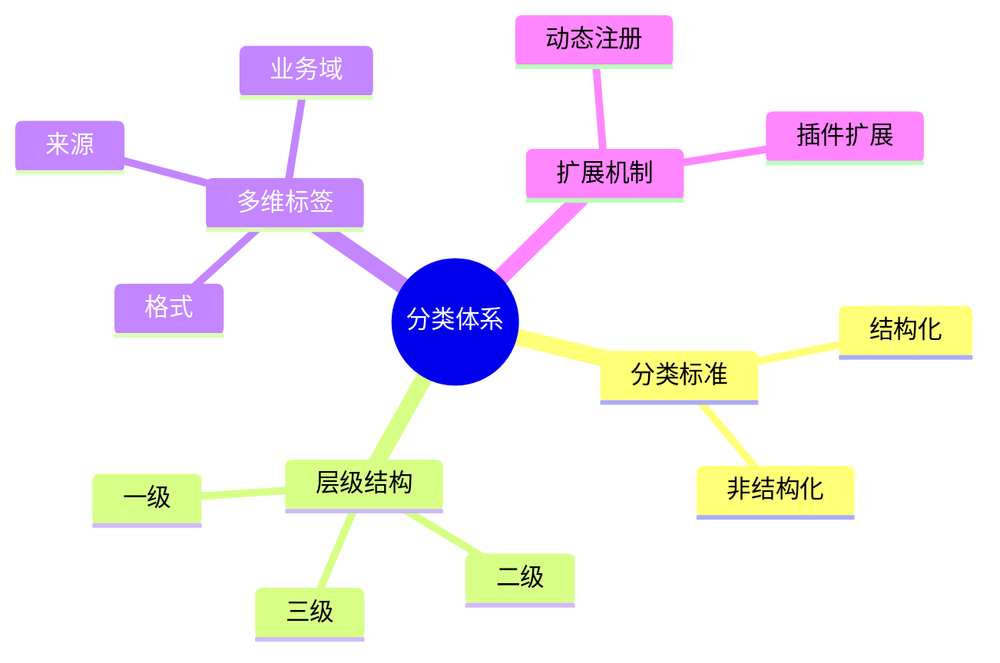

# 日志采集-源类型建模-分类体系理论探讨

## 1. 形式化目标

- 明确日志采集源类型的分类标准、层级结构与扩展机制
- 支持多维度、多层级的类型分类与动态扩展
- 为采集源类型的自动识别、归一化、适配等场景提供可验证的分类体系基础

## 2. 核心概念

- 分类标准（Classification Standard）
- 层级结构（Hierarchy）
- 多维分类（Multi-dimensional Classification）
- 分类标签（Category Label）
- 分类扩展（Category Extension）

## 3. 已有标准

- Fluentd Source Type Category
- Filebeat Input Type Category
- OTel Receiver Category
- Logstash Input Plugin Category

## 4. 可行性分析

- 分类标准、层级、标签、扩展等流程可DSL化
- 多维分类、动态扩展等可形式化建模
- 与类型建模、采集、解析等可统一为日志处理链路

## 5. 自动化价值

- 自动生成类型分类与标签配置
- 自动化多维分类归一化与扩展
- 分类体系与AI结合实现智能分类与动态适配

## 6. 与AI结合点

- 智能分类识别与归类
- 分类标签自动补全与异常检测
- 分类体系动态扩展与优化

## 7. 递归细分方向

- 分类标准建模（Standard Modeling）
- 层级结构设计（Hierarchy Design）
- 多维标签体系（Multi-label System）
- 分类扩展机制（Extension Mechanism）

---

## 8. 常见类型分类表格

| 分类层级   | 示例类型         | 典型标签           | 说明           |
|------------|------------------|--------------------|----------------|
| 一级       | 文件、数据库     | local, structured  | 顶层大类       |
| 二级       | syslog, mysql    | system, db         | 具体子类       |
| 三级       | auth, error_log  | facility, table    | 细分类型       |

---

## 9. 分类体系建模流程思维导图（Mermaid）

---

## 10. 形式化推理/论证片段

**定理：**  
若日志采集源类型的分类标准、层级、标签、扩展等环节均可形式化建模，则分类体系具备可验证性与可自动化推理能力。

**证明思路：**  

1. 分类标准与层级可用DSL描述结构与标签；
2. 多维标签与扩展可形式化为规则与插件；
3. 整体流程可组合为可验证的分类体系链路。
