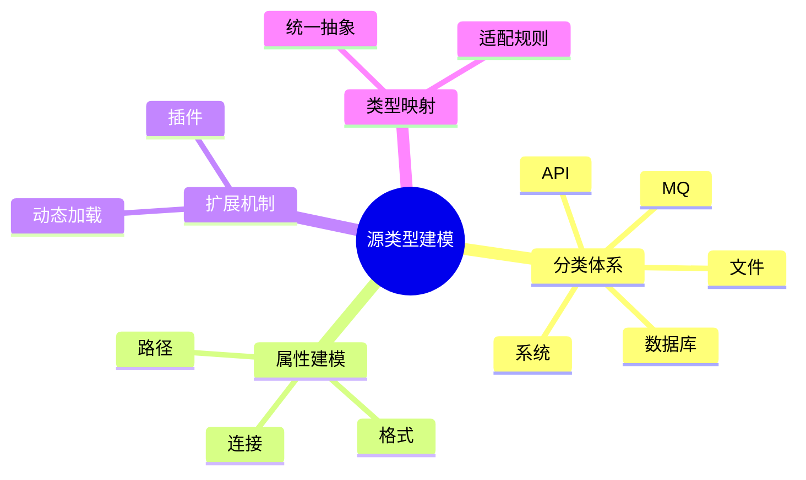

# 日志采集-源类型建模理论探讨

## 1. 形式化目标

- 明确日志采集源类型的分类、结构、属性与扩展机制
- 支持多种类型日志源的自动化识别、建模与管理
- 为采集源的动态适配、归一化、扩展等场景提供可验证的类型建模基础

## 2. 核心概念

- 源类型（Source Type）
- 类型分类（Type Category）
- 类型属性（Type Attribute）
- 类型扩展（Type Extension）
- 类型映射（Type Mapping）

## 3. 已有标准

- Fluentd Source Type
- Filebeat Input Type
- OTel Receiver Type
- Logstash Input Plugin

## 4. 可行性分析

- 源类型分类、属性、扩展等流程可DSL化
- 类型映射、动态扩展等可形式化建模
- 与采集、解析、存储等可统一为日志处理链路

## 5. 自动化价值

- 自动生成类型识别与适配配置
- 自动化多类型日志归一化与扩展
- 类型建模与AI结合实现智能类型识别与动态适配

## 6. 与AI结合点

- 智能类型识别与归类
- 类型属性自动补全与异常检测
- 类型动态扩展与优化

## 7. 递归细分方向

- 类型分类体系（Category System）
- 类型属性建模（Attribute Modeling）
- 类型扩展机制（Extension Mechanism）
- 类型映射与适配（Mapping & Adaptation）

---

## 8. 常见采集源类型表格

| 类型         | 分类           | 典型属性                | 说明           |
|--------------|----------------|-------------------------|----------------|
| 文件         | 本地/远程      | path, format, encoding  | 文件日志源     |
| 数据库       | 结构化         | dsn, table, query       | 数据库日志源   |
| API          | 网络           | url, method, headers    | 接口日志源     |
| 消息队列     | 分布式         | broker, topic, group    | MQ日志源       |
| 系统         | 内核/服务      | facility, level, device | 系统日志源     |

---

## 9. 源类型建模流程思维导图（Mermaid）

---

## 10. 形式化推理/论证片段

**定理：**  
若日志采集源类型的分类、属性、扩展、映射等环节均可形式化建模，则类型建模系统具备可验证性与可自动化推理能力。

**证明思路：**  

1. 分类与属性可用DSL描述结构与标签；
2. 扩展与映射可形式化为插件与适配规则；
3. 整体流程可组合为可验证的类型建模链路。
