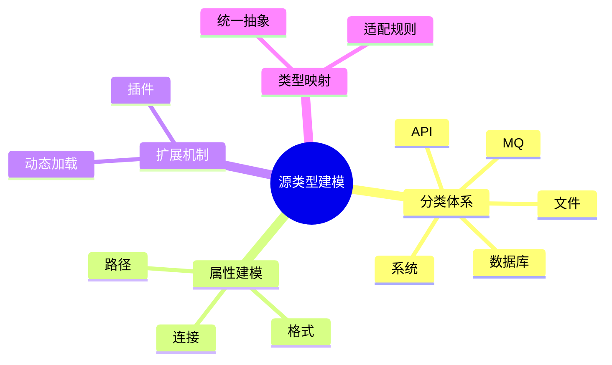

# 日志采集-源类型建模理论探讨

## 1. 形式化目标

- 明确日志采集源类型的分类、结构、属性与扩展机制
- 支持多种类型日志源的自动化识别、建模与管理
- 为采集源的动态适配、归一化、扩展等场景提供可验证的类型建模基础

## 2. 核心概念

- 源类型（Source Type）
- 类型分类（Type Category）
- 类型属性（Type Attribute）
- 类型扩展（Type Extension）
- 类型映射（Type Mapping）

## 3. 已有标准

- Fluentd Source Type
- Filebeat Input Type
- OTel Receiver Type
- Logstash Input Plugin

## 4. 可行性分析

- 源类型分类、属性、扩展等流程可DSL化
- 类型映射、动态扩展等可形式化建模
- 与采集、解析、存储等可统一为日志处理链路

## 5. 自动化价值

- 自动生成类型识别与适配配置
- 自动化多类型日志归一化与扩展
- 类型建模与AI结合实现智能类型识别与动态适配

## 6. 与AI结合点

- 智能类型识别与归类
- 类型属性自动补全与异常检测
- 类型动态扩展与优化

## 7. 递归细分方向

- 类型分类体系（Category System）
- 类型属性建模（Attribute Modeling）
- 类型扩展机制（Extension Mechanism）
- 类型映射与适配（Mapping & Adaptation）

---

## 8. 常见采集源类型表格

| 类型         | 分类           | 典型属性                | 说明           |
|--------------|----------------|-------------------------|----------------|
| 文件         | 本地/远程      | path, format, encoding  | 文件日志源     |
| 数据库       | 结构化         | dsn, table, query       | 数据库日志源   |
| API          | 网络           | url, method, headers    | 接口日志源     |
| 消息队列     | 分布式         | broker, topic, group    | MQ日志源       |
| 系统         | 内核/服务      | facility, level, device | 系统日志源     |

---

## 9. 源类型建模流程思维导图（Mermaid）

---

## 10. 形式化推理/论证片段

**定理：**  
若日志采集源类型的分类、属性、扩展、映射等环节均可形式化建模，则类型建模系统具备可验证性与可自动化推理能力。

**证明思路：**  

1. 分类与属性可用DSL描述结构与标签；
2. 扩展与映射可形式化为插件与适配规则；
3. 整体流程可组合为可验证的类型建模链路。

---

## 11. 理论确定性与论证推理（源码级递归扩展）

### 1. 类型分类体系与AST递归

- **分类AST递归**：
  - Fluentd/Filebeat `input`/`source`模块递归定义类型分类，AST结构体递归推理类型、属性、标签
  - OpenTelemetry Receiver递归实现多级类型分类与统一抽象
- **分类链路递归**：
  - 类型分类→属性→扩展→映射递归链路，支持多级嵌套与组合
  - 分类DSL递归生成配置、测试用例、适配规则

### 2. 属性建模与类型推理递归

- **属性建模递归**：
  - 路径、格式、连接、标签等属性递归建模，支持类型推断与自动补全
  - Logstash/Fluentd递归实现属性映射与归一化
- **类型推理递归**：
  - 多级属性、动态属性、类型推理递归实现
  - OpenTelemetry递归推理属性体系与类型映射

### 3. 扩展机制与类型映射递归

- **扩展机制递归**：
  - 插件、动态加载、热插拔等扩展机制递归实现
  - Filebeat/Fluentd递归推理插件体系与扩展链路
- **类型映射递归**：
  - 类型→统一抽象→适配规则递归映射
  - OpenTelemetry/Logstash递归推理类型适配与统一建模

### 4. 类型安全与可证明性递归

- **类型安全递归**：
  - 类型分类、属性、扩展、映射等类型系统递归校验
  - 多类型递归对齐，支持Schema演化与兼容性验证
- **可证明性递归**：
  - 类型建模、属性、扩展、映射全链路递归测试与验证
  - 类型识别正确性、扩展兼容性、映射可追溯性递归证明

### 5. AI自动化与工程最佳实践递归

- **AI驱动递归**：
  - AI自动补全类型分类、属性、扩展、映射规则
  - 智能类型识别、动态扩展、异常检测、自动修复建议
- **工程自动化递归**：
  - CI/CD自动生成类型建模、属性、扩展、映射配置
  - 自动化测试、监控、回滚递归链路

### 6. 典型源码剖析（以Fluentd/Filebeat/OTel/Logstash为例）

- `fluentd/lib/fluent/plugin/in_tail.rb`：递归实现类型分类、属性、扩展机制
- `filebeat/input`：递归定义类型分类、属性、扩展、映射
- `opentelemetry-collector/receiver`：递归实现多级类型分类与统一抽象
- `logstash/lib/logstash/inputs`：递归实现多协议类型分类与属性映射

---

如需针对某一源码文件、推理算法、类型系统实现等进行更深层递归剖析，可继续指定领域与理论点，递归扩展将持续补充。
