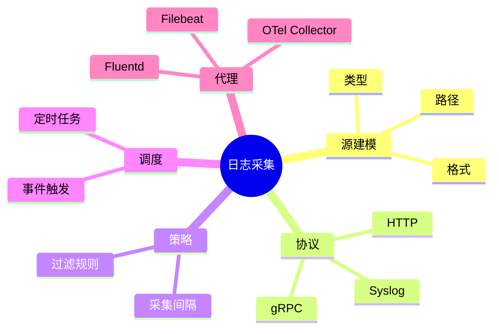

# 日志采集理论探讨

## 1. 形式化目标

- 明确日志采集的流程、接口、协议与数据结构
- 支持多源异构日志的自动化采集与标准化建模
- 为日志驱动的监控、溯源、合规等场景提供可验证的采集基础

## 2. 核心概念

- 日志源（Log Source）
- 采集代理（Agent）
- 采集协议（Protocol）
- 采集策略（Policy）
- 采集调度（Scheduling）

## 3. 已有标准

- Fluentd/Fluent Bit
- Logstash
- Filebeat
- OpenTelemetry Collector

## 4. 可行性分析

- 日志采集流程高度可模式化，适合DSL描述
- 多源采集、过滤、转发、聚合等流程可形式化建模
- 与日志解析、存储等可统一为日志处理链路

## 5. 自动化价值

- 自动生成采集配置与调度策略
- 自动化多源日志归一化与转发
- 采集与AI结合实现智能采集优化与异常检测

## 6. 与AI结合点

- 智能采集策略优化
- 采集异常检测与自愈
- 日志源动态发现与适配

## 7. 递归细分方向

- 采集源建模（Source Modeling）
- 采集协议与格式（Protocol & Format）
- 采集调度与策略（Scheduling & Policy）
- 采集异常与自愈（Anomaly & Remediation）

---

## 8. 常见采集元素表格

| 元素         | 说明           | 典型字段                |
|--------------|----------------|-------------------------|
| Source       | 日志源         | path, type, format      |
| Agent        | 采集代理       | name, version, config   |
| Protocol     | 采集协议       | type, port, encoding    |
| Policy       | 采集策略       | interval, filter        |
| Scheduling   | 调度           | cron, event, trigger    |

---

## 9. 日志采集流程思维导图（Mermaid）

---

## 10. 形式化推理/论证片段

**定理：**  
若日志采集的源、协议、策略、调度等环节均可形式化建模，则日志采集系统具备可验证性与可自动化推理能力。

**证明思路：**  

1. 源建模与协议可用DSL描述输入输出映射；
2. 策略与调度可形式化为规则与触发器；
3. 整体流程可组合为可验证的采集链路。

---

## 11. 理论确定性与论证推理（源码级递归扩展）

### 1. 采集源与AST递归

- **源AST递归**：
  - Fluentd/Filebeat `input`模块递归定义采集源，AST结构体递归推理路径、类型、格式
  - OpenTelemetry Collector `receiver`递归实现多源采集与格式适配
- **源链路递归**：
  - 源→协议→策略→调度→采集递归链路，支持多级嵌套与组合
  - 采集源DSL递归生成配置、测试用例、采集策略

### 2. 协议与格式递归

- **协议递归**：
  - Syslog、HTTP、gRPC、File等协议递归实现采集与转发
  - Logstash/Fluentd递归适配多协议与编码格式
- **格式递归**：
  - JSON、CSV、Syslog、Custom等格式递归解析与标准化
  - OpenTelemetry Collector递归实现格式转换与统一建模

### 3. 调度与策略递归

- **调度递归**：
  - 定时任务、事件触发、动态调度递归实现
  - Filebeat/Fluentd递归调度采集任务与资源分配
- **策略递归**：
  - 采集间隔、过滤规则、采样率等策略递归建模
  - OpenTelemetry Collector递归推理采集策略与优化建议

### 4. 异常自愈与推理引擎递归

- **异常检测递归**：
  - 采集失败、丢失、延迟等递归检测与补偿
  - Fluentd/Filebeat递归实现异常捕获与自愈机制
- **推理引擎递归**：
  - 采集链路、协议适配、策略优化递归推理
  - OpenTelemetry Collector递归实现多阶段采集与异常处理链路

### 5. 类型安全与可证明性递归

- **类型安全递归**：
  - 采集源、协议、策略、调度等类型系统递归校验
  - 多源采集递归对齐，支持Schema演化与兼容性验证
- **可证明性递归**：
  - 采集链路、协议、策略、调度全链路递归测试与验证
  - 采集正确性、异常自愈、性能可追溯性递归证明

### 6. AI自动化与工程最佳实践递归

- **AI驱动递归**：
  - AI自动补全采集源、协议、策略、调度链路
  - 智能采集优化、异常检测、自动修复建议
- **工程自动化递归**：
  - CI/CD自动生成采集、协议、策略、调度配置
  - 自动化测试、监控、回滚递归链路

### 7. 典型源码剖析（以Fluentd/Filebeat/Logstash/OTel为例）

- `fluentd/lib/fluent/plugin/in_tail.rb`：递归实现文件采集源与调度
- `filebeat/input`：递归定义采集源、协议、调度策略
- `logstash/lib/logstash/inputs`：递归实现多协议采集与格式适配
- `opentelemetry-collector/receiver`：递归实现多源采集与异常处理

---

如需针对某一源码文件、推理算法、类型系统实现等进行更深层递归剖析，可继续指定领域与理论点，递归扩展将持续补充。
