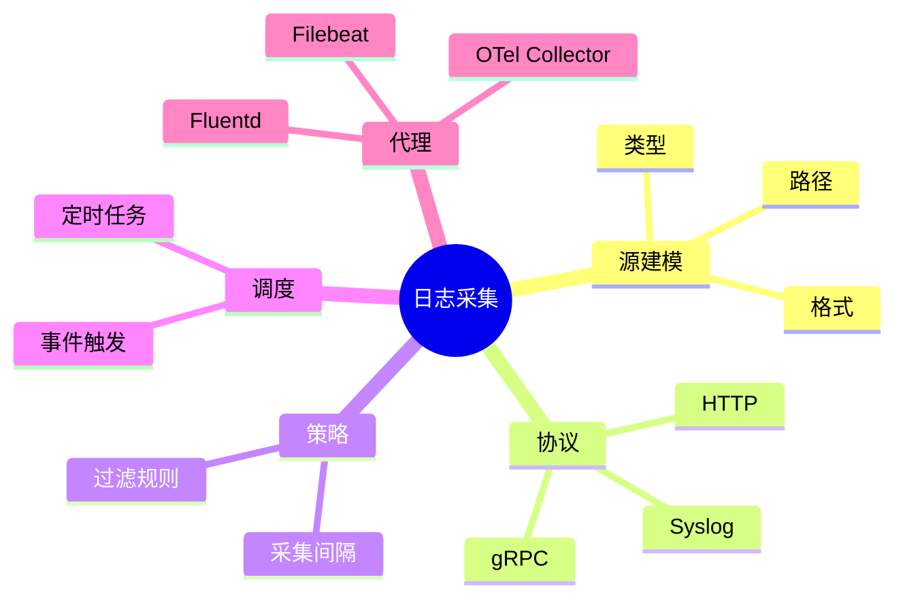

# 日志采集理论探讨

## 1. 形式化目标

- 明确日志采集的流程、接口、协议与数据结构
- 支持多源异构日志的自动化采集与标准化建模
- 为日志驱动的监控、溯源、合规等场景提供可验证的采集基础

## 2. 核心概念

- 日志源（Log Source）
- 采集代理（Agent）
- 采集协议（Protocol）
- 采集策略（Policy）
- 采集调度（Scheduling）

## 3. 已有标准

- Fluentd/Fluent Bit
- Logstash
- Filebeat
- OpenTelemetry Collector

## 4. 可行性分析

- 日志采集流程高度可模式化，适合DSL描述
- 多源采集、过滤、转发、聚合等流程可形式化建模
- 与日志解析、存储等可统一为日志处理链路

## 5. 自动化价值

- 自动生成采集配置与调度策略
- 自动化多源日志归一化与转发
- 采集与AI结合实现智能采集优化与异常检测

## 6. 与AI结合点

- 智能采集策略优化
- 采集异常检测与自愈
- 日志源动态发现与适配

## 7. 递归细分方向

- 采集源建模（Source Modeling）
- 采集协议与格式（Protocol & Format）
- 采集调度与策略（Scheduling & Policy）
- 采集异常与自愈（Anomaly & Remediation）

---

## 8. 常见采集元素表格

| 元素         | 说明           | 典型字段                |
|--------------|----------------|-------------------------|
| Source       | 日志源         | path, type, format      |
| Agent        | 采集代理       | name, version, config   |
| Protocol     | 采集协议       | type, port, encoding    |
| Policy       | 采集策略       | interval, filter        |
| Scheduling   | 调度           | cron, event, trigger    |

---

## 9. 日志采集流程思维导图（Mermaid）

---

## 10. 形式化推理/论证片段

**定理：**  
若日志采集的源、协议、策略、调度等环节均可形式化建模，则日志采集系统具备可验证性与可自动化推理能力。

**证明思路：**  

1. 源建模与协议可用DSL描述输入输出映射；
2. 策略与调度可形式化为规则与触发器；
3. 整体流程可组合为可验证的采集链路。
