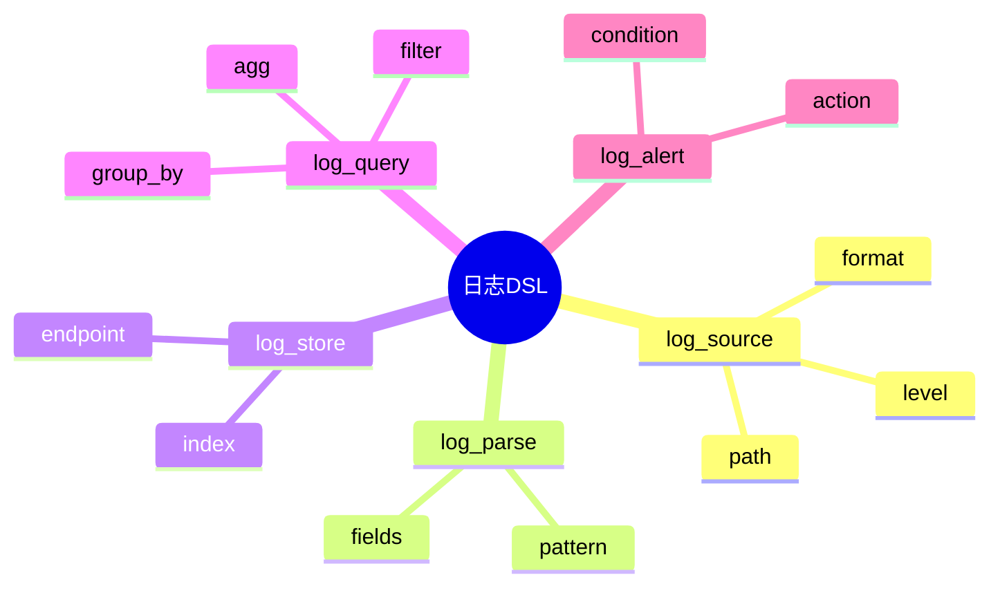

# 日志模型DSL草案

## 1. 设计目标

- 用声明式语法描述日志采集、解析、存储、查询、分析等流程
- 支持多源异构日志统一建模
- 便于自动生成采集/分析配置

## 2. 基本语法结构

```dsl
log_source "app" {
  path = "/var/log/app.log"
  format = "json"
  level = ["INFO", "ERROR"]
}

log_parse "json" {
  fields = ["timestamp", "level", "msg", "trace_id"]
}

log_store "es" {
  endpoint = "http://es:9200"
  index = "app-logs"
}

log_query "error_count" {
  filter = "level == 'ERROR'"
  group_by = "date"
  agg = "count"
}
```

## 3. 关键元素

- log_source：日志源定义
- log_parse：日志解析规则
- log_store：日志存储目标
- log_query：日志查询与聚合
- log_alert：日志告警规则

---

## 4. 示例

```dsl
log_source "syslog" {
  path = "/var/log/syslog"
  format = "rfc5424"
}

log_parse "syslog" {
  fields = ["timestamp", "host", "app", "msg"]
}

log_store "local" {
  path = "/data/logs/"
}

log_query "critical_events" {
  filter = "level in ['CRIT', 'ALERT', 'FATAL']"
  output = "alert"
}
```

---

## 5. 与主流标准的映射

| DSL元素    | Syslog字段 | OpenTelemetry | ELK Stack配置 |
|------------|------------|---------------|--------------|
| log_source | source     | resource      | input        |
| log_parse  | parser     | processor     | filter       |
| log_store  | sink       | exporter      | output       |
| log_query  | n/a        | processor     | query        |

---

## 6. 递归扩展建议

- 支持多级日志聚合与转发
- 日志与指标、追踪的统一DSL
- 日志采集与AI分析的集成

---

## 7. 日志DSL关键元素表格

| 元素        | 说明           | 典型属性           |
|-------------|----------------|--------------------|
| log_source  | 日志源定义     | path, format, level|
| log_parse   | 解析规则       | fields, pattern    |
| log_store   | 存储目标       | endpoint, index    |
| log_query   | 查询与聚合     | filter, group_by   |
| log_alert   | 告警规则       | condition, action  |

---

## 8. 日志DSL语法思维导图（Mermaid）



---

## 9. 形式化DSL推理片段

**推论：**  
若 log_source、log_parse、log_store、log_query、log_alert 语法均具备完备性，则任意日志采集与分析流程均可通过DSL自动生成配置与推理链路。

**证明思路：**  

- 每个环节均可形式化为DSL声明；
- DSL可自动转化为采集/分析/告警配置；
- 组合DSL可推导出完整的日志处理链路。
