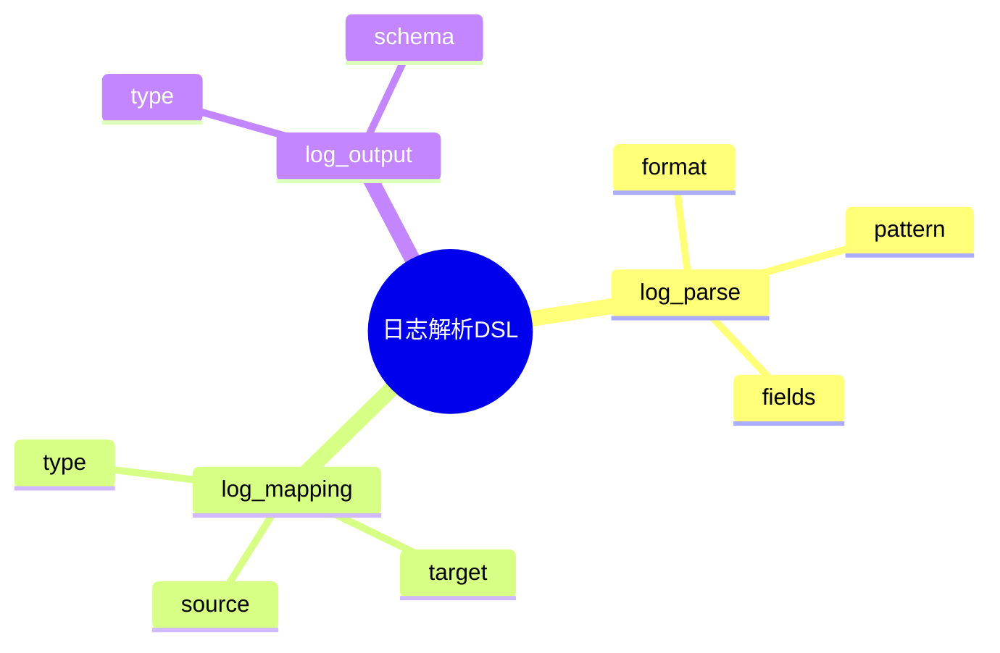

# 日志解析DSL草案

## 1. 设计目标

- 用声明式语法描述日志解析规则、格式、字段映射、输出等流程
- 支持多格式、多模式日志统一解析建模
- 便于自动生成解析与映射配置

## 2. 基本语法结构

```dsl
log_parse "json_app" {
  format = "json"
  fields = ["timestamp", "level", "msg", "trace_id"]
}

log_parse "syslog" {
  format = "rfc5424"
  pattern = "<%PRI%>%TIMESTAMP% %HOSTNAME% %APP-NAME%: %MSG%"
  fields = ["timestamp", "host", "app", "msg"]
}

log_mapping "level_map" {
  source = "sev"
  target = "level"
  type = "string"
}
```

## 3. 关键元素

- log_parse：日志解析规则定义
- log_mapping：字段映射配置
- log_output：结构化输出配置

---

## 4. 示例

```dsl
log_parse "csv_access" {
  format = "csv"
  delimiter = ","
  fields = ["time", "ip", "url", "status"]
}

log_mapping "status_map" {
  source = "status"
  target = "http_status"
  type = "int"
}

log_output "json_struct" {
  type = "json"
}
```

---

## 5. 与主流标准的映射

| DSL元素    | Logstash | Fluentd/Bit | OTel Processor |
|------------|----------|-------------|----------------|
| log_parse  | filter   | parser      | processor      |
| log_mapping| mutate   | record_transformer | processor |
| log_output | output   | output      | exporter       |

---

## 6. 递归扩展建议

- 支持多级解析与字段转换
- 解析与采集、存储的统一DSL
- 解析与AI模式识别的集成

---

## 7. 日志解析DSL关键元素表格

| 元素        | 说明           | 典型属性           |
|-------------|----------------|--------------------|
| log_parse   | 解析规则定义   | format, pattern, fields |
| log_mapping | 字段映射配置   | source, target, type    |
| log_output  | 输出配置       | type, schema           |

---

## 8. 日志解析DSL语法思维导图（Mermaid）



---

## 9. 形式化DSL推理片段

**推论：**  
若 log_parse、log_mapping、log_output 语法均具备完备性，则任意日志解析流程均可通过DSL自动生成配置与推理链路。

**证明思路：**  

- 每个环节均可形式化为DSL声明；
- DSL可自动转化为解析/映射/输出配置；
- 组合DSL可推导出完整的日志解析链路。
