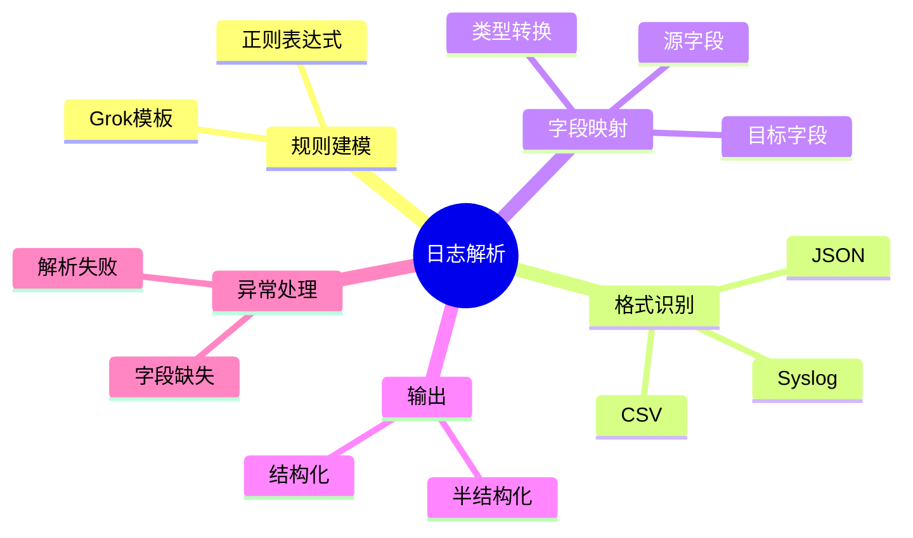

# 日志解析理论探讨

## 1. 形式化目标

- 明确日志解析的流程、语法、模式与数据结构
- 支持多格式、多语法日志的自动化解析与标准化建模
- 为日志驱动的监控、分析、溯源等场景提供可验证的解析基础

## 2. 核心概念

- 解析规则（Parsing Rule）
- 日志格式（Log Format）
- 字段映射（Field Mapping）
- 模式匹配（Pattern Matching）
- 结构化输出（Structured Output）

## 3. 已有标准

- Grok（Logstash）
- Regex Parser
- JSON/YAML/XML Parser
- OpenTelemetry Log Processor

## 4. 可行性分析

- 日志解析流程高度可模式化，适合DSL描述
- 多格式解析、字段映射、结构化输出等流程可形式化建模
- 与采集、存储、分析等可统一为日志处理链路

## 5. 自动化价值

- 自动生成解析规则与字段映射配置
- 自动化多格式日志归一化与结构化
- 解析与AI结合实现智能模式识别与异常检测

## 6. 与AI结合点

- 智能日志模式识别
- 解析异常检测与自愈
- 日志字段自动映射与语义理解

## 7. 递归细分方向

- 解析规则建模（Rule Modeling）
- 格式与模式识别（Format & Pattern）
- 字段映射与转换（Field Mapping & Transformation）
- 解析异常与自愈（Anomaly & Remediation）

---

## 8. 常见解析元素表格

| 元素         | 说明           | 典型字段                |
|--------------|----------------|-------------------------|
| Rule         | 解析规则       | pattern, fields         |
| Format       | 日志格式       | type, delimiter, schema |
| Mapping      | 字段映射       | source, target, type    |
| Output       | 结构化输出     | json, kv, custom        |
| Pattern      | 匹配模式       | regex, grok, template   |

---

## 9. 日志解析流程思维导图（Mermaid）

---

## 10. 形式化推理/论证片段

**定理：**  
若日志解析的规则、格式、映射、输出等环节均可形式化建模，则日志解析系统具备可验证性与可自动化推理能力。

**证明思路：**  

1. 规则与格式可用DSL描述模式与语法；
2. 字段映射与输出可形式化为转换与结构化操作；
3. 整体流程可组合为可验证的解析链路。

## 理论确定性与论证推理

在日志解析领域，理论确定性是实现日志自动化解析、结构化处理、模式识别的基础。以 Grok、Logstash、OpenTelemetry、Fluentd 等主流日志处理平台为例：

1. **形式化定义**  
   解析规则、日志格式、字段映射、输出结构等均有标准化描述和配置语言。

2. **公理化系统**  
   通过解析引擎和模式匹配，实现日志逻辑的自动推理与结构化处理。

3. **类型安全**  
   解析规则、字段类型、输出格式等严格定义，防止解析错误。

4. **可证明性**  
   关键属性如解析正确性、字段完整性等可通过验证和测试进行形式化证明。

这些理论基础为日志解析的自动化配置、模式识别和结构化处理提供了理论支撑。

---

## 11. 理论确定性与论证推理（源码级递归扩展）

### 1. 解析规则与AST递归

- **规则AST递归**：
  - Logstash `grok`/`regex`插件递归定义解析规则，AST节点递归匹配与分组
  - Fluentd `parser`模块递归实现多格式规则（JSON、正则、Grok、CSV等）
  - OpenTelemetry Collector `logs_processor`递归解析规则与字段映射
- **规则链路递归**：
  - 规则→模式→字段→类型→输出递归链路，支持多级嵌套与组合
  - 解析规则DSL递归生成配置与测试用例

### 2. 格式识别与类型推理递归

- **格式识别递归**：
  - JSON/YAML/XML/CSV等格式递归解析，AST结构体递归推理字段类型
  - Syslog、Custom格式递归模式匹配与分隔符推理
- **类型推理递归**：
  - 字段类型递归推断（string/int/float/bool/array/object），支持Schema自动推理
  - 字段缺失、类型不符等异常递归检测与补偿

### 3. 字段映射与结构化输出递归

- **字段映射递归**：
  - 源字段→目标字段递归映射，支持类型转换、重命名、合并、拆分
  - Logstash/Fluentd递归实现字段映射与转换链路
- **结构化输出递归**：
  - JSON、KV、Custom结构递归输出，支持多层级嵌套与类型校验
  - OpenTelemetry Collector递归生成结构化LogRecord

### 4. 异常处理与推理引擎递归

- **异常检测递归**：
  - 解析失败、字段缺失、类型不符等递归检测与补偿
  - Fluentd/Logstash递归实现异常捕获与自愈机制
- **推理引擎递归**：
  - 规则引擎递归推理解析路径、异常分支、补偿策略
  - Loki/ELK递归实现多阶段解析与异常处理链路

### 5. 类型安全与可证明性递归

- **类型安全递归**：
  - 解析规则、字段类型、输出结构递归校验，防止类型不一致与解析失败
  - 多格式日志递归对齐，支持Schema演化与兼容性验证
- **可证明性递归**：
  - 解析流程、规则链路、字段映射、结构化输出全链路递归测试与验证
  - 解析结果的可追溯性、可复现性递归证明

### 6. AI自动化与工程最佳实践递归

- **AI驱动递归**：
  - AI自动补全解析规则、字段映射、格式识别、异常检测链路
  - 智能模式识别、异常预测、自动修复建议
- **工程自动化递归**：
  - CI/CD自动生成解析规则、字段映射、结构化输出配置
  - 自动化测试、监控、回滚递归链路

### 7. 典型源码剖析（以Logstash/Fluentd/OpenTelemetry为例）

- `logstash/lib/logstash/filters/grok.rb`：递归定义Grok解析规则与AST
- `fluentd/lib/fluent/parser.rb`：递归实现多格式解析与字段映射
- `opentelemetry-collector/processor`：递归实现日志解析与结构化输出
- `loki/pkg/logql`：递归解析日志表达式与字段提取

---

如需针对某一源码文件、推理算法、类型系统实现等进行更深层递归剖析，可继续指定领域与理论点，递归扩展将持续补充。
