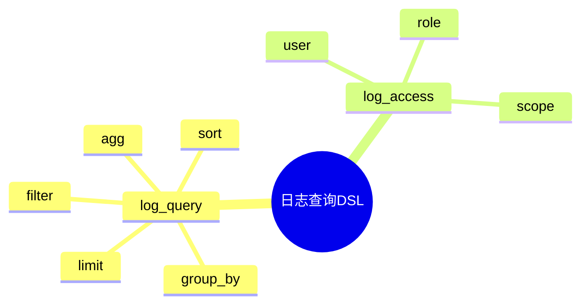

# 日志查询DSL草案

## 1. 设计目标

- 用声明式语法描述日志查询语法、过滤、聚合、排序、权限等流程
- 支持多维度、多条件日志统一查询建模
- 便于自动生成查询与权限配置

## 2. 基本语法结构

```dsl
log_query "error_count" {
  filter = "level == 'ERROR'"
  group_by = "date"
  agg = "count"
}

log_query "slow_requests" {
  filter = "duration > 1000"
  sort = "duration desc"
  limit = 100
}

log_access "admin" {
  user = "alice"
  role = "admin"
  scope = "all"
}
```

## 3. 关键元素

- log_query：日志查询定义
- log_access：权限控制配置

---

## 4. 示例

```dsl
log_query "top_users" {
  agg = "count"
  group_by = "user_id"
  sort = "count desc"
  limit = 10
}

log_query "status_5xx" {
  filter = "status >= 500 && status < 600"
  agg = "count"
}

log_access "readonly" {
  user = "bob"
  role = "viewer"
  scope = "logs"
}
```

---

## 5. 与主流标准的映射

| DSL元素    | ES Query DSL | Loki Query | SQL/PromQL |
|------------|--------------|------------|------------|
| log_query  | query        | query      | select      |
| log_access | security     | n/a        | grant       |

---

## 6. 递归扩展建议

- 支持多级聚合与多条件过滤
- 查询与采集、存储的统一DSL
- 查询与AI优化的集成

---

## 7. 日志查询DSL关键元素表格

| 元素        | 说明           | 典型属性           |
|-------------|----------------|--------------------|
| log_query   | 查询定义       | filter, agg, group_by, sort, limit |
| log_access  | 权限控制配置   | user, role, scope  |

---

## 8. 日志查询DSL语法思维导图（Mermaid）



---

## 9. 形式化DSL推理片段

**推论：**  
若 log_query、log_access 语法均具备完备性，则任意日志查询流程均可通过DSL自动生成配置与推理链路。

**证明思路：**  

- 每个环节均可形式化为DSL声明；
- DSL可自动转化为查询/权限配置；
- 组合DSL可推导出完整的日志查询链路。
