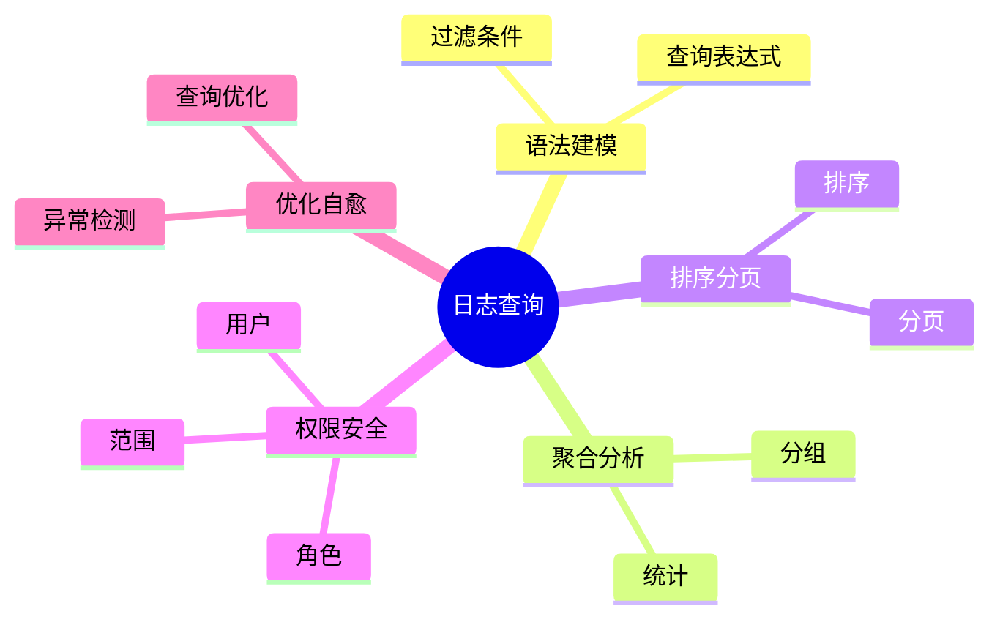

# 日志查询理论探讨

## 1. 形式化目标

- 明确日志查询的语法、算子、优化与安全机制
- 支持多维度、多条件的高效日志检索与聚合
- 为日志驱动的监控、分析、审计等场景提供可验证的查询基础

## 2. 核心概念

- 查询语法（Query Syntax）
- 过滤器（Filter）
- 聚合（Aggregation）
- 排序与分页（Sort & Pagination）
- 权限与安全（Access Control）

## 3. 已有标准

- Elasticsearch Query DSL
- SQL/PromQL/Loki Query
- Lucene
- OpenSearch Query

## 4. 可行性分析

- 日志查询语法、过滤、聚合、排序等流程可DSL化
- 查询优化、权限控制等可形式化建模
- 与采集、解析、存储等可统一为日志处理链路

## 5. 自动化价值

- 自动生成查询与聚合配置
- 自动化日志检索优化与权限管理
- 查询与AI结合实现智能检索、异常检测

## 6. 与AI结合点

- 智能查询推荐与优化
- 查询异常检测与自愈
- 日志语义理解与自动聚类

## 7. 递归细分方向

- 查询语法建模（Syntax Modeling）
- 过滤与聚合（Filter & Aggregation）
- 查询优化与安全（Optimization & Security）
- 查询异常与自愈（Anomaly & Remediation）

---

## 8. 常见查询元素表格

| 元素         | 说明           | 典型字段                |
|--------------|----------------|-------------------------|
| Query        | 查询语句       | expr, filter, sort      |
| Filter       | 过滤器         | field, op, value        |
| Aggregation  | 聚合           | field, func, group_by   |
| Sort         | 排序           | field, order            |
| Access       | 权限控制       | user, role, scope       |

---

## 9. 日志查询流程思维导图（Mermaid）

---

## 10. 形式化推理/论证片段

**定理：**  
若日志查询的语法、过滤、聚合、排序、权限等环节均可形式化建模，则日志查询系统具备可验证性与可自动化推理能力。

**证明思路：**  

1. 语法与过滤可用DSL描述表达式与条件；
2. 聚合与排序可形式化为算子与操作链；
3. 权限与优化可归约为规则与调度；
4. 整体流程可组合为可验证的查询链路。

## 理论确定性与论证推理

在日志查询领域，理论确定性是实现日志自动化检索、聚合分析、权限控制的基础。以 Elasticsearch、Loki、PromQL、Lucene、OpenSearch 等主流日志查询平台为例：

1. **形式化定义**  
   查询语法、过滤条件、聚合算子、权限规则等均有标准化描述和配置语言。

2. **公理化系统**  
   通过查询引擎和优化器，实现日志逻辑的自动推理与检索优化。

3. **类型安全**  
   查询表达式、字段类型、权限范围等严格定义，防止查询错误。

4. **可证明性**  
   关键属性如查询正确性、权限安全性等可通过验证和测试进行形式化证明。

这些理论基础为日志查询的自动化配置、检索优化和权限管理提供了理论支撑。
