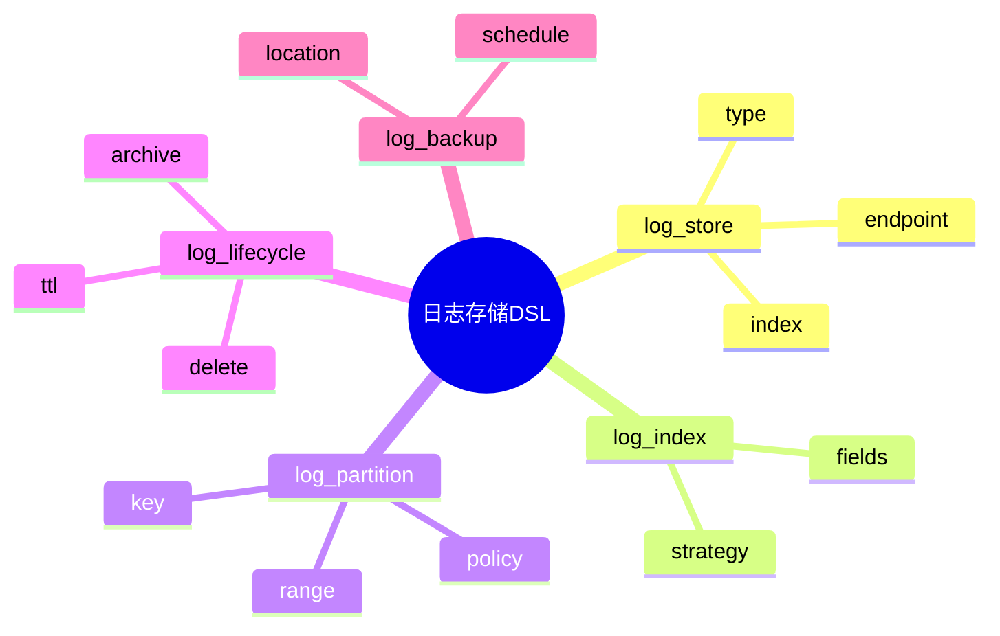

# 日志存储DSL草案

## 1. 设计目标

- 用声明式语法描述日志存储后端、索引、分区、生命周期、备份等流程
- 支持多类型、多规模日志统一存储建模
- 便于自动生成存储与归档配置

## 2. 基本语法结构

```dsl
log_store "es" {
  type = "elasticsearch"
  endpoint = "http://es:9200"
  index = "app-logs"
}

log_index "by_date" {
  fields = ["timestamp"]
  strategy = "daily"
}

log_lifecycle "archive" {
  ttl = "30d"
  archive = true
  delete = false
}

log_backup "remote" {
  schedule = "0 3 * * *"
  location = "s3://backup/logs"
}
```

## 3. 关键元素

- log_store：日志存储后端定义
- log_index：索引策略配置
- log_partition：分区策略配置
- log_lifecycle：生命周期与归档配置
- log_backup：备份配置

---

## 4. 示例

```dsl
log_store "loki" {
  type = "loki"
  endpoint = "http://loki:3100"
}

log_index "by_service" {
  fields = ["service", "level"]
  strategy = "hash"
}

log_lifecycle "clean" {
  ttl = "7d"
  archive = false
  delete = true
}

log_backup "local" {
  schedule = "@daily"
  location = "/data/backup/"
}
```

---

## 5. 与主流标准的映射

| DSL元素    | Elasticsearch | Loki | S3/HDFS |
|------------|---------------|------|---------|
| log_store  | index         | stream| bucket  |
| log_index  | mapping       | label | n/a     |
| log_partition| shard       | stream| n/a     |
| log_lifecycle| ilm         | retention| lifecycle|
| log_backup | snapshot      | backup| backup  |

---

## 6. 递归扩展建议

- 支持多级存储与冷热分层
- 存储与采集、解析的统一DSL
- 存储与AI优化的集成

---

## 7. 日志存储DSL关键元素表格

| 元素        | 说明           | 典型属性           |
|-------------|----------------|--------------------|
| log_store   | 存储后端定义   | type, endpoint, index |
| log_index   | 索引策略配置   | fields, strategy      |
| log_partition| 分区策略配置  | key, range, policy   |
| log_lifecycle| 生命周期配置  | ttl, archive, delete |
| log_backup  | 备份配置       | schedule, location   |

---

## 8. 日志存储DSL语法思维导图（Mermaid）



---

## 9. 形式化DSL推理片段

**推论：**  
若 log_store、log_index、log_partition、log_lifecycle、log_backup 语法均具备完备性，则任意日志存储流程均可通过DSL自动生成配置与推理链路。

**证明思路：**  

- 每个环节均可形式化为DSL声明；
- DSL可自动转化为存储/归档/备份配置；
- 组合DSL可推导出完整的日志存储链路。
