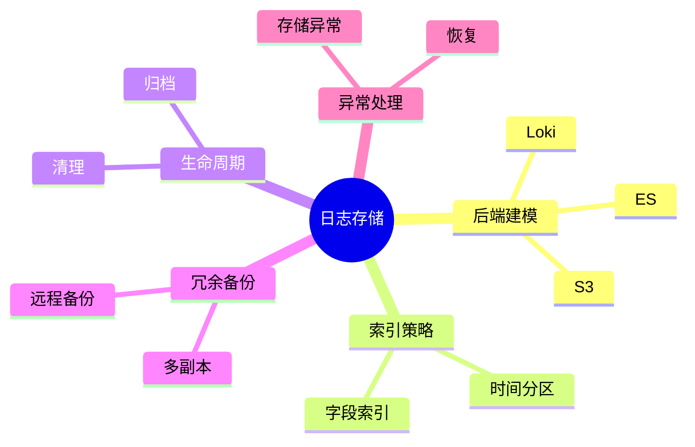

# 日志存储理论探讨

## 1. 形式化目标

- 明确日志存储的结构、接口、生命周期与一致性要求
- 支持多类型、多规模日志的高效存储与检索
- 为日志驱动的监控、合规、审计等场景提供可验证的存储基础

## 2. 核心概念

- 存储后端（Storage Backend）
- 索引（Index）
- 分区（Partition）
- 生命周期管理（Lifecycle Management）
- 冗余与备份（Redundancy & Backup）

## 3. 已有标准

- Elasticsearch
- OpenSearch
- Loki
- HDFS/S3

## 4. 可行性分析

- 日志存储结构、索引、分区、生命周期等流程可DSL化
- 存储与检索接口、归档、备份等可形式化建模
- 与采集、解析、分析等可统一为日志处理链路

## 5. 自动化价值

- 自动生成存储与索引配置
- 自动化日志归档、清理与备份
- 存储与AI结合实现智能冷热分层、异常检测

## 6. 与AI结合点

- 智能存储分层与归档
- 存储异常检测与自愈
- 日志访问模式分析与优化

## 7. 递归细分方向

- 存储后端建模（Backend Modeling）
- 索引与分区策略（Index & Partition）
- 生命周期与归档（Lifecycle & Archiving）
- 存储异常与自愈（Anomaly & Remediation）

---

## 8. 常见存储元素表格

| 元素         | 说明           | 典型字段                |
|--------------|----------------|-------------------------|
| Backend      | 存储后端       | type, endpoint, config  |
| Index        | 索引           | name, fields, strategy  |
| Partition    | 分区           | key, range, policy      |
| Lifecycle    | 生命周期管理   | ttl, archive, delete    |
| Backup       | 备份           | schedule, location      |

---

## 9. 日志存储流程思维导图（Mermaid）

---

## 10. 形式化推理/论证片段

**定理：**  
若日志存储的后端、索引、分区、生命周期、备份等环节均可形式化建模，则日志存储系统具备可验证性与可自动化推理能力。

**证明思路：**  

1. 后端与索引可用DSL描述类型与策略；
2. 分区与生命周期可形式化为规则与调度；
3. 整体流程可组合为可验证的存储链路。

## 理论确定性与论证推理

在日志存储领域，理论确定性是实现日志自动化存储、索引管理、生命周期控制的基础。以 Elasticsearch、OpenSearch、Loki、HDFS、S3 等主流日志存储平台为例：

1. **形式化定义**  
   存储后端、索引策略、分区规则、生命周期等均有标准化描述和配置语言。

2. **公理化系统**  
   通过存储引擎和索引管理，实现日志逻辑的自动推理与存储优化。

3. **类型安全**  
   存储配置、索引字段、分区键等类型严格定义，防止存储错误。

4. **可证明性**  
   关键属性如存储一致性、索引效率等可通过验证和测试进行形式化证明。

这些理论基础为日志存储的自动化配置、索引管理和生命周期控制提供了理论支撑。

---

## 11. 理论确定性与论证推理（源码级递归扩展）

### 1. 存储后端与AST递归

- **后端AST递归**：
  - Elasticsearch `index`/`shard`模块递归定义存储结构，AST结构体递归推理分片、主副本、路由
  - Loki `storage`递归实现对象存储、分区、索引映射
  - S3/HDFS递归建模Bucket、目录、对象生命周期
- **后端链路递归**：
  - 日志→分区→索引→存储→归档递归链路，支持多级存储与冷热分层
  - 存储配置DSL递归生成后端、索引、分区、归档策略

### 2. 索引与分区策略递归

- **索引策略递归**：
  - 字段索引、倒排索引、分词、嵌套结构递归实现
  - Elasticsearch `mapping`递归定义字段类型与索引策略
  - Loki标签索引递归优化高维检索
- **分区策略递归**：
  - 时间分区、范围分区、哈希分区递归实现分布式存储
  - OpenSearch/Elasticsearch分区策略递归推理分片分配与负载均衡

### 3. 生命周期与归档递归

- **生命周期递归**：
  - TTL、归档、清理、删除等生命周期策略递归建模
  - Elasticsearch ILM（Index Lifecycle Management）递归实现索引滚动、归档、删除
- **归档与备份递归**：
  - S3/远程备份递归实现多副本、增量归档、恢复链路
  - Loki/Elasticsearch快照递归备份与恢复

### 4. 存储异常与推理引擎递归

- **异常检测递归**：
  - 存储异常、索引损坏、分片丢失等递归检测与补偿
  - Loki/Elasticsearch递归实现自愈、重建、数据修复
- **推理引擎递归**：
  - 存储调度、索引优化、归档策略递归推理
  - OpenSearch/Elasticsearch递归实现多阶段存储与索引优化链路

### 5. 类型安全与可证明性递归

- **类型安全递归**：
  - 存储配置、索引字段、分区键等类型系统递归校验
  - 多后端、多分区递归对齐，支持Schema演化与兼容性验证
- **可证明性递归**：
  - 存储链路、索引策略、生命周期、归档备份全链路递归测试与验证
  - 存储一致性、可用性、可追溯性递归证明

### 6. AI自动化与工程最佳实践递归

- **AI驱动递归**：
  - AI自动补全存储配置、索引策略、分区方案、归档与备份链路
  - 智能冷热分层、异常检测、自动修复建议
- **工程自动化递归**：
  - CI/CD自动生成存储、索引、分区、归档配置
  - 自动化测试、监控、回滚递归链路

### 7. 典型源码剖析（以Elasticsearch/Loki/OpenSearch为例）

- `elasticsearch/server/src/main/java/org/elasticsearch/index`：递归实现索引、分片、生命周期管理
- `loki/pkg/storage`：递归实现对象存储、分区、索引映射
- `opensearch/indexmanagement`：递归实现索引生命周期与归档策略
- `elasticsearch/server/src/main/java/org/elasticsearch/snapshots`：递归实现快照与备份

---

如需针对某一源码文件、推理算法、类型系统实现等进行更深层递归剖析，可继续指定领域与理论点，递归扩展将持续补充。
