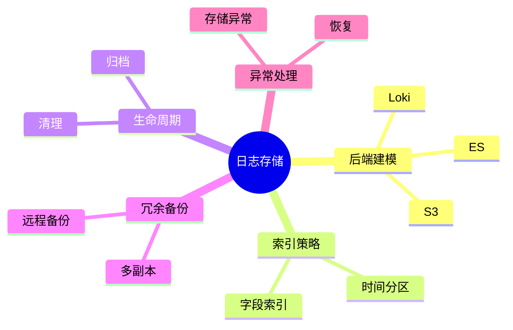

# 日志存储理论探讨

## 1. 形式化目标

- 明确日志存储的结构、接口、生命周期与一致性要求
- 支持多类型、多规模日志的高效存储与检索
- 为日志驱动的监控、合规、审计等场景提供可验证的存储基础

## 2. 核心概念

- 存储后端（Storage Backend）
- 索引（Index）
- 分区（Partition）
- 生命周期管理（Lifecycle Management）
- 冗余与备份（Redundancy & Backup）

## 3. 已有标准

- Elasticsearch
- OpenSearch
- Loki
- HDFS/S3

## 4. 可行性分析

- 日志存储结构、索引、分区、生命周期等流程可DSL化
- 存储与检索接口、归档、备份等可形式化建模
- 与采集、解析、分析等可统一为日志处理链路

## 5. 自动化价值

- 自动生成存储与索引配置
- 自动化日志归档、清理与备份
- 存储与AI结合实现智能冷热分层、异常检测

## 6. 与AI结合点

- 智能存储分层与归档
- 存储异常检测与自愈
- 日志访问模式分析与优化

## 7. 递归细分方向

- 存储后端建模（Backend Modeling）
- 索引与分区策略（Index & Partition）
- 生命周期与归档（Lifecycle & Archiving）
- 存储异常与自愈（Anomaly & Remediation）

---

## 8. 常见存储元素表格

| 元素         | 说明           | 典型字段                |
|--------------|----------------|-------------------------|
| Backend      | 存储后端       | type, endpoint, config  |
| Index        | 索引           | name, fields, strategy  |
| Partition    | 分区           | key, range, policy      |
| Lifecycle    | 生命周期管理   | ttl, archive, delete    |
| Backup       | 备份           | schedule, location      |

---

## 9. 日志存储流程思维导图（Mermaid）

---

## 10. 形式化推理/论证片段

**定理：**  
若日志存储的后端、索引、分区、生命周期、备份等环节均可形式化建模，则日志存储系统具备可验证性与可自动化推理能力。

**证明思路：**  

1. 后端与索引可用DSL描述类型与策略；
2. 分区与生命周期可形式化为规则与调度；
3. 整体流程可组合为可验证的存储链路。
