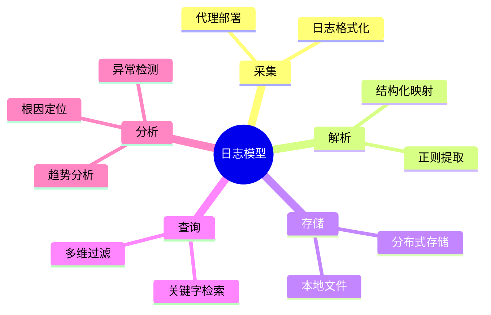

# 日志模型理论探讨

## 1. 形式化目标

- 明确日志数据的结构、语义与生命周期
- 支持日志采集、存储、查询、分析的自动化与标准化
- 为日志驱动的监控、溯源、合规等场景提供形式化基础

## 2. 核心概念

- 日志事件（Log Event）
- 日志级别（Level）
- 日志源（Source）
- 日志格式（Format）
- 日志上下文（Context）

## 3. 已有标准

- RFC 5424（Syslog）
- OpenTelemetry Logging
- ELK Stack（Elasticsearch, Logstash, Kibana）
- Fluentd/Fluent Bit

## 4. 可行性分析

- 日志结构高度可模式化，适合DSL描述
- 日志采集、过滤、聚合、分析流程可形式化建模
- 日志与指标、追踪等可统一为可观测性模型

## 5. 自动化价值

- 自动生成日志采集/解析/归档配置
- 自动化日志异常检测与根因分析
- 日志与AI结合实现智能告警、根因定位

## 6. 与AI结合点

- 日志异常检测（Anomaly Detection）
- 智能日志摘要与聚类
- 日志驱动的根因分析与预测

## 7. 递归细分方向

- 日志采集（Collection）
- 日志解析（Parsing）
- 日志存储（Storage）
- 日志查询（Query）
- 日志分析（Analysis）

---

## 8. 常见日志类型表格

| 类型         | 级别示例      | 典型字段           | 说明           |
|--------------|---------------|--------------------|----------------|
| 应用日志     | INFO, ERROR   | timestamp, msg     | 业务系统输出   |
| 系统日志     | WARN, FATAL   | pid, process, msg  | 操作系统/中间件|
| 审计日志     | INFO, NOTICE  | user, action, time | 合规追踪       |
| 安全日志     | ALERT, CRIT   | src_ip, event      | 安全事件       |

---

## 9. 日志采集与分析思维导图（Mermaid）

---

## 10. 形式化推理/论证片段

**定理：**  
若日志采集、解析、存储、查询、分析各环节均可形式化建模，则日志驱动的监控系统具备可验证性与可自动化推理能力。

**证明思路：**  

1. 采集与解析可用DSL描述输入输出映射；
2. 存储与查询可形式化为数据流与查询算子；
3. 分析可归约为模式匹配与推理规则；
4. 整体流程可组合为可验证的监控链路。
