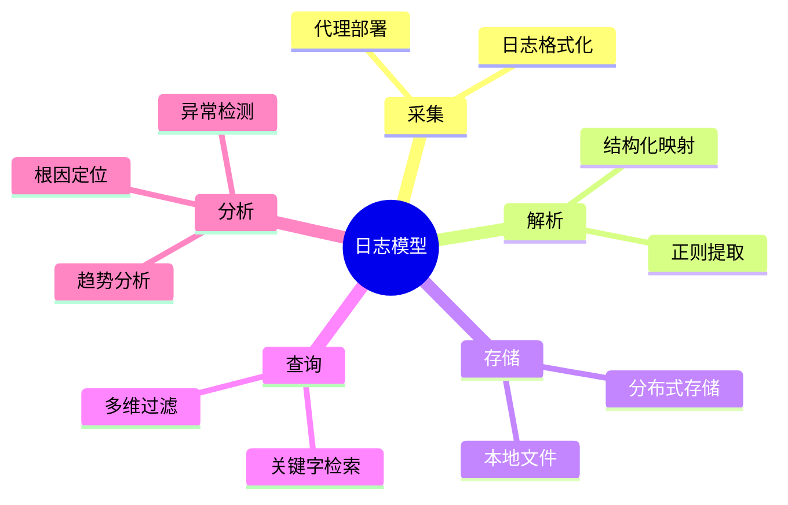

# 日志模型理论探讨

## 1. 形式化目标

- 明确日志数据的结构、语义与生命周期
- 支持日志采集、存储、查询、分析的自动化与标准化
- 为日志驱动的监控、溯源、合规等场景提供形式化基础

## 2. 核心概念

- 日志事件（Log Event）
- 日志级别（Level）
- 日志源（Source）
- 日志格式（Format）
- 日志上下文（Context）

## 3. 已有标准

- RFC 5424（Syslog）
- OpenTelemetry Logging
- ELK Stack（Elasticsearch, Logstash, Kibana）
- Fluentd/Fluent Bit

## 4. 可行性分析

- 日志结构高度可模式化，适合DSL描述
- 日志采集、过滤、聚合、分析流程可形式化建模
- 日志与指标、追踪等可统一为可观测性模型

## 5. 自动化价值

- 自动生成日志采集/解析/归档配置
- 自动化日志异常检测与根因分析
- 日志与AI结合实现智能告警、根因定位

## 6. 与AI结合点

- 日志异常检测（Anomaly Detection）
- 智能日志摘要与聚类
- 日志驱动的根因分析与预测

## 7. 递归细分方向

- 日志采集（Collection）
- 日志解析（Parsing）
- 日志存储（Storage）
- 日志查询（Query）
- 日志分析（Analysis）

---

## 8. 常见日志类型表格

| 类型         | 级别示例      | 典型字段           | 说明           |
|--------------|---------------|--------------------|----------------|
| 应用日志     | INFO, ERROR   | timestamp, msg     | 业务系统输出   |
| 系统日志     | WARN, FATAL   | pid, process, msg  | 操作系统/中间件|
| 审计日志     | INFO, NOTICE  | user, action, time | 合规追踪       |
| 安全日志     | ALERT, CRIT   | src_ip, event      | 安全事件       |

---

## 9. 日志采集与分析思维导图（Mermaid）

---

## 10. 形式化推理/论证片段

**定理：**  
若日志采集、解析、存储、查询、分析各环节均可形式化建模，则日志驱动的监控系统具备可验证性与可自动化推理能力。

**证明思路：**  

1. 采集与解析可用DSL描述输入输出映射；
2. 存储与查询可形式化为数据流与查询算子；
3. 分析可归约为模式匹配与推理规则；
4. 整体流程可组合为可验证的监控链路。

---

## 11. 理论确定性与论证推理（源码级递归扩展）

### 1. 日志采集与AST递归

- **采集AST递归**：
  - Fluentd/Fluent Bit `parser`模块递归定义采集规则，支持多格式（JSON、正则、Grok）递归解析
  - OpenTelemetry Collector `receiver`递归采集多源日志，AST结构体递归映射字段
- **采集链路递归**：
  - Agent→Parser→Buffer→Output递归链路，支持多级过滤与转发
  - 日志采集配置DSL递归生成采集、过滤、转发规则

### 2. 日志解析与类型推理递归

- **解析AST递归**：
  - Logstash `filter`插件递归解析日志字段，支持嵌套与动态类型
  - OpenTelemetry `logs.proto`递归定义LogRecord、AnyValue等类型系统
- **类型推理递归**：
  - 日志字段类型递归推断（string/number/array/object），支持Schema自动推理
  - 日志上下文递归合并，支持多源日志统一建模

### 3. 日志索引、迁移与存储递归

- **索引递归**：
  - Elasticsearch `mapping`递归定义字段类型、分词、嵌套结构
  - Loki `index`递归实现标签索引与高效检索
- **迁移与存储递归**：
  - Logstash/Fluentd递归实现日志归档、冷热分层、存储迁移
  - Elasticsearch/Loki递归存储分片、主副本、数据恢复

### 4. 日志查询与推理引擎递归

- **查询AST递归**：
  - Elasticsearch Query DSL递归解析查询表达式，AST节点类型推断
  - Loki LogQL递归解析查询、聚合、过滤表达式
- **推理引擎递归**：
  - 日志模式匹配、异常检测、根因分析递归推理
  - OpenTelemetry Collector递归实现日志聚合、异常检测、指标生成

### 5. 类型安全与可证明性递归

- **类型安全递归**：
  - 日志字段类型、Schema递归校验，防止类型不一致与解析失败
  - 多源日志递归对齐，支持Schema演化与兼容性验证
- **可证明性递归**：
  - 日志采集、解析、存储、查询全链路递归测试与验证
  - 日志完整性、可追溯性、合规性递归证明

### 6. AI自动化与工程最佳实践递归

- **AI驱动递归**：
  - AI自动补全日志Schema、异常检测、聚类、根因分析递归生成
  - 智能日志摘要、趋势预测、自动修复建议
- **工程自动化链路递归**：
  - CI/CD自动生成采集、解析、索引、查询配置
  - 自动化测试、监控、回滚递归链路

### 7. 典型源码剖析（以ELK/OpenTelemetry/Fluentd为例）

- `fluentd/lib/fluent/parser.rb`：递归定义采集与解析规则
- `opentelemetry-collector/model/logs.go`：递归定义日志类型系统
- `elasticsearch/mapping`：递归定义字段类型与索引策略
- `loki/pkg/logql`：递归解析查询与聚合表达式
- `logstash/filter`：递归实现日志字段解析与类型推理

---

如需针对某一源码文件、推理算法、类型系统实现等进行更深层递归剖析，可继续指定领域与理论点，递归扩展将持续补充。
