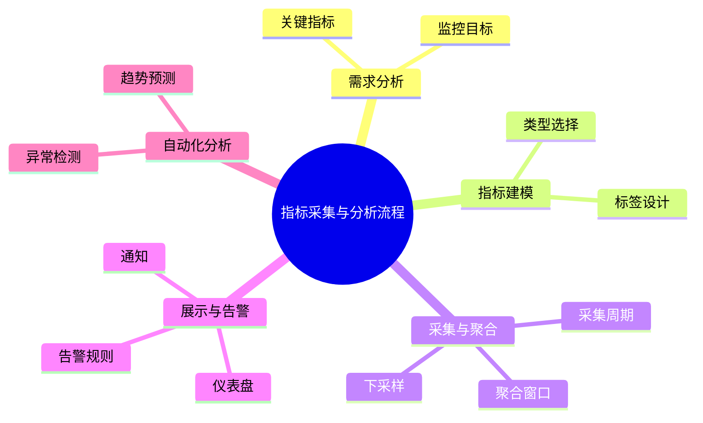

# 指标建模理论探讨

## 1. 形式化目标

- 以结构化方式描述系统的监控指标、采集、聚合、展示等。
- 支持多种指标类型（计数、采样、分布、聚合等）统一建模。
- 便于自动生成指标配置、采集脚本、仪表盘、告警规则等。

## 2. 核心概念

- **指标类型**：Counter、Gauge、Histogram、Summary等。
- **标签与维度**：多维度分组、聚合。
- **采集与聚合**：采集周期、聚合窗口、下采样。
- **展示与可视化**：仪表盘、图表、趋势分析。
- **告警与阈值**：指标阈值、告警规则、通知。

## 3. 已有标准

- Prometheus指标模型
- OpenTelemetry Metrics
- StatsD、Graphite等

## 4. 可行性分析

- 指标建模结构化强，标准化程度高，适合DSL抽象。
- 可自动生成指标配置、采集脚本、仪表盘等。
- 易于与AI结合进行异常检测、趋势预测、自动调优。

## 5. 自动化价值

- 降低手工配置和维护指标的成本。
- 提高系统可观测性和响应速度。
- 支持自动化异常检测和告警。

## 6. 与AI结合点

- 智能补全指标定义、标签。
- 自动推理异常模式、趋势预测。
- 智能生成告警规则与仪表盘建议。

---

## 7. 常见指标类型与特性一览（表格）

| 类型         | 特性                 | 典型场景           |
|--------------|----------------------|--------------------|
| Counter      | 单调递增、计数       | 请求数、错误数     |
| Gauge        | 可增可减、快照值     | 内存、CPU、温度    |
| Histogram    | 分布、区间统计       | 响应时间、延迟     |
| Summary      | 分位数、采样         | P99延迟、流量      |

---

## 8. 指标采集与分析流程思维导图

---

## 9. 形式化推理/证明片段

**定理（指标可观测性）**：
若系统所有关键路径均有指标覆盖，则系统可观测性完备。

*证明思路*：
对每条关键路径定义Counter/Gauge等指标，覆盖所有操作。

**推论（异常可检测性）**：
若指标有阈值告警，则异常可被及时发现。
