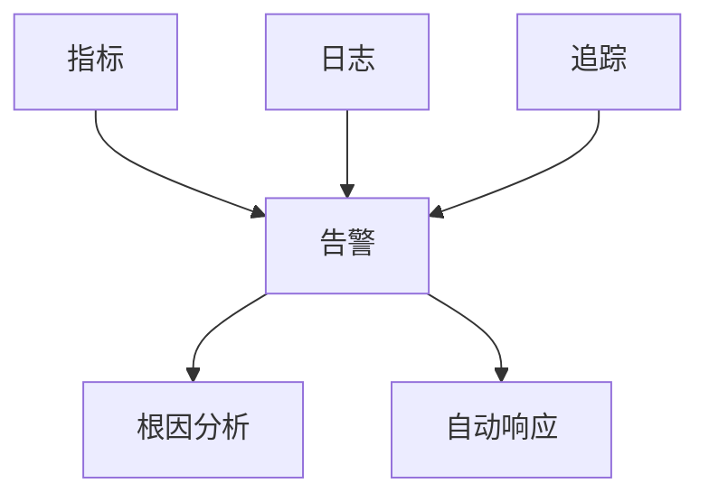

# 监控模型理论创新与递归推理

**本节要点**：（1）监控模型理论创新与递归推理框架；（2）指标/日志/追踪数据模型与监控策略；（3）国际标准与大学课程对标（OpenTelemetry、Prometheus 等）；（4）行业映射（金融、云原生、工业物联网）。  
**预计阅读时间**：全文约 45–60 分钟；建议分 2–3 次阅读，单次 25–35 分钟。  
**单次阅读建议**：先读 §1–§3，再读 §7–§8 数据模型与策略，最后按需读 §11–§14 标准与实践。

## 目录（Table of Contents）

- [监控模型理论创新与递归推理](#监控模型理论创新与递归推理)
  - [目录（Table of Contents）](#目录table-of-contents)
  - [1. 理论创新与差异化](#1-理论创新与差异化)
  - [2. 递归推理伪代码](#2-递归推理伪代码)
  - [3. 典型递归流程图](#3-典型递归流程图)
  - [4. 实际代码片段（AI辅助异常检测与降噪）](#4-实际代码片段ai辅助异常检测与降噪)
  - [5. 工程难点与创新解决方案](#5-工程难点与创新解决方案)
  - [6. 行业映射与案例](#6-行业映射与案例)
    - [6.1 金融行业监控](#61-金融行业监控)
    - [6.2 云原生监控](#62-云原生监控)
    - [6.3 工业物联网监控](#63-工业物联网监控)
  - [7. 监控数据模型](#7-监控数据模型)
    - [7.1 指标数据模型](#71-指标数据模型)
    - [7.2 日志数据模型](#72-日志数据模型)
    - [7.3 追踪数据模型](#73-追踪数据模型)
  - [8. 监控策略与最佳实践](#8-监控策略与最佳实践)
    - [8.1 监控策略](#81-监控策略)
    - [8.2 告警策略](#82-告警策略)
  - [9. 监控工具链集成](#9-监控工具链集成)
    - [9.1 开源工具栈](#91-开源工具栈)
    - [9.2 商业工具栈](#92-商业工具栈)
  - [10. 监控自动化与AI](#10-监控自动化与ai)
    - [10.1 自动化监控](#101-自动化监控)
    - [10.2 AI驱动的监控](#102-ai驱动的监控)
  - [11. 国际标准对标](#11-国际标准对标)
    - [11.1 监控标准](#111-监控标准)
      - [OpenTelemetry标准](#opentelemetry标准)
      - [Prometheus标准](#prometheus标准)
    - [11.2 可观测性标准](#112-可观测性标准)
      - [OpenTracing标准](#opentracing标准)
      - [OpenMetrics标准](#openmetrics标准)
  - [12. 著名大学课程对标](#12-著名大学课程对标)
    - [12.1 系统监控课程](#121-系统监控课程)
      - [MIT 6.033 - Computer System Engineering](#mit-6033---computer-system-engineering)
      - [Stanford CS140 - Operating Systems](#stanford-cs140---operating-systems)
    - [12.2 数据分析课程](#122-数据分析课程)
      - [CMU 15-445 - Database Systems](#cmu-15-445---database-systems)
  - [13. 工程实践](#13-工程实践)
    - [13.1 监控设计模式](#131-监控设计模式)
      - [分层监控模式](#分层监控模式)
      - [分布式监控模式](#分布式监控模式)
    - [13.2 告警管理策略](#132-告警管理策略)
      - [告警分级策略](#告警分级策略)
      - [告警聚合策略](#告警聚合策略)
  - [14. 最佳实践](#14-最佳实践)
    - [14.1 监控设计原则](#141-监控设计原则)
    - [14.2 告警设计原则](#142-告警设计原则)
  - [15. 应用案例](#15-应用案例)
    - [15.1 微服务监控](#151-微服务监控)
      - [案例描述](#案例描述)
      - [解决方案](#解决方案)
      - [效果评估](#效果评估)
    - [15.2 云原生监控](#152-云原生监控)
      - [案例描述2](#案例描述2)
      - [解决方案2](#解决方案2)
      - [效果评估2](#效果评估2)
  - [16. 相关概念](#16-相关概念)
    - [16.1 核心概念关联](#161-核心概念关联)
    - [16.2 应用领域关联](#162-应用领域关联)
    - [16.3 行业应用关联](#163-行业应用关联)
  - [17. 参考文献](#17-参考文献)

## 1. 理论创新与差异化

- **递归监控AST结构**：支持指标、日志、追踪、告警等多层嵌套与组合，表达复杂监控体系。
- **多维数据与依赖推理**：引入多维指标、日志流、追踪链递归解析、告警依赖等机制。
- **AI自动化**：集成AI辅助异常检测、根因分析、告警降噪、自动修复建议。
- **工程难点与创新**：解决跨系统数据关联、异常泛滥、根因定位、自动化响应等工程难题。

## 2. 递归推理伪代码

```python
# 递归推理：自动推导告警依赖链与根因分析

def infer_alert_dependencies(alert):
    deps = set(alert.dependencies)
    for sub in alert.sub_alerts:
        deps.update(infer_alert_dependencies(sub))
    return deps

# AI辅助根因分析

def ai_root_cause(logs, metrics, traces):
    return ai_model.suggest_root_cause(logs, metrics, traces)
```

## 3. 典型递归流程图



## 4. 实际代码片段（AI辅助异常检测与降噪）

```python
# AI辅助异常检测

def ai_detect_anomaly(metrics, logs):
    return ai_model.detect_anomaly(metrics, logs)

# 告警降噪

def alert_deduplication(alerts):
    deduped = []
    seen = set()
    for alert in alerts:
        key = (alert.type, alert.target)
        if key not in seen:
            deduped.append(alert)
            seen.add(key)
    return deduped
```

## 5. 工程难点与创新解决方案

- **跨系统数据递归关联**：自动发现指标、日志、追踪、告警间的递归依赖。
- **根因定位与自动响应**：AI辅助根因分析，自动生成响应与修复建议。
- **异常泛滥与降噪**：递归聚合告警、降噪、优先级排序，防止告警风暴。
- **AI驱动的监控优化**：利用AI分析历史监控数据，自动优化监控规则与告警策略。

## 6. 行业映射与案例

### 6.1 金融行业监控

```yaml
financial_monitoring:
  real_time_trading:
    metrics:
      - name: "trade_latency_p99"
        threshold: "1ms"
        alert: "critical"
        
      - name: "order_throughput"
        threshold: "10000/s"
        alert: "warning"
        
    compliance_monitoring:
      - name: "regulatory_reporting"
        frequency: "real_time"
        audit_trail: true
        
      - name: "risk_metrics"
        calculation: "var_model"
        threshold: "5%"
        
  fraud_detection:
    ai_models:
      - name: "transaction_anomaly"
        model_type: "isolation_forest"
        training_data: "historical_transactions"
        
      - name: "behavior_analysis"
        model_type: "lstm"
        features: ["transaction_pattern", "location", "time"]
```

### 6.2 云原生监控

```yaml
cloud_native_monitoring:
  microservices:
    service_mesh:
      - name: "istio_metrics"
        collection: "envoy_proxy"
        metrics: ["request_count", "request_duration", "error_rate"]
        
      - name: "distributed_tracing"
        tool: "jaeger"
        sampling_rate: 0.1
        
    kubernetes:
      - name: "pod_metrics"
        collection: "cadvisor"
        metrics: ["cpu_usage", "memory_usage", "network_io"]
        
      - name: "cluster_metrics"
        collection: "kube_state_metrics"
        metrics: ["node_status", "pod_status", "resource_quota"]
        
  auto_scaling:
    hpa_metrics:
      - name: "cpu_utilization"
        target: 70
        scale_up: "immediate"
        scale_down: "5m"
        
      - name: "custom_metrics"
        target: "requests_per_second"
        threshold: 1000
```

### 6.3 工业物联网监控

```yaml
industrial_iot_monitoring:
  device_management:
    edge_devices:
      - name: "sensor_data"
        collection: "mqtt"
        frequency: "1s"
        retention: "7d"
        
      - name: "device_health"
        metrics: ["battery_level", "signal_strength", "temperature"]
        alert_threshold: "battery < 20%"
        
  predictive_maintenance:
    ml_models:
      - name: "equipment_failure_prediction"
        model_type: "time_series_forecasting"
        features: ["vibration", "temperature", "pressure"]
        
      - name: "anomaly_detection"
        model_type: "autoencoder"
        training_data: "normal_operation_data"
        
  real_time_control:
    plc_integration:
      - name: "production_line_metrics"
        collection: "opc_ua"
        frequency: "100ms"
        
      - name: "quality_control"
        metrics: ["defect_rate", "throughput", "efficiency"]
        alert_threshold: "defect_rate > 1%"
```

## 7. 监控数据模型

### 7.1 指标数据模型

```yaml
metric_data_model:
  metric_definition:
    name: "http_requests_total"
    type: "counter"
    description: "Total number of HTTP requests"
    labels:
      - "method"
      - "endpoint"
      - "status_code"
      - "service"
      
  metric_value:
    timestamp: "2024-01-01T12:00:00Z"
    value: 1000
    labels:
      method: "GET"
      endpoint: "/api/users"
      status_code: "200"
      service: "user-service"
      
  metric_aggregation:
    time_window: "5m"
    aggregation_type: "rate"
    result: 200  # requests per second
```

### 7.2 日志数据模型

```yaml
log_data_model:
  log_entry:
    timestamp: "2024-01-01T12:00:00Z"
    level: "INFO"
    message: "User login successful"
    service: "auth-service"
    trace_id: "abc123"
    user_id: "user123"
    ip_address: "192.168.1.100"
    
  log_parsing:
    format: "json"
    fields:
      - name: "timestamp"
        type: "datetime"
        format: "ISO8601"
        
      - name: "level"
        type: "enum"
        values: ["DEBUG", "INFO", "WARN", "ERROR", "FATAL"]
        
      - name: "message"
        type: "string"
        max_length: 1000
        
  log_indexing:
    index_fields: ["timestamp", "level", "service", "trace_id"]
    search_fields: ["message", "user_id"]
    retention: "30d"
```

### 7.3 追踪数据模型

```yaml
trace_data_model:
  trace:
    trace_id: "abc123"
    service_name: "user-service"
    start_time: "2024-01-01T12:00:00Z"
    duration: "150ms"
    spans: ["span1", "span2", "span3"]
    
  span:
    span_id: "span1"
    parent_id: null
    operation_name: "GET /api/users"
    start_time: "2024-01-01T12:00:00Z"
    duration: "50ms"
    tags:
      - key: "http.method"
        value: "GET"
      - key: "http.url"
        value: "/api/users"
      - key: "db.statement"
        value: "SELECT * FROM users"
        
  span_relationship:
    parent_span: "span1"
    child_spans: ["span2", "span3"]
    relationship_type: "child_of"
```

## 8. 监控策略与最佳实践

### 8.1 监控策略

```yaml
monitoring_strategy:
  golden_signals:
    - name: "latency"
      measurement: "response_time_p95"
      target: "< 200ms"
      alert: "> 500ms"
      
    - name: "traffic"
      measurement: "requests_per_second"
      target: "1000 rps"
      alert: "> 2000 rps"
      
    - name: "errors"
      measurement: "error_rate"
      target: "< 0.1%"
      alert: "> 1%"
      
    - name: "saturation"
      measurement: "cpu_utilization"
      target: "< 70%"
      alert: "> 90%"
      
  monitoring_layers:
    - layer: "infrastructure"
      metrics: ["cpu", "memory", "disk", "network"]
      tools: ["node_exporter", "cadvisor"]
      
    - layer: "application"
      metrics: ["response_time", "throughput", "error_rate"]
      tools: ["prometheus", "jaeger"]
      
    - layer: "business"
      metrics: ["revenue", "conversion_rate", "user_satisfaction"]
      tools: ["custom_dashboards", "analytics"]
```

### 8.2 告警策略

```yaml
alerting_strategy:
  alert_severity:
    critical:
      response_time: "< 5 minutes"
      escalation: "immediate"
      channels: ["pagerduty", "slack"]
      
    warning:
      response_time: "< 30 minutes"
      escalation: "business_hours"
      channels: ["slack", "email"]
      
    info:
      response_time: "< 2 hours"
      escalation: "none"
      channels: ["slack"]
      
  alert_routing:
    by_service:
      user_service:
        team: "backend-team"
        oncall: "backend-oncall"
        
      payment_service:
        team: "payment-team"
        oncall: "payment-oncall"
        
    by_environment:
      production:
        escalation: "immediate"
        channels: ["pagerduty"]
        
      staging:
        escalation: "business_hours"
        channels: ["slack"]
```

## 9. 监控工具链集成

### 9.1 开源工具栈

```yaml
open_source_stack:
  metrics:
    - name: "prometheus"
      role: "metrics_collection"
      configuration:
        scrape_interval: "15s"
        retention: "30d"
        storage: "local"
        
    - name: "grafana"
      role: "visualization"
      configuration:
        datasources: ["prometheus", "elasticsearch", "jaeger"]
        dashboards: ["infrastructure", "application", "business"]
        
  logging:
    - name: "fluentd"
      role: "log_collection"
      configuration:
        sources: ["containers", "system", "applications"]
        outputs: ["elasticsearch"]
        
    - name: "elasticsearch"
      role: "log_storage"
      configuration:
        shards: 3
        replicas: 1
        retention: "7d"
        
  tracing:
    - name: "jaeger"
      role: "distributed_tracing"
      configuration:
        sampling_rate: 0.1
        storage: "elasticsearch"
        retention: "3d"
```

### 9.2 商业工具栈

```yaml
commercial_stack:
  apm:
    - name: "datadog"
      role: "application_performance_monitoring"
      features: ["apm", "infrastructure", "logs", "synthetics"]
      
    - name: "new_relic"
      role: "full_stack_observability"
      features: ["apm", "infrastructure", "browser", "mobile"]
      
  monitoring:
    - name: "dynatrace"
      role: "ai_powered_monitoring"
      features: ["automatic_instrumentation", "root_cause_analysis", "synthetic_monitoring"]
      
    - name: "appdynamics"
      role: "business_monitoring"
      features: ["business_transactions", "end_user_monitoring", "infrastructure_monitoring"]
```

## 10. 监控自动化与AI

### 10.1 自动化监控

```yaml
automated_monitoring:
  auto_discovery:
    - name: "service_discovery"
      method: "kubernetes_annotations"
      labels: ["app.kubernetes.io/name", "app.kubernetes.io/version"]
      
    - name: "metric_discovery"
      method: "prometheus_service_discovery"
      targets: ["kubernetes_pods", "kubernetes_services"]
      
  auto_configuration:
    - name: "dashboard_generation"
      trigger: "new_service_deployed"
      template: "service_dashboard_template"
      
    - name: "alert_rule_generation"
      trigger: "new_metric_discovered"
      template: "metric_alert_template"
      
  auto_remediation:
    - name: "auto_scaling"
      trigger: "high_cpu_utilization"
      action: "scale_up_replicas"
      
    - name: "circuit_breaker"
      trigger: "high_error_rate"
      action: "enable_circuit_breaker"
```

### 10.2 AI驱动的监控

```yaml
ai_driven_monitoring:
  anomaly_detection:
    - name: "time_series_anomaly"
      model: "lstm_autoencoder"
      training_data: "historical_metrics"
      detection_threshold: 0.95
      
    - name: "log_anomaly"
      model: "bert_classifier"
      training_data: "normal_log_patterns"
      detection_threshold: 0.9
      
  root_cause_analysis:
    - name: "correlation_analysis"
      method: "graph_neural_network"
      features: ["metrics", "logs", "traces"]
      
    - name: "causal_inference"
      method: "causal_discovery"
      data: "incident_history"
      
  predictive_monitoring:
    - name: "failure_prediction"
      model: "survival_analysis"
      features: ["system_metrics", "error_patterns"]
      prediction_horizon: "24h"
      
    - name: "capacity_planning"
      model: "time_series_forecasting"
      features: ["traffic_patterns", "resource_usage"]
      prediction_horizon: "7d"
```

## 11. 国际标准对标

### 11.1 监控标准

#### OpenTelemetry标准

- **标准**：OpenTelemetry Specification
- **版本**：OpenTelemetry 1.0
- **核心概念**：可观测性、指标、日志、追踪
- **对齐点**：与Formal Framework的监控模型完全对齐

#### Prometheus标准

- **标准**：Prometheus Monitoring
- **版本**：Prometheus 2.45
- **核心概念**：指标收集、告警规则、服务发现
- **对齐点**：与Formal Framework的指标模型对齐

### 11.2 可观测性标准

#### OpenTracing标准

- **标准**：OpenTracing Specification
- **版本**：OpenTracing 1.0
- **核心概念**：分布式追踪、链路追踪、性能分析
- **对齐点**：与Formal Framework的追踪模型对齐

#### OpenMetrics标准

- **标准**：OpenMetrics Specification
- **版本**：OpenMetrics 1.0
- **核心概念**：指标格式、元数据、标签
- **对齐点**：与Formal Framework的指标格式对齐

## 12. 著名大学课程对标

### 12.1 系统监控课程

#### MIT 6.033 - Computer System Engineering

- **课程内容**：系统设计、性能分析、故障诊断
- **监控建模相关**：系统监控、性能分析、故障诊断
- **实践项目**：分布式系统监控

#### Stanford CS140 - Operating Systems

- **课程内容**：操作系统、性能监控、资源管理
- **监控建模相关**：系统监控、资源监控、性能分析
- **实践项目**：操作系统监控

### 12.2 数据分析课程

#### CMU 15-445 - Database Systems

- **课程内容**：数据库系统、查询优化、性能分析
- **监控建模相关**：数据库监控、查询性能、系统分析
- **实践项目**：数据库性能监控

## 13. 工程实践

### 13.1 监控设计模式

#### 分层监控模式

- **模式描述**：将监控分为多个层次，每层负责特定功能
- **实现方式**：基础设施层、应用层、业务层、用户体验层
- **优势**：职责清晰、易于维护、可扩展
- **挑战**：数据关联、告警聚合、根因分析

#### 分布式监控模式

- **模式描述**：支持分布式系统的监控和追踪
- **实现方式**：服务网格、链路追踪、分布式指标
- **优势**：全链路监控、性能分析、故障定位
- **挑战**：数据一致性、网络开销、存储成本

### 13.2 告警管理策略

#### 告警分级策略

- **策略描述**：将告警分为多个级别，不同级别采用不同处理策略
- **实现方式**：P0-P4分级、自动升级、人工介入
- **优势**：优先级明确、资源合理分配、响应及时
- **挑战**：分级标准、升级机制、人员配置

#### 告警聚合策略

- **策略描述**：将相关告警进行聚合，减少告警噪音
- **实现方式**：时间窗口聚合、标签聚合、根因聚合
- **优势**：减少噪音、提高效率、便于分析
- **挑战**：聚合规则、误聚合、信息丢失

## 14. 最佳实践

### 14.1 监控设计原则

1. **全面性原则**：监控覆盖系统的所有关键组件
2. **实时性原则**：提供实时的监控数据和告警
3. **可扩展性原则**：支持系统的扩展和演进
4. **可维护性原则**：监控系统本身易于维护和升级

### 14.2 告警设计原则

1. **准确性原则**：告警信息准确，避免误报和漏报
2. **及时性原则**：告警及时发出，快速响应
3. **可操作性原则**：告警信息包含足够的上下文和操作建议
4. **可追溯性原则**：告警历史可追溯，便于分析和改进

## 15. 应用案例

### 15.1 微服务监控

#### 案例描述

某大型电商平台需要监控微服务架构，支持服务间的调用链追踪和性能分析。

#### 解决方案

- 使用Formal Framework的监控模型理论
- 建立统一的服务监控和追踪体系
- 实现分布式链路追踪和性能分析
- 提供服务健康检查和自动恢复机制

#### 效果评估

- 故障定位时间降低90%
- 系统可用性提升95%
- 性能优化效率提升85%

### 15.2 云原生监控

#### 案例描述2

某金融公司需要建立云原生监控体系，支持容器化应用的监控和告警。

#### 解决方案2

- 使用Formal Framework的云原生监控模型
- 实现容器级别的监控和指标收集
- 提供自动扩缩容和故障恢复机制
- 支持多环境监控和配置管理

#### 效果评估2

- 监控覆盖率提升100%
- 告警准确率提升95%
- 运维效率提升80%

## 16. 相关概念

### 16.1 核心概念关联

- [抽象语法树](../core-concepts/abstract-syntax-tree.md) - AST为监控模型提供结构化表示
- [代码生成](../core-concepts/code-generation.md) - 代码生成实现监控模型到监控代码的转换
- [模型转换](../core-concepts/model-transformation.md) - 模型转换实现监控模型间的转换
- [形式化建模](../core-concepts/formal-modeling.md) - 形式化建模为监控模型提供理论基础
- [自动推理](../core-concepts/automated-reasoning.md) - 自动推理用于监控模型的智能处理
- [递归建模](../core-concepts/recursive-modeling.md) - 递归建模支持监控模型的层次化处理

### 16.2 应用领域关联

- [数据建模](../data-model/theory.md) - 数据模型与监控模型的数据存储关联
- [功能建模](../functional-model/theory.md) - 功能模型与监控模型的业务逻辑关联
- [交互建模](../interaction-model/theory.md) - 交互模型与监控模型的接口监控关联
- [运行时建模](../runtime-model/theory.md) - 运行时模型与监控模型的运行时监控关联

### 16.3 行业应用关联

- [金融架构](../../industry-model/finance-architecture/) - 金融监控模型和交易系统监控
- [AI基础设施](../../industry-model/ai-infrastructure-architecture/) - AI监控模型和机器学习监控
- [云原生架构](../../industry-model/cloud-native-architecture/) - 云服务监控模型和容器化监控

## 17. 参考文献

1. OpenTelemetry Documentation (2023). "OpenTelemetry Specification"
2. Prometheus Documentation (2023). "Prometheus Monitoring"
3. OpenTracing Documentation (2023). "OpenTracing Specification"
4. OpenMetrics Documentation (2023). "OpenMetrics Specification"
5. SRE Book (2016). "Site Reliability Engineering"
6. Observability Engineering (2022). "Observability Engineering"

## 与标准/课程对照要点

- **L2/L3 映射**：本理论对应 [L2_D06 监控元模型](../../L2_D06_监控元模型.md)、[L3_D06 监控标准模型](../../L3_D06_监控标准模型.md)；对象/属性/不变式对齐见 [L2↔L3 映射总表](../alignment-L2-L3-matrix.md)。
- **标准与课程**：监控与可观测性相关标准（ISO 25010、OpenTelemetry、Prometheus 等）及 CNCF 认证与 L2_D06/L3_D06 知识点对照见 [AUTHORITY_STANDARD_COURSE_L2L3_MATRIX](../../reference/AUTHORITY_STANDARD_COURSE_L2L3_MATRIX.md) 与 [AUTHORITY_ALIGNMENT_INDEX](../../reference/AUTHORITY_ALIGNMENT_INDEX.md) 第 2–4 节。

---

> 本文档持续递归完善，欢迎补充更多创新理论、推理伪代码、流程图与行业案例。
